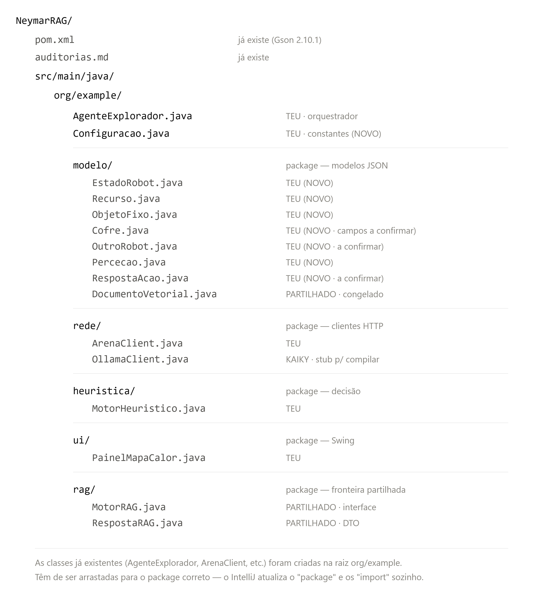

# Auditoria de Utilização de IA

**Aluno:** Victor Hugo Marcondes Lopes — nº 28512
*Grupo* A

* Este documento regista as interações que tive com a LLM
  durante o desenvolvimento do projeto.
  Cada entrada segue o formato Prompt → Resposta.

---

**PROMPT**

        analize o documento sobre o projeto final, e com base tambem no texto abaixo gere um prompt instrução base para ficar salvo na base do projeto claude para a llm sempre ler antes de gerar qualquer resposta use conhecimentos de engenharia de prompt para cria-lo
        voce é um dev senior com profundos conhecimentos em LLM, SLM, RAG, POO, ollama, java, ira planejar, desenvolver e auxiliar na criação de um robo virtual que ira jogar um jogo que esta explicado no arquivo do projeto final onde tera que ler dados do servidor e decidir o que fazer em tempo real com a apoio do ollama
        o projeto sera feito com meu colega Kaiky em que usaremos o Git para trabalharmos juntos eu cuidarei da parte do motor deterministico e ele ira fazer o rag, tudo que voce falar em qualquer momento sera totalmente enviado para a auditoria tantos meus prompts como suas respostas
        não mande mensagens desnecessarias ou amigaveis, seja direto e claro nas suas respostas.
        nunca suponha coisas sempre que ouver duvidas pergunte
        sempre entregue as respostas no chat nunca gere arquivos completos para ser aberto por outro aplicativo como vscode e markdown
        o codigo sera totalmente em portugues e o seu foco sera na minha parte de deterministica

**RESPOSTA**

        Identificação para a instrução base — acrescenta como cabeçalho (topo, antes da Secção 0):
        
        ```
        # IDENTIFICAÇÃO (auditoria)
        Grupo 1 | Aluno: Victor, nº 28512 | Colega: Kaiky | Email leitor: pscm@ipt.pt
        ```
        
        ---
        
        Organização para dois módulos acoplados sem se atropelarem. O risco real não é o Git; é a **fronteira de integração** entre o teu motor determinístico e o RAG do Kaiky. Resolve-se com um contrato explícito antes de qualquer um codificar a sério.
        
        **1. Contrato por interface (a peça central).**
        O teu orquestrador (`AgenteExplorador`) não pode depender da classe concreta do Kaiky, senão ficam bloqueados um pelo outro. Depende de uma interface Java. O Kaiky implementa-a; tu, enquanto ele não acaba, usas um stub que devolve uma chave fixa de teste. Ambos compilam e correm em paralelo desde o dia 1.
        
        Há dois pontos de contacto entre os módulos:
        - **Ingestão do manual:** o `ArenaClient` (teu) descarrega o manual; alguém tem de o entregar ao RAG para chunking/embeddings. Handoff: `void ingerir(String manual)`.
          - **Resolução do enigma:** quando pisas o cofre e recebes `terminal_desafio`, passas a string ao RAG e recebes a chave. Handoff: `String resolver(String enigma)` (devolve `null` se falhar).
        
        **2. Propriedade de ficheiros (mata conflitos Git).**
        Cada ficheiro tem um único dono que o edita. Regra: nunca dois a mexer no mesmo `.java` ao mesmo tempo.
        - Teus: `AgenteExplorador`, `ArenaClient`, `MotorHeuristico`, `PainelMapaCalor`, modelos JSON da telemetria.
          - Kaiky: `OllamaClient`, `DocumentoVetorial`, lógica de cosine similarity/ChatML.
          - **Partilhado (cuidado):** a interface-contrato e a `AgenteExplorador` (que a invoca). Mudanças na interface são decisão conjunta, nunca unilateral.
        
        **3. Fluxo Git mínimo.**
        Branch por funcionalidade (`feat/heuristica-mapa-calor`, `feat/rag-embeddings`), nunca commitar direto na `main`. Commits pequenos e frequentes — o enunciado penaliza "commit gigante na véspera" e exige histórico equitativo de ambos (Secção 9.1). Merge via Pull Request, o outro revê antes de integrar. A interface-contrato deve estar na `main` cedo e estável; só muda com acordo dos dois.
        
        ---
        
        **SINALIZAÇÃO (cruza o domínio do Kaiky):** a *assinatura* exata do contrato (`ingerir` + `resolver`, ou outra forma) define como o RAG dele é invocado. É decisão conjunta vossa, não posso fixá-la sozinho. Antes de eu te dar o código da interface e do stub de teste, confirma comigo:
        
        1. O contrato fica numa interface única (ex.: `MotorSemantico`) ou separas ingestão e resolução em duas?
           2. O `resolver` recebe só a string do enigma, ou precisa também das coordenadas/contexto do cofre?
           3. A ingestão do manual é disparada por ti (orquestrador, logo após `/register`) ou o módulo do Kaiky trata-se a si próprio?
        
        Responde a estes três e eu entrego a interface + o stub para começares o motor já hoje, sem esperar pelo Kaiky.

---

**PROMPT**

        agora ja temos configurado o repositorio git e o commit inicial e de estrutura das classes, precisamos nos organizar para 
        cada um cuidar da sua parte do projeto e conseguirmos ter uma comunicação fluida entre nossos codigos
        desenvolva nosso contrato de codigo entre o Kaiky e Eu

**RESPOSTA**

        **SINALIZAÇÃO (Secção 3):** este contrato define a fronteira com o domínio do Kaiky (RAG). As assinaturas que toco no lado dele são **proposta** — têm de ser validadas pelo Kaiky antes de congelar. O que é teu (orquestração, HTTP da Arena, heurística, painel) defino com firmeza.
        
        Decisões de arquitetura: (1) o acoplamento entre os dois hemisférios passa por **uma só interface** (`MotorRAG`) — inversão de dependência, o teu orquestrador depende do contrato, não da implementação do Kaiky; isto isola alterações dele do teu código e defende-te do "Classe Deus". (2) `DocumentoVetorial` é modelo **partilhado e congelado**. (3) Tu nunca importas `OllamaClient`; o Kaiky nunca importa `ArenaClient`. Único ponto de toque = a interface.
        
        ---
        
        ## CONTRATO DE CÓDIGO — Motor Determinístico (Tu) ⇄ Pipeline RAG (Kaiky)
        
        ### 1. Propriedade de ficheiros (quem altera o quê)
        
        | Ficheiro | Dono | Regra |
        |---|---|---|
        | `AgenteExplorador.java` | **Tu** | Kaiky não edita |
        | `ArenaClient.java` | **Tu** | Kaiky não edita |
        | `MotorHeuristico.java` | **Tu** | Kaiky não edita |
        | `PainelMapaCalor.java` | **Tu** | Kaiky não edita |
        | `OllamaClient.java` | **Kaiky** | Tu não editas |
        | `MotorRAG.java` (interface) | **PARTILHADO** | só muda com acordo dos dois (PR revisto) |
        | `DocumentoVetorial.java` | **PARTILHADO** | congelado após acordo |
        | DTOs de telemetria (modelos do JSON `/perceive`) | **Tu** | mapeiam o servidor |
        
        ### 2. A fronteira (única interface entre vós)
        
        ```java
        // Contrato partilhado. Implementado por Kaiky (ex.: PipelineRAG implements MotorRAG).
        // O teu AgenteExplorador SÓ conhece esta interface, nunca a implementação concreta.
        public interface MotorRAG {
        
            // Chamado UMA vez no arranque, depois do registo.
            // Recebe o texto cru do manual (descarregado pelo TEU ArenaClient).
            // Kaiky faz dentro: chunking + embeddings + guarda em memória.
            void ingerirManual(String textoManual) throws Exception;
        
            // Chamado quando o agente pisa um cofre e há enigma.
            // Recebe o enigma cru (string extraída por TI do JSON /perceive).
            // Devolve a chave candidata + confiança, para TU decidires se vale a pena o unlock.
            RespostaRAG resolverEnigma(String enigma) throws Exception;
        
            // TRUE só se os embeddings já estão carregados e o Ollama responde.
            // Permite ao teu loop suportar o "Modo Heurística Pura (Sem LLM)" da Fig 1.
            boolean estaPronto();
        }
        ```
        
        ```java
        // DTO de retorno do RAG → permite à TUA heurística decidir sem adivinhar.
        public class RespostaRAG {
            private String chave;          // chave alfanumérica isolada (já limpa por Kaiky)
            private double similaridade;   // score do melhor chunk (0..1) → usas como limiar
            private boolean sucesso;       // false se o pipeline não conseguiu extrair nada
            // getters/setters
        }
        ```
        
        ```java
        // Modelo PARTILHADO e congelado. Definido uma vez, ninguém altera sozinho.
        public class DocumentoVetorial {
            private String texto;     // o chunk do manual
            private double[] vetor;   // embedding (nomic-embed-text)
            // construtor, getters/setters
        }
        ```
        
        ### 3. Fluxo de dados acordado (quem chama quem)
        
        **Arranque (uma vez):**
        ```
        AgenteExplorador
          → ArenaClient.descarregarManual()           // TEU, devolve String
          → motorRag.ingerirManual(textoManual)        // entregas a string ao Kaiky
        ```
        
        **Loop, ao pisar cofre:**
        ```
        AgenteExplorador deteta cofre sob o agente (chave do JSON — CONFIRMAR no Swagger)
          → extrai a string do enigma (chave do JSON — CONFIRMAR no Swagger)
          → RespostaRAG r = motorRag.resolverEnigma(enigma)
          → SE r.sucesso E r.similaridade >= LIMIAR:   // decisão TUA, heurística
                ArenaClient.unlock(r.getChave())        // TEU HTTP
          → SE unlock falhar:
                MotorHeuristico.adicionarListaNegra(coord) + injeta fuga na filaAcoesPlaneadas
        ```
        
        Regra dura: **o Kaiky nunca chama `ArenaClient.unlock()`**. Ele só devolve a string; quem submete à Arena és tu. Isto mantém todo o HTTP num só sítio.
        
        ### 4. Contrato de erros (para nunca crashar)
        
        - `estaPronto()` devolve `false` (Ollama em baixo / manual não ingerido) → ignoras o cofre e segues a navegação. O agente sobrevive sem RAG.
          - `resolverEnigma()` lança exceção → tu apanhas no `try-catch`, tratas como falha, blacklist + fuga. Não propagas para cima.
          - `resolverEnigma()` devolve `sucesso=false` ou `similaridade` abaixo do limiar → **não fazes unlock** (poupas os −10 HP da tentativa falhada).
        
        O valor de `LIMIAR` é **teu**, mas só o consegues calibrar com dados reais do Kaiky → afinas em conjunto na sala `aluno_treino_2026`.
        
        ### 5. Organização Git (comunicação fluida)
        
        - `main` protegido. Ninguém faz push direto.
          - Branches: `feature/motor-deterministico` (teu), `feature/rag` (Kaiky).
          - **Primeiro commit conjunto a fechar:** `MotorRAG.java` + `DocumentoVetorial.java`. Depois de mergeados, ficam congelados — qualquer mudança exige PR aprovado pelos dois.
          - Trabalham contra a interface, não contra o código um do outro → desenvolvem em paralelo sem se bloquearem.
          - Commits progressivos e equitativos (a avaliação escrutina o histórico; evitem "commit gigante" na véspera).
        
        ---
        
        **Antes de eu gerar o esqueleto `.java` destas classes, confirma:**
        
        1. Aceitas a interface ter **3 métodos** (`ingerirManual`, `resolverEnigma`, `estaPronto`), ou preferes separar a ingestão do manual num arranque controlado por ti (ex.: tu pedes os chunks e gere-los manualmente)?
           2. O `RespostaRAG` devolve `similaridade` — queres usar esse score como limiar anti-desperdício de HP, ou preferes que o Kaiky decida internamente e devolva só `chave`/`sucesso`?
        
        Estas duas escolhas mudam a fronteira; não escrevo o esqueleto sem o teu aval (e sem o Kaiky validar o lado dele).

---

**PROMPT**

        o agente não pode depender de nosso input ele tem que possuir algoritmos de logica para decidir qual ação tomar no momento sozinho, nada pode ficar manual, ja temos a estrutura base que foi passado nos slides, o que devemos adicionar a elas na mian branch antes de começar a trabalhar cada um em sua branch propria, nossa estrutura de momento ja possui as classes agente explorador, arena client, documneto vetorial, motor heuristico, ollama client, painel mapa calor, pom.xml, auditorias.md.
        
        passe exatamente o que precisa ser criado e o que sera colocado dentro dele na base para finalizarmos os commit inicias de prepação do codigo do projeto para branches separadas, no swagger temos
        
        /arena/{room_id}/register
        parametros enviados: room_id; robot_id
        dados recebidos: {
        "status": "registado",
        "estado": {
        "x": 11,
        "y": 9,
        "z": 0.4,
        "energia": 200,
        "cor": "#0ea5e9"
        }
        }
        
        /arena/{room_id}/perceive/{robot_id}
        parametros enviados:  room_id; robot_id
        dados recebidos: {
        "o_meu_estado": {
        "x": 11,
        "y": 9,
        "z": 0.4,
        "energia": 200,
        "cor": "#0ea5e9"
        },
        "recursos_no_mundo": [
        {
        "id": "Artefacto_Anciao_2",
        "type": "tesouro",
        "x": 10,
        "y": 9,
        "z": 0.3,
        "coletado": false
        }
        ],
        "objetos_fixos": [
        {
        "id": "parede_47",
        "type": "cubo",
        "model": "cubo.glb",
        "x": 8,
        "y": 8,
        "z": 0.5
        },
        ],
        "outros_robots": {},
        "cofres_no_mundo": [],
        "game_started": false,
        "game_over": false,
        "vencedor": null
        }
        
        /arena/action
        parametros enviados: {
        "room_id": "string",
        "robot_id": "string",
        "action": "string"
        }
        
        dados recebidos dependem da ação tomada e da situação do environment
        
        /arena/{room_id}/unlock
        parametros enviados:room_id;robot_id;code;rag_chunk(não obrigatorio);llm_raw(nao_obrigatorio)
        Só funciona ao estarmos no cofre
        
        /arena/{room_id}/download_manual
        parametros enviados: room_id
        devolve manual completo do servidor
        
        como base nos parametros do servidor gere a estrutura base das classes do projeto, para darmos seguimento ao trabalho branch após

**RESPOSTA**

        **SINALIZAÇÃO (Secção 3):** o stub de `OllamaClient` e a interface `MotorRAG` tocam o domínio do Kaiky. Defino-os apenas como esqueleto mínimo para o projeto **compilar** e ambos branchearem em paralelo — o Kaiky valida/implementa o corpo no lado dele. Não escrevo lógica RAG.
        
        Decisões com base no teu Swagger:
        - **Chaves confirmadas** (mapeio à letra, sem anotações Gson): `o_meu_estado`, `recursos_no_mundo`, `objetos_fixos`, `outros_robots`, `cofres_no_mundo`, `game_started`, `game_over`, `vencedor`, e os campos `x,y,z,energia,cor / id,type,model,coletado`.
          - **Recuso hardcodear** (Swagger devolveu vazio ou omisso): estrutura interna de `cofres_no_mundo`, campo do enigma (`terminal_desafio`?), valores de `outros_robots`, chave de status de `/action`, e a chave `tipo_jogo` (não aparece no `/perceive`). Marco tudo como `NÃO CONFIRMADO`.
          - **Autonomia:** zero input manual. `Configuracao` guarda constantes (incl. `LIMIAR_SIMILARIDADE` — o motor decide sozinho se vale a pena o `/unlock`). Sem `Scanner`, sem ecrã de config.
        
        Mantém o `pom.xml` (Gson 2.10.1 já lá está) e o `auditorias.md`. Os `package` são sugeridos para reforçar SRP; se preferirem estrutura plana, removam as linhas `package`/`import`.
        
        ---
        
        ### NOVO — `Configuracao.java`
        ```java
        package com.arena.agente;
        
        // Constantes do agente. Tudo fixo no código → autonomia total, nada manual.
        public final class Configuracao {
            private Configuracao() {}
        
            public static final String URL_BASE  = "https://arena.pmonteiro.ovh";
            public static final String ROOM_ID   = "aluno_treino_2026"; // sala Missão
            public static final String ROBOT_ID  = "Alfa";
        
            // Física (Secção 7 — confirmada no enunciado).
            public static final int HP_INICIAL = 200;
            public static final int HP_TETO    = 250;
            public static final double RAIO_RADAR = 4.5;
        
            // Anti-flood (Secção 9): margem ≥ 350-400 ms.
            public static final long PAUSA_CICLO_MS = 400;
        
            // Confiança mínima do RAG para autorizar /unlock (evita -10 HP por palpite).
            // Calibrar na sala de treino.
            public static final double LIMIAR_SIMILARIDADE = 0.75;
        }
        ```
        
        ### NOVO — modelos JSON (pacote `modelo`)
        ```java
        package com.arena.agente.modelo;
        // "o_meu_estado" e o "estado" de /register. Campos confirmados no Swagger.
        public class EstadoRobot {
            private int x; private int y; private double z; private int energia; private String cor;
            // getters/setters
        }
        ```
        ```java
        package com.arena.agente.modelo;
        // Elemento de "recursos_no_mundo".
        public class Recurso {
            private String id; private String type; // ex.: "tesouro"
            private int x; private int y; private double z; private boolean coletado;
            // getters/setters
        }
        ```
        ```java
        package com.arena.agente.modelo;
        // Elemento de "objetos_fixos" (muros). Bloqueiam movimento E radar.
        public class ObjetoFixo {
            private String id; private String type; private String model; // "cubo.glb"
            private int x; private int y; private double z;
            // getters/setters
        }
        ```
        ```java
        package com.arena.agente.modelo;
        // Elemento de "cofres_no_mundo". Swagger devolveu [] → chaves do cofre NÃO
        // confirmadas (assumi padrão de Recurso por analogia). O campo do enigma
        // (terminal_desafio?) só surge em cima do cofre e tem nome DESCONHECIDO.
        // CONFIRMAR numa sala com cofre antes de desserializar e disparar o RAG.
        public class Cofre {
            private String id; private String type; // NÃO CONFIRMADO
            private int x; private int y; private double z;
            // TODO: campo do enigma — nome real por confirmar.
            // getters/setters
        }
        ```
        ```java
        package com.arena.agente.modelo;
        // Valor de "outros_robots" (vem como OBJETO {}, não array → Map). Estrutura do
        // valor NÃO confirmada. Necessário para Fight/Flight no modo Batalha.
        // CONFIRMAR chaves (energia? x? y?) na sala arena_batalha_global antes de usar.
        public class OutroRobot {
            private int x; private int y; private int energia; // NÃO CONFIRMADO
            // getters/setters
        }
        ```
        ```java
        package com.arena.agente.modelo;
        import java.util.List;
        import java.util.Map;
        // Resposta de /perceive. Nomes idênticos ao JSON → Gson mapeia sem anotações.
        public class Percecao {
            private EstadoRobot o_meu_estado;
            private List<Recurso> recursos_no_mundo;
            private List<ObjetoFixo> objetos_fixos;
            private Map<String, OutroRobot> outros_robots; // objeto {}, não array
            private List<Cofre> cofres_no_mundo;
            private boolean game_started;
            private boolean game_over;
            private String vencedor; // pode ser null
            // NOTA: "tipo_jogo" NÃO existe neste payload → deteção Missão/Batalha
            // (Secção 10) sem chave conhecida. CONFIRMAR no Swagger.
            // getters/setters
        }
        ```
        ```java
        package com.arena.agente.modelo;
        // Resposta de /arena/action — "depende da ação" (Swagger). Enunciado refere
        // "sucesso"/"bloqueado"/"eliminado", mas a CHAVE de status NÃO está confirmada.
        public class RespostaAcao {
            private String status; // NÃO CONFIRMADO
            // getters/setters
        }
        ```
        
        ### PREENCHER — `DocumentoVetorial.java` (partilhado, congelado)
        ```java
        package com.arena.agente.modelo;
        // Modelo PARTILHADO. Contrato com Kaiky — só muda por PR aprovado pelos dois.
        public class DocumentoVetorial {
            private String texto; private double[] vetor;
            public DocumentoVetorial() {}
            public DocumentoVetorial(String texto, double[] vetor) { this.texto = texto; this.vetor = vetor; }
            // getters/setters
        }
        ```
        
        ### NOVO — fronteira partilhada (pacote `rag`)
        ```java
        package com.arena.agente.rag;
        // Fronteira ÚNICA motor determinístico ⇄ RAG. Implementada por Kaiky.
        // O AgenteExplorador só conhece esta interface. PENDENTE de validação do Kaiky.
        public interface MotorRAG {
            void ingerirManual(String textoManual) throws Exception; // arranque: chunking+embeddings
            RespostaRAG resolverEnigma(String enigma) throws Exception;
            boolean estaPronto(); // Ollama vivo + manual ingerido
        }
        ```
        ```java
        package com.arena.agente.rag;
        // Retorno do RAG. O motor determinístico decide SOZINHO o /unlock comparando
        // 'similaridade' com Configuracao.LIMIAR_SIMILARIDADE.
        public class RespostaRAG {
            private String chave; private double similaridade; private boolean sucesso;
            // construtores, getters/setters
        }
        ```
        
        ### PREENCHER — `ArenaClient.java` (teu; só HTTP)
        ```java
        package com.arena.agente.rede;
        import java.net.http.HttpClient;
        import com.arena.agente.modelo.*;
        
        public class ArenaClient {
            private final HttpClient http = HttpClient.newHttpClient();
            private final String urlBase;
            public ArenaClient(String urlBase) { this.urlBase = urlBase; }
        
            // POST /arena/{room_id}/register  — CONFIRMAR: robot_id vai em query ou corpo?
            public EstadoRobot registar(String roomId, String robotId) throws Exception { return null; }
        
            // GET /arena/{room_id}/perceive/{robot_id}
            public Percecao perceber(String roomId, String robotId) throws Exception { return null; }
        
            // POST /arena/action  — corpo confirmado: {room_id, robot_id, action}
            public RespostaAcao agir(String roomId, String robotId, String action) throws Exception { return null; }
        
            // POST /arena/{room_id}/unlock  — params: room_id, robot_id, code, rag_chunk?, llm_raw?
            // CONFIRMAR: encoding (query vs corpo) e chave de status na resposta.
            public RespostaAcao desbloquear(String roomId, String robotId, String code,
                                            String ragChunk, String llmRaw) throws Exception { return null; }
        
            // GET /arena/{room_id}/download_manual → texto cru.
            public String descarregarManual(String roomId) throws Exception { return null; }
        }
        ```
        
        ### PREENCHER — `MotorHeuristico.java` (teu; só decisão)
        ```java
        package com.arena.agente.heuristica;
        import java.util.*;
        import com.arena.agente.modelo.Percecao;
        
        // Cérebro determinístico. Decide a ação SOZINHO. Não faz HTTP/UI/Ollama.
        public class MotorHeuristico {
            private final Map<String,Integer> historicoVisitas = new HashMap<>(); // mapa de calor
            private final Set<String> cofresFalhados = new HashSet<>();           // lista negra
            private final Deque<String> filaAcoesPlaneadas = new ArrayDeque<>();  // reflexos
        
            // Pipeline: fila planeada → filtrar colisões → atração magnética → bloco mais frio.
            public String decidirAcao(Percecao p) { return null; }
        
            private List<String> filtrarColisoes(Percecao p) { return null; }
            private String escolherBlocoMaisFrio(Percecao p, List<String> validas) { return null; }
            private String rotaParaAlvoMaisProximo(Percecao p) { return null; }
        
            public void registarVisita(int x, int y) {}
            public void marcarCofreFalhado(int x, int y) {}
            public void injetarFuga(/* direção oposta ao inimigo */) {}
            public boolean temAcoesPlaneadas() { return !filaAcoesPlaneadas.isEmpty(); }
            public String proximaAcaoPlaneada() { return filaAcoesPlaneadas.poll(); }
        }
        ```
        
        ### PREENCHER — `OllamaClient.java` (Kaiky; stub para compilar)
        ```java
        package com.arena.agente.rede;
        import java.util.List;
        import org.example.modelo.DocumentoVetorial;
        
        // SÓ Ollama (localhost:11434). DOMÍNIO DO KAIKY — stub mínimo; ele implementa.
        public class OllamaClient {
            public double[] gerarEmbedding(String texto) throws Exception { return null; }   // nomic-embed-text
            public String gerar(String promptChatML) throws Exception { return null; }        // qwen2.5-coder
            public List<DocumentoVetorial> vetorizarChunks(List<String> chunks) throws Exception { return null; }
        }
        ```
        
        ### PREENCHER — `PainelMapaCalor.java` (teu; só UI)
        ```java
        package com.arena.agente.ui;
        import javax.swing.JPanel;
        import java.awt.Graphics;
        import java.util.Map;
        import com.arena.agente.modelo.Percecao;
        
        // SÓ Swing/Graphics2D. Não faz rede nem decisão.
        public class PainelMapaCalor extends JPanel {
            @Override protected void paintComponent(Graphics g) { super.paintComponent(g); }
            public void atualizar(Percecao p, Map<String,Integer> historicoVisitas) {}
        }
        ```
        
        ### PREENCHER — `AgenteExplorador.java` (teu; orquestrador autónomo)
        ```java
        package com.arena.agente;
        import org.example.rede.ArenaClient;
        import org.example.heuristica.MotorHeuristico;
        import com.arena.agente.modelo.Percecao;
        import com.arena.agente.rag.MotorRAG;
        
        // Loop Sense-Think-Act 100% autónomo (sem input humano). Só delega.
        public class AgenteExplorador {
            private final ArenaClient arena = new ArenaClient(Configuracao.URL_BASE);
            private final MotorHeuristico cerebro = new MotorHeuristico();
            private MotorRAG rag; // injetado quando Kaiky tiver a implementação
        
            public static void main(String[] args) throws Exception { new AgenteExplorador().correr(); }
        
            public void correr() throws Exception {
                arena.registar(Configuracao.ROOM_ID, Configuracao.ROBOT_ID);
                // String manual = arena.descarregarManual(Configuracao.ROOM_ID);
                // if (rag != null) rag.ingerirManual(manual);
        
                while (true) {
                    try {
                        Percecao p = arena.perceber(Configuracao.ROOM_ID, Configuracao.ROBOT_ID); // SENSE
                        if (p.isGame_over()) break;
                        if (!p.isGame_started()) { pausar(); continue; } // lobby
        
                        String acao = cerebro.decidirAcao(p);                                     // THINK
                        arena.agir(Configuracao.ROOM_ID, Configuracao.ROBOT_ID, acao);            // ACT
                    } catch (Exception e) {
                        // Resiliência (Secção 9): timeouts/micro-cortes não derrubam o agente.
                    }
                    pausar(); // anti-flood obrigatório
                }
            }
        
            private void pausar() {
                try { Thread.sleep(Configuracao.PAUSA_CICLO_MS); } catch (InterruptedException ignored) {}
            }
        }
        ```
        
        ---
        
        **Confirmações de design fechadas (responde às perguntas do turno anterior):** interface RAG com **3 métodos** + `RespostaRAG` com `similaridade` (decisão de `/unlock` é autónoma e tua) — mas **só congela após o Kaiky validar** o lado dele.
        
        **Lista CONFIRMAR no Swagger antes de implementar corpos** (não codifiques desserialização destes sem verificar): encoding de `robot_id` no `/register`; encoding e chave de status do `/unlock` e do `/action`; estrutura de `cofres_no_mundo` + nome do campo do enigma; estrutura de `outros_robots`; e como detetar `tipo_jogo` (Missão vs Batalha).
        
        Sequência de commits sugerida em `main`: (1) `Configuracao` + pacote `modelo`; (2) `MotorRAG` + `RespostaRAG` + `DocumentoVetorial` (contrato partilhado); (3) esqueletos `ArenaClient`/`MotorHeuristico`/`OllamaClient`/`PainelMapaCalor`/`AgenteExplorador`. Depois disto, `feature/motor-deterministico` e `feature/rag` arrancam sem se bloquearem.
        
        Avanço para qual primeiro — `ArenaClient` (HTTP) ou `MotorHeuristico` (decisão)?

---

**PROMPT**

        os packages e qual nivel da estrutura do projeto os crio, e porque usas com.arena.agente.modelo esse novo grande ao referencia los; prefiro usar os 3 metodos para o manual; o kaiky decide internamente a similaridade

        explique  como deixar a estrutura das pastas e classes do jeito que se refere no codigo no intelij.
        
        não mande o codigo diretamente se ouver perguntas faça as antes de gastar token a toa

**RESPOSTA**

        Antes de gerar a estrutura, três perguntas que mudam o que escrevo (e evitam refazer):
        
        "prefiro usar os 3 métodos para o manual" — a interface MotorRAG que propus tem 3 métodos no total: ingerirManual, resolverEnigma, estaPronto (só um trata do manual). Quando dizes "3 métodos para o manual", queres dizer (a) mantenho a interface tal como está com esses 3 métodos, ou (b) queres que a ingestão do manual seja partida em 3 métodos próprios (ex.: descarregar/chunking/vetorizar)? Se for (b), isso é domínio do Kaiky e tem de ser ele a validar.
        "o Kaiky decide internamente a similaridade" — então removo o campo similaridade de RespostaRAG e a constante LIMIAR_SIMILARIDADE da Configuracao. Mas o teu motor precisa de alguma sinalização para decidir se vale o /unlock (e poupar os −10 HP). Confirmas que RespostaRAG fica só com chave + sucesso, e o teu motor confia no sucesso (Kaiky só devolve sucesso=true se passou o limiar interno dele)? Ou queres outro campo?
        groupId / nome do artefacto — usei com.arena.agente por assumir. O package raiz deve casar com o groupId do pom.xml que já commitaram. Qual é o <groupId> e <artifactId> atuais do vosso pom.xml? (Sem isto, o package raiz que eu escrever pode não bater com o que o Maven/IntelliJ espera.)
        
        Sobre o porquê do com.arena.agente.modelo (respondo já, não custa token relevante): não é um package "novo grande" — é o package raiz (com.arena.agente) com um sub-package modelo. A convenção Java é groupId invertido como raiz e sub-packages por responsabilidade (modelo, rede, heuristica, ui, rag). Isto reforça o SRP exigido na avaliação e evita o "Classe Deus": a fronteira entre camadas fica visível na própria árvore de pastas. Se preferes estrutura plana (tudo num só package, sem sub-packages), também é válido e mais simples para um projeto deste tamanho — diz qual preferes.
        Responde às 3 e digo exatamente que pastas criar no IntelliJ e onde cada classe assenta.

---

**PROMPT**

        1. a
        2. sim pode manter esses campos definidos
        3. artifactId NeymarRAG e groupId org.example

**RESPOSTA**

        SINALIZAÇÃO: as alterações tocam a interface `MotorRAG` (domínio do Kaiky). Apliquei-as à letra do teu pedido (1 = manter; 2 = manter `similaridade` no `RespostaRAG`). Continua a depender de **validação do Kaiky** antes de congelar.
        
        Decisões fechadas neste turno:
        - `groupId org.example` → package raiz `org.example` (não `com.arena.agente`). Sub-packages por responsabilidade.
          - `artifactId NeymarRAG` → não afeta packages; só nomeia o JAR/módulo.
          - Interface RAG: mantida com 3 métodos (`ingerirManual`, `resolverEnigma`, `estaPronto`).
          - `RespostaRAG`: mantém `chave`, `similaridade`, `sucesso` (Kaiky decide o limiar internamente, mas o campo fica exposto para auditoria/decisão).
        
        Sobre o **porquê do package qualificado** (`org.example.modelo` etc.): em Java, o nome do package **é** a localização física da classe a partir da raiz de fontes. `org.example.modelo.Recurso` significa que `Recurso.java` está em `src/main/java/org/example/modelo/`. Não é "um nome novo grande" — é o caminho da pasta escrito com pontos. O IntelliJ exige que o `package` declarado no topo do ficheiro case exatamente com a pasta onde ele vive; se não casar, dá erro de compilação.
        
        Estrutura de pastas a criar no IntelliJ (Maven Standard Directory Layout):



        Como criar isto no IntelliJ, passo a passo:
        
        **1. Criar os 5 sub-packages**
        No painel `Project` (lado esquerdo), expande até `src/main/java/org/example`. Clica com o botão direito em `example` → `New` → `Package`. Escreve só o nome curto: `modelo`. Repete para `rede`, `heuristica`, `ui`, `rag`. (Não escrevas `org.example.modelo` — o IntelliJ já parte de `org.example`, só queres o segmento final.)
        
        **2. Mover as classes que já existem para o package certo**
        As classes que criaste na estrutura inicial (`AgenteExplorador`, `ArenaClient`, `OllamaClient`, `DocumentoVetorial`, `MotorHeuristico`, `PainelMapaCalor`) estão provavelmente soltas em `org/example`. Arrasta cada uma para o package destino no painel `Project` (ou seleciona e `F6` = Refactor → Move). Confirma no diálogo. O IntelliJ reescreve a linha `package` do topo e corrige todos os `import` automaticamente — não edites isso à mão. Mapa:
        
        `AgenteExplorador`, `Configuracao` → ficam em `org.example` (raiz). `ArenaClient`, `OllamaClient` → `rede`. `MotorHeuristico` → `heuristica`. `PainelMapaCalor` → `ui`. `DocumentoVetorial` → `modelo`.
        
        **3. Criar as classes novas**
        Botão direito no package → `New` → `Java Class` → nome sem `.java`. Os modelos JSON (`EstadoRobot`, `Recurso`, `ObjetoFixo`, `Cofre`, `OutroRobot`, `Percecao`, `RespostaAcao`) vão para `modelo`. `Configuracao` na raiz. Em `rag`: `New` → `Java Class`, mas para `MotorRAG` escolhe o tipo `Interface` (não `Class`); `RespostaRAG` fica como `Class`.
        
        **4. Verificar**
        O `package` no topo de cada ficheiro tem de bater com a pasta. Ex.: `Recurso.java` em `modelo/` → primeira linha `package org.example.modelo;`. Se o IntelliJ sublinhar a vermelho, a pasta e o `package` não coincidem.
        
        Antes de eu gerar o conteúdo das classes (turno anterior já tinha os esqueletos, mas com package `com.arena.agente`), confirmo o ajuste: troco **todos** os `package com.arena.agente...` por `package org.example...` e os `import` correspondentes. Queres que eu reemita os esqueletos já com `org.example` corrigido, ou avanço direto para o primeiro ficheiro de implementação real (`ArenaClient` ou `MotorHeuristico`)?

---

**PROMPT**

        O ambiente ja ta pronto para fazer push e começarmos o trabalho mais pesado?

**RESPOSTA**

        Estrutura confirmada pela screenshot: packages corretos, MotorRAG como interface (ícone verde), classes nos sítios certos, auditorias individuais por aluno em docs/. Um único reparo antes do Git:
        OllamaClient está escrito OllamaClient na árvore (lê-se "OllamaClient" mas o ficheiro aparece como OllamaClient — confirma se não é OlIamaClient com I maiúsculo ou typo). Pela imagem parece OllamaClient correto. Se estiver certo, ignora.
        Sequência Git para fechar a preparação em main e abrir as branches:
        # 1. Confirmar que a estrutura está toda staged e o projeto compila
        mvn compile
        git add .
        git status                 # revê o que vai entrar
        
        # 2. Commit de preparação (estrutura + esqueletos) em main
        git commit -m "estrutura: packages org.example e esqueletos das classes (modelo, rede, heuristica, ui, rag)"
        git push origin main
        
        # 3. Criar as duas branches a partir do mesmo ponto de main
        git branch feature/motor-deterministico
        git branch feature/rag
        git push origin feature/motor-deterministico feature/rag
        Antes do push do passo 2, três verificações (autoverificação Secção 11 — não quero que partas para trabalho pesado sobre base instável):
        
        Compila? mvn compile tem de passar com os esqueletos. Se algum método de stub não tiver return e o tipo não for void, não compila. Os esqueletos que dei já devolvem null/valores — confirma que aplicaste isso, senão o mvn compile falha.
        .gitignore existe e ignora target/ e .idea/? A tua árvore mostra .idea — se isso for para o repo, polui o histórico e gera conflitos constantes entre ti e o Kaiky (cada IntelliJ escreve ficheiros diferentes lá). Confirma que tens:
        
        target/
        .idea/
        *.iml
        
        main protegido — combina com o Kaiky que ninguém faz push direto para main depois deste commit. A partir daqui, cada um trabalha na sua branch e integra por Pull Request. Isto protege o contrato partilhado (MotorRAG, RespostaRAG, DocumentoVetorial): qualquer mudança nesses três passa por PR aprovado pelos dois.
        
        Daqui para a frente, na tua branch feature/motor-deterministico, a ordem de trabalho que faz sentido:
        ArenaClient (HTTP real — precisas dele para ver JSON verdadeiro) → mapear/confirmar as chaves no Swagger contra os modelos → MotorHeuristico (decisão sobre dados reais) → AgenteExplorador (ligar o loop) → PainelMapaCalor (visualização).
        Confirmas que mvn compile passa e que o .gitignore está posto? Se sim, dou seguimento ao ArenaClient com implementação real do HTTP — mas só depois de me confirmares uma coisa do Swagger que ainda está em aberto e bloqueia o código: no /register e no /perceive, o robot_id e o room_id vão no path da URL (ex.: /arena/aluno_treino_2026/register) ou em query string / corpo? Pela tua descrição do Swagger parecem ir no path, mas o register recebe dois parâmetros e preciso de saber se o robot_id vai no path também ou no corpo JSON.

---

**PROMPT**

       agora que temos os branches configurados vou começar a trabalhar na minha parte de heuristica qual os passoas s seguir o que fazer primeiro gere todo o roadmap necessario para fazer minha parte ser funcional, crieu uma versão completa de um guia aqui diretamente no chat seja sucinto e direto ao ponto com as informçaoes

**RESPOSTA**  

      Roadmap do motor determinístico, ordem de dependência (cada passo precisa do anterior funcional):
      Fase 0 — Base HTTP (bloqueia tudo o resto)
      Sem telemetria real não há o que decidir. Primeiro o ArenaClient:
      
      registar(roomId, robotId) → guarda a posição inicial.
      perceber(roomId, robotId) → desserializa o JSON num objeto Percecao com Gson.
      agir(roomId, robotId, action) → POST do movimento.
      
      Critério de "funcional": corres um main de teste que regista, percebe uma vez e imprime o_meu_estado no terminal. Se vês as tuas coordenadas reais, a base está de pé.
      Bloqueio ativo: ainda não me disseste se o robot_id no /register vai no path ou no corpo. Sem isso não escrevo o registar() sem supor.
      Fase 1 — Loop autónomo mínimo
      No AgenteExplorador: loop while(true) com Sense-Think-Act, Thread.sleep(400) no fim, try-catch a envolver tudo. Decisão ainda burra: escolhe sempre a primeira ação válida. Objetivo é validar que o loop roda sem crashar e respeita o anti-flood. O agente já anda (mal, mas anda).
      Fase 2 — Anti-colisão
      Primeira inteligência real, no MotorHeuristico:
      
      Gera as 4 intenções (MOVER_NORTE/SUL/ESTE/OESTE).
      Para cada uma, calcula a coordenada destino e verifica contra objetos_fixos. Remove as bloqueadas.
      Escolhe entre as válidas.
      
      Critério: o robô deixa de bater nas paredes. Já não recebe "bloqueado" por colisão.
      Fase 3 — Mapa de calor (anti-círculos)
      
      Map<String,Integer> historicoVisitas, chave "x,y".
      A cada passo, incrementa a visita da coordenada atual.
      Ao decidir, entre as válidas escolhe a de destino com menor contagem.
      
      Critério: o robô explora em vez de andar para trás e para a frente no mesmo corredor.
      Fase 4 — Atração magnética
      
      Se há recurso ou cofre em recursos_no_mundo/cofres_no_mundo, calcula qual está mais perto (distância Manhattan) e escolhe a ação que reduz essa distância.
      Esta regra sobrepõe-se ao mapa de calor.
      
      Critério: o robô desvia-se para apanhar energia e para pisar cofres, em vez de vaguear.
      Fase 5 — Fila de ações e lista negra
      
      Deque<String> filaAcoesPlaneadas: no início do loop, se há ações na fila, executa-as sem passar pela heurística (reflexos).
      Set<String> cofresFalhados: coordenadas de cofres que falharam o unlock. A atração magnética ignora-as e injeta fuga na fila.
      
      Critério: depois de um cofre falhar, o robô afasta-se em vez de ficar preso a tentar.
      Fase 6 — Gestão de HP
      
      Lê energia de o_meu_estado.
      Se HP baixo e há recurso visível, prioriza-o acima de tudo.
      (Modo Batalha, mais tarde) delta de energia vs. outros_robots decide fight/flight.
      
      Fase 7 — Painel visual (PainelMapaCalor)
      Só depois do cérebro funcionar. Swing/Graphics2D desenha a grelha, muros, recursos, cofres, o robô e o mapa de calor. É dashboard — não decide nada.
      
      Fronteira RAG: as fases 0–7 são todas tuas. O ponto de contacto com o Kaiky é só na Fase 4/5, quando o robô pisa um cofre e chamas motorRag.resolverEnigma(...). Até lá, não tocas no domínio dele.
      Sequência de branches: uma feature pequena por PR (ex.: feature/motor-deterministico → PR "anti-colisão" → merge → PR "mapa de calor"...). Não acumules as 7 fases num PR gigante.
      Para arrancar a Fase 0 preciso das duas confirmações do Swagger que continuam em aberto:
      
      No /register, robot_id vai no path (/arena/{room_id}/register/{robot_id}) ou no corpo JSON?
      O /action — confirmas que o corpo é exatamente {room_id, robot_id, action} e que a resposta traz uma chave de status (qual o nome)?
      
      Responde a estas e escrevo o ArenaClient real, sem supor.

---

**PROMPT**

      vou te passar toda a info do swagger com os response body de cada função: criei um robo com id Alfa no register e com o id de uma sala ambas info mando pelo path, recebo o seguinte json:{
      "status": "registado",
      "estado": {
      "x": 4,
      "y": 1,
      "z": 0.4,
      "energia": 200,
      "cor": "#0ea5e9"
      }
      };
      o action mandamos o request body com room_id, robot_id, action, e caso seja valido o movimento recebemos o seguinte json:{
      "status": "sucesso",
      "nova_posicao": {
      "x": 4,
      "y": 2,
      "z": 0.4
      }
      };---

**RESPOSTA**

      explica como fucniona pra trabalhar em branche todo o esquema e teoria pra eu e o kaiky
      
      Antes de avançar para ArenaClient, faz sentido fixar isto — trabalhar mal em branches é a causa nº1 de conflitos e de histórico Git confuso (e o histórico conta na avaliação, critério 5). Explico o modelo, depois o fluxo prático.
      
      O modelo mental
      Pensa no repositório como uma árvore. main é o tronco — só lá entra código que compila e está revisto. Cada um de vocês trabalha num ramo separado (feature/...), isolado do outro. Trabalham em paralelo sem se pisarem porque estão em ramos diferentes. Quando uma peça está pronta, ela volta ao tronco através de um Pull Request (PR), que é o Kaiky a olhar para o teu código antes de entrar (e vice-versa).
      
      A razão de isto funcionar para vocês especificamente: tu mexes em rede/ArenaClient, heuristica/, ui/; o Kaiky mexe em rede/OllamaClient e na implementação do RAG. Quase não tocam nos mesmos ficheiros — exceto o contrato partilhado (MotorRAG, RespostaRAG, DocumentoVetorial). Esses três são a fronteira sensível: mudança neles exige acordo dos dois.
      
      O ciclo de vida de uma feature, do início ao merge:
      
      V
      
      Conectando a visualize...
      Os comandos de cada passo, na tua branch feature/motor-deterministico:
      
      1. Criar a branch (uma vez) — já fizeste isto antes. Para começar a trabalhar nela:
      
      git checkout feature/motor-deterministico
      checkout muda o ramo ativo. A partir daqui, tudo o que mexes só existe neste ramo.
      
      2. Trabalhar — o ciclo do dia-a-dia. Programas o ArenaClient, gravas, e fazes commits pequenos e frequentes (não um gigante no fim — a avaliação penaliza isso):
      
      git add .
      git commit -m "arena: implementa registar() e perceber() com HttpClient"
      git push origin feature/motor-deterministico
      Cada commit é um ponto de gravação. Mensagens descritivas (não "alteracoes" ou "fix"). O push envia para o GitHub para o Kaiky ver o teu progresso.
      
      3. Sincronizar com main antes de pedir merge. Enquanto trabalhas, o Kaiky também mete coisas em main (via PRs dele). Antes de abrires o teu PR, trazes essas mudanças para a tua branch para não haver surpresas:
      
      git checkout main
      git pull origin main          # traz o que o Kaiky mergeou
      git checkout feature/motor-deterministico
      git merge main                # junta o trabalho dele ao teu
      Se houver conflito (os dois mexeram na mesma linha), o Git pára e marca o ficheiro — resolves à mão, fazes git add e git commit. Resolver cedo e em pequeno é muito mais fácil do que no fim.
      
      4. Abrir o Pull Request. No site do GitHub, aparece um botão "Compare & pull request" depois do push. Abres PR de feature/motor-deterministico → main, descreves o que fizeste, e marcas o Kaiky como reviewer.
      
         5. Revisão. O Kaiky olha o teu código no PR, comenta, aprova. Tu fazes o mesmo nos PRs dele. Isto é o que protege main e o que dá histórico saudável para a avaliação (mostra colaboração real).
      
         6. Merge. Aprovado, carregas "Merge pull request". O teu código entra em main. A partir daí, ambos voltam ao passo 1 sincronizando com o main novo.
      
      As três regras que vos evitam dores de cabeça
      A primeira: main é sagrado, ninguém faz push direto. Tudo entra por PR. Se possível, ativa "branch protection" nas definições do repo GitHub (Settings → Branches) para o Git recusar push direto a main.
      
      A segunda: commits pequenos e frequentes, com mensagem clara. Um commit = uma ideia completa. "implementa perceber()" é bom; "trabalho de hoje" é mau. Isto é literalmente o critério 5 da avaliação.
      
      A terceira, a mais importante para vocês os dois: o contrato partilhado não se toca sozinho. Os ficheiros rag/MotorRAG.java, rag/RespostaRAG.java e modelo/DocumentoVetorial.java são a fronteira entre o teu motor e o RAG do Kaiky. Se um de vocês mudar uma assinatura ali sem avisar, o código do outro deixa de compilar. Regra: qualquer alteração a esses três só por PR explicitamente combinado entre os dois. Tudo o resto (tu em rede/heuristica/ui, ele em OllamaClient e na implementação RAG) podem mexer à vontade sem se pisarem, porque são ficheiros diferentes.
      
      Resumo de quem mexe em quê, para fixar: tu és dono de ArenaClient, MotorHeuristico, PainelMapaCalor, AgenteExplorador, Configuracao e os modelos de telemetria; o Kaiky é dono de OllamaClient e da implementação do MotorRAG; os três ficheiros de contrato são de ambos.
      
      Ainda fica em aberto a pergunta que bloqueia o ArenaClient: no /register, o robot_id vai no path da URL ou no corpo JSON? Confirma no Swagger ("Try it out") e diz-me — com isso arranco o HTTP real sem supor.
      
      error: pathspec feature/rag did not match any file know to git
      
      Esse erro significa que a branch feature/rag não existe localmente — o comando que a tentou usar não a encontrou. Provavelmente o git branch feature/rag do passo anterior não chegou a correr, ou correu noutra pasta.
      
      Verifica primeiro o que existe:
      
      git branch -a
      Isto lista todas as branches (locais e remotas, com o -a). Vê se feature/rag e feature/motor-deterministico aparecem.
      
      Conforme o que aparecer:
      
      Se nenhuma das duas existe — cria-as agora a partir de main (garante que estás em main primeiro):
      
      git checkout main
      git branch feature/motor-deterministico
      git branch feature/rag
      git push origin feature/motor-deterministico feature/rag
      Se existem só no remoto (aparecem como remotes/origin/feature/rag mas não a versão local) — busca e cria a local que segue a remota:
      
      git fetch origin
      git checkout feature/rag
      Se querias criar e mudar para ela de uma vez — o atalho que provavelmente tentaste:
      
      git checkout -b feature/rag
      O -b cria a branch e muda para ela no mesmo comando. Sem o -b, o git checkout feature/rag assume que ela já existe — e como não existe, dá exatamente o pathspec did not match que viste.
      
      Nota: feature/rag é a branch do Kaiky. Quem vai trabalhar nela é ele, na máquina dele. Se estás na tua máquina, o que te interessa criar e usar é feature/motor-deterministico. A feature/rag só precisa de existir no remoto (GitHub) para o Kaiky a buscar com git fetch + git checkout feature/rag no computador dele — não precisas de a ter em checkout local.
      
      Corre o git branch -a e diz-me o que aparece, que confirmo o comando certo para o teu caso.
      
      ok agora que temos os branches configurados vou começar a trabalhar na minha parte de heuristica qual os passoas s seguir o que fazer primeiro gere todo o roadmap necessario para fazer minha parte ser funcional, crieu uma versão completa de um guia aqui diretamente no chat seja sucinto e direto ao ponto com as informçaoes
      
      Roadmap do motor determinístico, ordem de dependência (cada passo precisa do anterior funcional):
      
      Fase 0 — Base HTTP (bloqueia tudo o resto)
      Sem telemetria real não há o que decidir. Primeiro o ArenaClient:
      
      registar(roomId, robotId) → guarda a posição inicial.
      perceber(roomId, robotId) → desserializa o JSON num objeto Percecao com Gson.
      agir(roomId, robotId, action) → POST do movimento.
      Critério de "funcional": corres um main de teste que regista, percebe uma vez e imprime o_meu_estado no terminal. Se vês as tuas coordenadas reais, a base está de pé.
      
      Bloqueio ativo: ainda não me disseste se o robot_id no /register vai no path ou no corpo. Sem isso não escrevo o registar() sem supor.
      
      Fase 1 — Loop autónomo mínimo
      No AgenteExplorador: loop while(true) com Sense-Think-Act, Thread.sleep(400) no fim, try-catch a envolver tudo. Decisão ainda burra: escolhe sempre a primeira ação válida. Objetivo é validar que o loop roda sem crashar e respeita o anti-flood. O agente já anda (mal, mas anda).
      
      Fase 2 — Anti-colisão
      Primeira inteligência real, no MotorHeuristico:
      
      Gera as 4 intenções (MOVER_NORTE/SUL/ESTE/OESTE).
      Para cada uma, calcula a coordenada destino e verifica contra objetos_fixos. Remove as bloqueadas.
      Escolhe entre as válidas.
      Critério: o robô deixa de bater nas paredes. Já não recebe "bloqueado" por colisão.
      
      Fase 3 — Mapa de calor (anti-círculos)
      Map<String,Integer> historicoVisitas, chave "x,y".
      A cada passo, incrementa a visita da coordenada atual.
      Ao decidir, entre as válidas escolhe a de destino com menor contagem.
      Critério: o robô explora em vez de andar para trás e para a frente no mesmo corredor.
      
      Fase 4 — Atração magnética
      Se há recurso ou cofre em recursos_no_mundo/cofres_no_mundo, calcula qual está mais perto (distância Manhattan) e escolhe a ação que reduz essa distância.
      Esta regra sobrepõe-se ao mapa de calor.
      Critério: o robô desvia-se para apanhar energia e para pisar cofres, em vez de vaguear.
      
      Fase 5 — Fila de ações e lista negra
      Deque<String> filaAcoesPlaneadas: no início do loop, se há ações na fila, executa-as sem passar pela heurística (reflexos).
      Set<String> cofresFalhados: coordenadas de cofres que falharam o unlock. A atração magnética ignora-as e injeta fuga na fila.
      Critério: depois de um cofre falhar, o robô afasta-se em vez de ficar preso a tentar.
      
      Fase 6 — Gestão de HP
      Lê energia de o_meu_estado.
      Se HP baixo e há recurso visível, prioriza-o acima de tudo.
      (Modo Batalha, mais tarde) delta de energia vs. outros_robots decide fight/flight.
      Fase 7 — Painel visual (PainelMapaCalor)
      Só depois do cérebro funcionar. Swing/Graphics2D desenha a grelha, muros, recursos, cofres, o robô e o mapa de calor. É dashboard — não decide nada.
      
      Fronteira RAG: as fases 0–7 são todas tuas. O ponto de contacto com o Kaiky é só na Fase 4/5, quando o robô pisa um cofre e chamas motorRag.resolverEnigma(...). Até lá, não tocas no domínio dele.
      
      Sequência de branches: uma feature pequena por PR (ex.: feature/motor-deterministico → PR "anti-colisão" → merge → PR "mapa de calor"...). Não acumules as 7 fases num PR gigante.
      
      Para arrancar a Fase 0 preciso das duas confirmações do Swagger que continuam em aberto:
      
      No /register, robot_id vai no path (/arena/{room_id}/register/{robot_id}) ou no corpo JSON?
      O /action — confirmas que o corpo é exatamente {room_id, robot_id, action} e que a resposta traz uma chave de status (qual o nome)?
      Responde a estas e escrevo o ArenaClient real, sem supor.
      
      vou te passar toda a info do swagger com os response body de cada função: criei um robo com id Alfa no register e com o id de uma sala ambas info mando pelo path, recebo o seguinte json:{
      "status": "registado",
      "estado": {
      "x": 4,
      "y": 1,
      "z": 0.4,
      "energia": 200,
      "cor": "
      #0ea5e9"
      }
      };
      o action mandamos o request body com room_id, robot_id, action, e caso seja valido o movimento recebemos o seguinte json:{
      "status": "sucesso",
      "nova_posicao": {
      "x": 4,
      "y": 2,
      "z": 0.4
      }
      };
      
      Mostrar mais
      Confirmado: robot_id e room_id no path do /register; /action recebe corpo {room_id, robot_id, action} e devolve {status, nova_posicao{x,y,z}}. Sem suposições — arranco a Fase 0.
      
      Ajuste ao modelo RespostaAcao face ao que confirmaste (tinha só status; agora tem nova_posicao):
      
      java
      package org.example.modelo;
      
      // Resposta de /arena/action. Confirmado no Swagger: status + nova_posicao.
      public class RespostaAcao {
      private String status;              // ex.: "sucesso"; "bloqueado"/"eliminado" ainda por confirmar
      private NovaPosicao nova_posicao;   // presente quando o movimento é válido
      
          public String getStatus() { return status; }
          public void setStatus(String status) { this.status = status; }
          public NovaPosicao getNova_posicao() { return nova_posicao; }
          public void setNova_posicao(NovaPosicao nova_posicao) { this.nova_posicao = nova_posicao; }
      
          // Classe aninhada: a nova posição só tem x, y, z (sem energia/cor).
          public static class NovaPosicao {
              private int x;
              private int y;
              private double z;
              public int getX() { return x; }
              public void setX(int x) { this.x = x; }
              public int getY() { return y; }
              public void setY(int y) { this.y = y; }
              public double getZ() { return z; }
              public void setZ(double z) { this.z = z; }
          }
      }
      Modelo para a resposta do /register (o corpo tem status + estado, e estado é o mesmo formato de EstadoRobot):
      
      java
      package org.example.modelo;
      
      // Resposta de /arena/{room_id}/register/{robot_id}. Confirmado no Swagger.
      public class RespostaRegisto {
      private String status;       // "registado"
      private EstadoRobot estado;  // x, y, z, energia, cor
      
          public String getStatus() { return status; }
          public void setStatus(String status) { this.status = status; }
          public EstadoRobot getEstado() { return estado; }
          public void setEstado(EstadoRobot estado) { this.estado = estado; }
      }
      Agora o ArenaClient — Fase 0 real, só os 3 métodos que já podes testar (registar, perceber, agir). Deixo desbloquear e descarregarManual como stub porque ainda faltam confirmações (encoding do /unlock; formato do manual):
      
      java
      package org.example.rede;
      
      import com.google.gson.Gson;
      import org.example.modelo.Percecao;
      import org.example.modelo.RespostaAcao;
      import org.example.modelo.RespostaRegisto;
      
      import java.net.URI;
      import java.net.http.HttpClient;
      import java.net.http.HttpRequest;
      import java.net.http.HttpResponse;
      import java.time.Duration;
      
      // SÓ HTTP com a Arena. Não decide, não desenha, não fala com o Ollama.
      public class ArenaClient {
      
          private final HttpClient http;
          private final Gson gson;
          private final String urlBase;
      
          public ArenaClient(String urlBase) {
              this.urlBase = urlBase;
              this.gson = new Gson();
              // Timeout de ligação evita bloqueio infinito se o servidor não responder.
              this.http = HttpClient.newBuilder()
                      .connectTimeout(Duration.ofSeconds(5))
                      .build();
          }
      
          // POST /arena/{room_id}/register/{robot_id} — ids no path, sem corpo.
          public RespostaRegisto registar(String roomId, String robotId) throws Exception {
              String url = urlBase + "/arena/" + roomId + "/register/" + robotId;
              HttpRequest req = HttpRequest.newBuilder()
                      .uri(URI.create(url))
                      .timeout(Duration.ofSeconds(10))
                      .POST(HttpRequest.BodyPublishers.noBody())
                      .build();
              HttpResponse<String> resp = http.send(req, HttpResponse.BodyHandlers.ofString());
              return gson.fromJson(resp.body(), RespostaRegisto.class);
          }
      
          // GET /arena/{room_id}/perceive/{robot_id} — devolve o radar completo.
          public Percecao perceber(String roomId, String robotId) throws Exception {
              String url = urlBase + "/arena/" + roomId + "/perceive/" + robotId;
              HttpRequest req = HttpRequest.newBuilder()
                      .uri(URI.create(url))
                      .timeout(Duration.ofSeconds(10))
                      .GET()
                      .build();
              HttpResponse<String> resp = http.send(req, HttpResponse.BodyHandlers.ofString());
              return gson.fromJson(resp.body(), Percecao.class);
          }
      
          // POST /arena/action — corpo JSON {room_id, robot_id, action}.
          public RespostaAcao agir(String roomId, String robotId, String action) throws Exception {
              String url = urlBase + "/arena/action";
              String corpo = gson.toJson(new PedidoAcao(roomId, robotId, action));
              HttpRequest req = HttpRequest.newBuilder()
                      .uri(URI.create(url))
                      .timeout(Duration.ofSeconds(10))
                      .header("Content-Type", "application/json")
                      .POST(HttpRequest.BodyPublishers.ofString(corpo))
                      .build();
              HttpResponse<String> resp = http.send(req, HttpResponse.BodyHandlers.ofString());
              return gson.fromJson(resp.body(), RespostaAcao.class);
          }
      
          // STUB — /unlock: encoding (path vs corpo) por confirmar no Swagger.
          public RespostaAcao desbloquear(String roomId, String robotId, String code,
                                          String ragChunk, String llmRaw) throws Exception {
              throw new UnsupportedOperationException("Confirmar formato do /unlock no Swagger.");
          }
      
          // STUB — /download_manual: formato de retorno (texto cru?) por confirmar.
          public String descarregarManual(String roomId) throws Exception {
              throw new UnsupportedOperationException("Confirmar formato do /download_manual no Swagger.");
          }
      
          // Estrutura interna só para serializar o corpo do /action. Nomes = chaves JSON.
          private static class PedidoAcao {
              private final String room_id;
              private final String robot_id;
              private final String action;
              PedidoAcao(String roomId, String robotId, String action) {
                  this.room_id = roomId;
                  this.robot_id = robotId;
                  this.action = action;
              }
          }
      }
      Teste de fumo da Fase 0 — põe no AgenteExplorador temporariamente (substituis pelo loop na Fase 1). Confirma que vês as tuas coordenadas reais impressas:
      
      java
      public static void main(String[] args) throws Exception {
      ArenaClient arena = new ArenaClient(Configuracao.URL_BASE);
      
          RespostaRegisto reg = arena.registar(Configuracao.ROOM_ID, Configuracao.ROBOT_ID);
          System.out.println("Registo: " + reg.getStatus()
                  + " em (" + reg.getEstado().getX() + "," + reg.getEstado().getY() + ")"
                  + " energia=" + reg.getEstado().getEnergia());
      
          Percecao p = arena.perceber(Configuracao.ROOM_ID, Configuracao.ROBOT_ID);
          System.out.println("Perceção: pos=(" + p.getO_meu_estado().getX() + ","
                  + p.getO_meu_estado().getY() + ") game_started=" + p.isGame_started());
      }
      Se isto imprimir posição e energia reais, a Fase 0 está fechada e passas à Fase 1 (loop autónomo). Commit sugerido: arena: implementa registar, perceber e agir (HTTP base confirmado no Swagger).
      
      Duas confirmações do Swagger que vais precisar em breve (não bloqueiam a Fase 0, mas bloqueiam a 4/5):
      
      Quando o /action falha (colisão ou morte), que valor vem em status? Preciso das strings exatas para tratar "bloqueado"/"eliminado".
      A estrutura de um cofre dentro de cofres_no_mundo e o nome do campo do enigma — só aparece numa sala que tenha cofres. Quando testares numa com cofre, cola o JSON.

---

**PROMPT**

      no codigo do AgenteExplorador esta referenciando metodos do EstadoRobot como getX, getEnergia,getY porem o estadoRobot ainda não foi codado, gere o codigo para a classe estadoRobot

**RESPOSTA**

      EstadoRobot mapeia o objeto estado do /register e o o_meu_estado do /perceive — ambos confirmados no Swagger com os mesmos campos (x, y, z, energia, cor). Nomes idênticos ao JSON → Gson mapeia sem anotações.
      javapackage org.example.modelo;
      
      // Estado do próprio robô. Mapeia "estado" (/register) e "o_meu_estado" (/perceive).
      // Campos confirmados no Swagger: x, y, z, energia, cor.
      public class EstadoRobot {
      
          private int x;
          private int y;
          private double z;
          private int energia;
          private String cor;
      
          public int getX() { return x; }
          public void setX(int x) { this.x = x; }
      
          public int getY() { return y; }
          public void setY(int y) { this.y = y; }
      
          public double getZ() { return z; }
          public void setZ(double z) { this.z = z; }
      
          public int getEnergia() { return energia; }
          public void setEnergia(int energia) { this.energia = energia; }
      
          public String getCor() { return cor; }
          public void setCor(String cor) { this.cor = cor; }
      }
      x e y como int porque a grelha é discreta (coordenadas inteiras nos exemplos); z como double (aparece 0.4 no JSON); energia como int (HP inteiro). Se algum destes vier com decimais noutro payload, avisa que ajusto o tipo.

---

**PROMPT**

      ao fazer run do AgenteExplorador esta a gerar o seguinte erro: "C:\Program Files\Java\jdk-25.0.3\bin\java.exe" "-javaagent:C:\Program Files\JetBrains\IntelliJ IDEA 2026.1.1\lib\idea_rt.jar=57698" -Dfile.encoding=UTF-8 -Dsun.stdout.encoding=UTF-8 -Dsun.stderr.encoding=UTF-8 -classpath C:\Users\marco\dev\universityTomar\subjects\coding3\neymarRAG\target\classes;C:\Users\marco\.m2\repository\com\google\code\gson\gson\2.10.1\gson-2.10.1.jar org.example.AgenteExplorador
      Exception in thread "main" com.google.gson.JsonSyntaxException: java.lang.IllegalStateException: Expected BEGIN_OBJECT but was STRING at line 1 column 1 path $
      at com.google.gson.internal.bind.ReflectiveTypeAdapterFactory$Adapter.read(ReflectiveTypeAdapterFactory.java:397)
      at com.google.gson.Gson.fromJson(Gson.java:1227)
      at com.google.gson.Gson.fromJson(Gson.java:1137)
      at com.google.gson.Gson.fromJson(Gson.java:1047)
      at com.google.gson.Gson.fromJson(Gson.java:982)
      at org.example.rede.ArenaClient.registar(ArenaClient.java:39)
      at org.example.AgenteExplorador.main(AgenteExplorador.java:17)
      Caused by: java.lang.IllegalStateException: Expected BEGIN_OBJECT but was STRING at line 1 column 1 path $
      at com.google.gson.stream.JsonReader.beginObject(JsonReader.java:393)
      at com.google.gson.internal.bind.ReflectiveTypeAdapterFactory$Adapter.read(ReflectiveTypeAdapterFactory.java:386)
      ... 6 more
      Process finished with exit code 1

**RESPOSTA**

      O erro diz que o Gson esperava um objeto JSON ({...}) mas recebeu uma string. Ou seja: a resposta do servidor no registar() não é o JSON {status, estado} que esperávamos — é texto simples ou um JSON diferente. Antes de corrigir o código, tenho de ver o que o servidor devolve de facto.
      Adiciona uma linha no registar() para imprimir o corpo cru antes de desserializar:
      javapublic RespostaRegisto registar(String roomId, String robotId) throws Exception {
      String url = urlBase + "/arena/" + roomId + "/register/" + robotId;
      HttpRequest req = HttpRequest.newBuilder()
      .uri(URI.create(url))
      .timeout(Duration.ofSeconds(10))
      .POST(HttpRequest.BodyPublishers.noBody())
      .build();
      HttpResponse<String> resp = http.send(req, HttpResponse.BodyHandlers.ofString());
      System.out.println("STATUS HTTP: " + resp.statusCode());
      System.out.println("CORPO CRU: " + resp.body());
      return gson.fromJson(resp.body(), RespostaRegisto.class);
      }
      Corre outra vez e cola aqui o que aparece em STATUS HTTP e CORPO CRU. Isto diz-me exatamente o problema. As hipóteses mais prováveis:
      A resposta é uma string entre aspas (ex.: "registado") em vez do objeto completo — nesse caso o teu Swagger de teste mostrou o objeto mas o endpoint real devolve outra coisa, ou o robô já estava registado e o servidor respondeu com um erro em texto.
      O STATUS HTTP não é 200 — se for 404/422/500, o corpo é uma mensagem de erro (string ou JSON de erro), não o registo. Um 422 costuma indicar que o formato do pedido não bate certo (talvez o robot_id afinal não vá só no path, ou falte algo no corpo).
      O robô com id Alfa já existe na sala e o servidor devolve um erro de "já registado" em vez do estado.
      Não altero o modelo nem o parsing sem ver o corpo real — mudar às cegas seria supor. Cola o output e digo o ajuste exato.

---

**PROMPT**

      ao fazer run no agenteexplorador recebemos error 404 desta vez, o url request que fizemos no swagger que funcionou foi https://arena.pmonteiro.ovh/arena/52508A/register?robot_id=Alfa, analize o codigo do register e veja se bate com o url que veria ser gerado

**RESPOSTA**

      Encontrei. O 404 diz que o URL não existe — e comparando com o que funcionou no Swagger, a diferença é clara.
      O URL do Swagger que funcionou:
      https://arena.pmonteiro.ovh/arena/52508A/register?robot_id=Alfa
      O robot_id vai em query string (?robot_id=Alfa), não no path. O meu código montou /arena/{room}/register/{robot} (robot no path), que não existe → 404. Correção do registar():
      java// POST /arena/{room_id}/register?robot_id=... — room no path, robot em query string.
      public RespostaRegisto registar(String roomId, String robotId) throws Exception {
      String url = urlBase + "/arena/" + roomId + "/register?robot_id=" + robotId;
      HttpRequest req = HttpRequest.newBuilder()
      .uri(URI.create(url))
      .timeout(Duration.ofSeconds(10))
      .POST(HttpRequest.BodyPublishers.noBody())
      .build();
      HttpResponse<String> resp = http.send(req, HttpResponse.BodyHandlers.ofString());
      return gson.fromJson(resp.body(), RespostaRegisto.class);
      }
      Isto muda uma coisa importante que assumi antes e estava errado: o robot_id não vai no path. O /perceive quase de certeza segue o mesmo padrão. Antes de corrigir o perceber(), confirma no Swagger qual foi o URL que funcionou lá — é /arena/{room}/perceive?robot_id=Alfa (query) ou /arena/{room}/perceive/Alfa (path)? Cola o URL exato que o Swagger gerou, como fizeste agora com o register, e ajusto sem supor.
      Nota sobre room_id 52508A: no teu Swagger a sala é 52508A, mas a Configuracao tem ROOM_ID = "aluno_treino_2026". Confirma qual estás a usar de facto — se a sala de teste que criaste é 52508A, atualiza a constante, senão vais registar numa sala e testar noutra.
      Mantém o print do corpo cru enquanto testas (System.out.println("CORPO CRU: " + resp.body())) — é o que te vai mostrar imediatamente qualquer 404 futuro em vez de rebentar no Gson.

---

**PROMPT**

      aluno_treino_2026 é apenas a senha que usamos para gerar salas no menu da arena ai ao gerar temos uma sala com id que no caso deste teste é 52508A, no swagger do perceive temos o url https://arena.pmonteiro.ovh/arena/52508A/perceive/Alfa realmente passei-lhe info errada, refaça o perceive do arenaclient

**RESPOSTA**

      Confirmado: /perceive usa robot_id no path (/arena/{room}/perceive/{robot}), ao contrário do /register que usa query string. Os dois endpoints têm padrões diferentes — daí ser essencial confirmar cada um no Swagger. O perceber() que escrevi já estava correto (path), portanto não muda:
      java// GET /arena/{room_id}/perceive/{robot_id} — ambos no path. Confirmado no Swagger.
      public Percecao perceber(String roomId, String robotId) throws Exception {
      String url = urlBase + "/arena/" + roomId + "/perceive/" + robotId;
      HttpRequest req = HttpRequest.newBuilder()
      .uri(URI.create(url))
      .timeout(Duration.ofSeconds(10))
      .GET()
      .build();
      HttpResponse<String> resp = http.send(req, HttpResponse.BodyHandlers.ofString());
      return gson.fromJson(resp.body(), Percecao.class);
      }
      O que realmente estava errado era só o registar() (robot no path em vez de query). Já corrigi isso na resposta anterior. Resumo dos padrões confirmados, para fixares:
      /register → room no path, robot em query (?robot_id=Alfa)
      /perceive → room e robot ambos no path (/perceive/Alfa)
      /action → tudo no corpo JSON ({room_id, robot_id, action})
      Corrige também a Configuracao: ROOM_ID tem de ser o id da sala gerada (52508A neste teste), não a senha aluno_treino_2026. Como o id muda cada vez que geras sala nova, na prática vais atualizar essa constante a cada sessão de teste:
      javapublic static final String ROOM_ID = "52508A"; // id da sala gerada (muda por sessão)
      Corre o AgenteExplorador outra vez com o registar() corrigido e o print do corpo cru ativo. Se o registo passar e o perceber() imprimir a tua posição real, a Fase 0 fecha e avanças para o loop autónomo (Fase 1). Cola o output se algo falhar.

---

**PROMPT**

      ao rodar o agenteexplorador funciona a criação do robo na sala, ja esta a aparecer e dar print na posição, energia sendo o registo e o perceção a funcionar; vou fazer commit desta parte que ja fizemos e vamos começar a implementar as decisões do robo ao analizar o mapa para decidir qual ação tomar

**RESPOSTA**

      Fase 0 fechada — registo e perceção a funcionar com dados reais. Bom momento para commit.
      
      Sugestão de mensagem: `arena: HTTP base funcional (registar em query, perceber em path, agir em corpo)`. Antes do commit, remove os `System.out.println` de debug (`STATUS HTTP`/`CORPO CRU`) do `registar()`, ou converte-os num print condicional — não queres ruído de debug no código que vai a `main`.
      
      Agora as Fases 1–2. A ordem correta é: primeiro o loop autónomo mínimo (o robô anda sozinho, ainda que mal), depois a anti-colisão. Faço as duas juntas porque a Fase 1 sem a 2 anda contra paredes e não te ensina nada — mas mantenho-as como dois métodos separados para veres a fronteira.
      
      Antes de escrever a decisão, uma confirmação que bloqueia a anti-colisão — e não quero supor:
      
      **Como é o sistema de coordenadas para os movimentos?** Preciso de saber a direção exata de cada `MOVER_*` em (x,y). No teste do `/action` que fizeste, moveste de `(4,1)` para `(4,2)` — o `y` aumentou. Que movimento enviaste para obter isso? Se enviaste `MOVER_NORTE` e o `y` subiu, então Norte = y+1. Preciso desse mapeamento para calcular a coordenada destino de cada intenção e compará-la com os muros. Sem ele, a verificação de colisão fica ao contrário e o robô evita as paredes erradas.
      
      Confirma: que ação enviaste no teste que levou `(4,1)` → `(4,2)`? Com isso, deduzo os quatro eixos (ou testa os quatro e diz-me o resultado de cada). Assim escrevo a Fase 1+2 com o mapeamento certo à primeira.

---

**PROMPT**

      estou testando no swagger o action segue mapeamentos das coordenadas:
      mover_sul:  y + 1
      mover_norte: y - 1
      mover_oeste: x - 1
      mover_este: x + 1

**RESPOSTA**

      Mapeamento confirmado por ti (não suponho):
      
      ```
      MOVER_NORTE → y - 1
      MOVER_SUL   → y + 1
      MOVER_ESTE  → x + 1
      MOVER_OESTE → x - 1
      ```
      
      Fases 1+2 juntas: loop autónomo + anti-colisão. Dois métodos separados no `MotorHeuristico` para manter a fronteira clara (gerar intenções vs. filtrar colisões). A decisão ainda é simples — escolhe a primeira ação válida; o mapa de calor (Fase 3) entra a seguir.
      
      `MotorHeuristico` — Fase 2 (anti-colisão):
      
      ```java
      package org.example.heuristica;
      
      import org.example.modelo.ObjetoFixo;
      import org.example.modelo.Percecao;
      
      import java.util.ArrayList;
      import java.util.List;
      
      // Cérebro determinístico. Decide a ação SOZINHO. Não faz HTTP/UI/Ollama.
      public class MotorHeuristico {
      
          // As quatro intenções base. Confirmadas no Swagger.
          private static final String[] INTENCOES = {
                  "MOVER_NORTE", "MOVER_SUL", "MOVER_ESTE", "MOVER_OESTE"
          };
      
          // Recebe a perceção e devolve a ação a executar. Por agora: primeira válida.
          public String decidirAcao(Percecao p) {
              List<String> validas = filtrarColisoes(p);
              if (validas.isEmpty()) {
                  // Cercado por muros — fica parado enviando um movimento qualquer
                  // (o servidor bloqueia, mas não crasha). Revisto na Fase 3.
                  return INTENCOES[0];
              }
              return validas.get(0);
          }
      
          // Remove as intenções cujo destino colide com um muro (objetos_fixos).
          private List<String> filtrarColisoes(Percecao p) {
              int x = p.getO_meu_estado().getX();
              int y = p.getO_meu_estado().getY();
              List<String> validas = new ArrayList<>();
      
              for (String intencao : INTENCOES) {
                  int destinoX = x;
                  int destinoY = y;
                  switch (intencao) {
                      case "MOVER_NORTE": destinoY = y - 1; break;
                      case "MOVER_SUL":   destinoY = y + 1; break;
                      case "MOVER_ESTE":  destinoX = x + 1; break;
                      case "MOVER_OESTE": destinoX = x - 1; break;
                  }
                  if (!haMuro(p, destinoX, destinoY)) {
                      validas.add(intencao);
                  }
              }
              return validas;
          }
      
          // True se algum objeto_fixo ocupa a coordenada dada.
          private boolean haMuro(Percecao p, int x, int y) {
              if (p.getObjetos_fixos() == null) return false;
              for (ObjetoFixo muro : p.getObjetos_fixos()) {
                  if (muro.getX() == x && muro.getY() == y) {
                      return true;
                  }
              }
              return false;
          }
      }
      ```
      
      `AgenteExplorador` — Fase 1 (loop autónomo Sense-Think-Act com anti-flood e try-catch):
      
      ```java
      package org.example;
      
      import org.example.heuristica.MotorHeuristico;
      import org.example.modelo.Percecao;
      import org.example.modelo.RespostaRegisto;
      import org.example.rede.ArenaClient;
      
      // Loop Sense-Think-Act 100% autónomo. Só orquestra e delega.
      public class AgenteExplorador {
      
          private final ArenaClient arena = new ArenaClient(Configuracao.URL_BASE);
          private final MotorHeuristico cerebro = new MotorHeuristico();
      
          public static void main(String[] args) throws Exception {
              new AgenteExplorador().correr();
          }
      
          public void correr() throws Exception {
              RespostaRegisto reg = arena.registar(Configuracao.ROOM_ID, Configuracao.ROBOT_ID);
              System.out.println("Registado em (" + reg.getEstado().getX() + ","
                      + reg.getEstado().getY() + ") energia=" + reg.getEstado().getEnergia());
      
              while (true) {
                  try {
                      // SENSE
                      Percecao p = arena.perceber(Configuracao.ROOM_ID, Configuracao.ROBOT_ID);
      
                      if (p.isGame_over()) {
                          System.out.println("Jogo terminado. A desligar motores.");
                          break;
                      }
                      if (!p.isGame_started()) {
                          // Lobby: aguarda o início sem consumir a decisão.
                          pausar();
                          continue;
                      }
      
                      // THINK
                      String acao = cerebro.decidirAcao(p);
      
                      // ACT
                      arena.agir(Configuracao.ROOM_ID, Configuracao.ROBOT_ID, acao);
                      System.out.println("Pos=(" + p.getO_meu_estado().getX() + ","
                              + p.getO_meu_estado().getY() + ") HP=" + p.getO_meu_estado().getEnergia()
                              + " -> " + acao);
      
                  } catch (Exception e) {
                      // Resiliência: timeouts/micro-cortes não derrubam o agente.
                      System.out.println("Falha no turno (a retomar): " + e.getMessage());
                  }
                  pausar(); // anti-flood obrigatório
              }
          }
      
          // Pausa entre turnos. Margem ≥ 350-400ms para o Jitter da rede.
          private void pausar() {
              try {
                  Thread.sleep(Configuracao.PAUSA_CICLO_MS);
              } catch (InterruptedException ignored) {
                  Thread.currentThread().interrupt();
              }
          }
      }
      ```
      
      Este código precisa que os modelos `Percecao` e `ObjetoFixo` já tenham os getters usados (`getO_meu_estado`, `getObjetos_fixos`, `getX`, `getY`, `isGame_over`, `isGame_started`). Se algum não existir ainda, o compilador aponta — diz-me qual e gero.
      
      Testa numa sala de missão. O que esperar: o robô começa a andar e **deixa de bater nas paredes** (já não recebes `status: bloqueado` por colisão). Mas ainda vais notar um problema — ele tende a andar em linha reta ou preso num canto, porque escolhe sempre a primeira válida. Isso é esperado e resolve-se na Fase 3 (mapa de calor), que faz o robô preferir zonas menos visitadas em vez da primeira opção.
      
      Confirmação para a Fase 3, quando lá chegares: o print acima mostra a posição da perceção **deste** turno (antes de mover). Se quiseres validar que o movimento aconteceu, o `agir()` devolve `nova_posicao` — queres que no próximo passo eu use essa resposta para atualizar/confirmar a posição em vez de esperar o próximo `/perceive`? Isso liga-se à deteção de "bloqueado", que ainda precisa da string exata que o servidor devolve quando o movimento falha. Quando apanhares um movimento bloqueado no teste, cola o JSON da resposta.

---

**PROMPT**

      getters faltantes que precisam ser gerados são no objetoFixo: getx e gety

**RESPOSTA**

      Getters em falta no `ObjetoFixo`. O `MotorHeuristico` usa `getX()` e `getY()`; a classe já tem os campos, faltam os acessores. Getters completos da classe (incluo os cinco campos confirmados no Swagger — `id, type, model, x, y, z` — para a classe ficar íntegra, mas só `getX`/`getY` são usados agora):
      
      ```java
      package org.example.modelo;
      
      // Elemento de "objetos_fixos" (muros). Bloqueiam movimento E radar.
      // Campos confirmados no Swagger: id, type, model, x, y, z.
      public class ObjetoFixo {
      
          private String id;
          private String type;
          private String model;
          private int x;
          private int y;
          private double z;
      
          public String getId() { return id; }
          public void setId(String id) { this.id = id; }
      
          public String getType() { return type; }
          public void setType(String type) { this.type = type; }
      
          public String getModel() { return model; }
          public void setModel(String model) { this.model = model; }
      
          public int getX() { return x; }
          public void setX(int x) { this.x = x; }
      
          public int getY() { return y; }
          public void setY(int y) { this.y = y; }
      
          public double getZ() { return z; }
          public void setZ(double z) { this.z = z; }
      }
      ```
      
      Nota: no IntelliJ podes gerar getters/setters automaticamente sem os escreveres à mão — `Alt+Insert` (ou `Code` → `Generate` → `Getter and Setter`), selecionas os campos. Útil para os restantes modelos (`Recurso`, `Cofre`, `Percecao`, etc.) à medida que forem precisos.
      
      Com isto o `MotorHeuristico` compila. Testa o loop autónomo + anti-colisão na sala de missão e confirma que o robô anda sem apanhar `bloqueado` por colisão. Quando validares, é o commit da Fase 1+2 (ex.: `heuristica: loop autonomo Sense-Think-Act com anti-colisao de muros`), e passamos ao mapa de calor.

---

**PROMPT**

      vamos iniciar o mapa de calor, para que o robo tenha movimento inteligente e saiba onde ja pisou, e ande sempre em quadrados novos "frios"

**RESPOSTA**
      
      Antes de escrever o mapa de calor preciso de confirmar os nomes exatos que já existem no teu código, para não inventar assinaturas/campos e partir o que já funciona na Fase 1+2. Preciso de ver:
      
      O método atual do MotorHeuristico que termina em return validas.get(0) — em concreto: a assinatura do método, o tipo da lista validas (é List<String> com "MOVER_NORTE" etc., ou um enum?), e como recebe o estado/posição atual.
      O DTO do o_meu_estado — os nomes exatos dos getters da posição (ex.: getX()/getY(), ou getPosX(), ou campos aninhados). No /register a resposta trazia estado:{x,y,z,...}; confirma se o DTO do /perceive usa os mesmos nomes.
      
      Com isto respondido, a lógica que vou introduzir é esta (para já validar o desenho contigo):
      
      Campo novo no MotorHeuristico: Map<String,Integer> historicoVisitas, chave "x,y".
      A cada passo, incrementar a contagem da coordenada atual (onde o robô está agora).
      Para cada intenção em validas, calcular a coordenada de destino aplicando o mapeamento já confirmado:
      
      MOVER_NORTE → (x, y-1)
      MOVER_SUL → (x, y+1)
      MOVER_ESTE → (x+1, y)
      MOVER_OESTE → (x-1, y)
      
      
      Escolher a intenção cujo destino tem menor contagem em historicoVisitas (destino nunca visitado conta como 0). Isto substitui o return validas.get(0).
      
      Duas decisões de desenho que quero fechar contigo antes de codificar:
      
      Onde incrementar a visita: proponho incrementar a coordenada atual dentro do próprio MotorHeuristico no início da decisão. Alternativa: só incrementar após confirmação de "sucesso" no /action (mais correto, porque um movimento "bloqueado" não mudou a posição). Qual preferes? A segunda é mais rigorosa mas obriga a passar o feedback do /action de volta ao motor.
      Desempate quando duas intenções têm a mesma contagem mínima: manter a ordem da lista validas, ou aleatório? A ordem fixa é determinística (melhor para auditoria e debug); o aleatório reduz padrões previsíveis. Recomendo ordem fixa nesta fase.

Confirma os pontos 1 e 2 e responde às duas decisões, e escrevo o código.

---

**PROMPT**

      1. o metodo decidirAcao é List<String> com MOVER e as quatro direções
      2. sim usa os mesmo nomes getX, getY, getEnergia

**RESPOSTA**

      Confirmado o essencial. Duas decisões que ficaram em aberto — assumo estes defaults (justificação em baixo); diz se queres mudar:
      
      - **Incremento a cada passo** (na decisão), alinhado com o teu roadmap. Mais simples; nota que um `/action` que devolva `"bloqueado"` não move o robô, logo esta versão conta uma visita "otimista". Se quiseres rigor total, movemos o incremento para depois de confirmar `"sucesso"` no `/action` (obriga a passar esse feedback ao motor — fica para quando fecharmos a string de status no Swagger).
        - **Desempate determinístico**: com contagens iguais, fica a primeira ação pela ordem de `validas`. Melhor para auditoria/debug do que aleatório.
      
      Uma coisa que preciso que confirmes no teu código: dentro de `decidirAcao`, o nome da variável do estado (a que usas no `filtrarColisoes` para `getX()/getY()`). No código abaixo chamei-lhe `estado` — se for outro nome, ajusta.
      
      **1. Campos e helpers (topo da classe `MotorHeuristico`):**
      
      ```java
      // imports necessários no topo do ficheiro
      import java.util.HashMap;
      import java.util.Map;
      
      // mapa de calor: chave "x,y" -> nº de vezes que o robô pisou essa coordenada
      private final Map<String, Integer> historicoVisitas = new HashMap<>();
      
      // constrói a chave textual da coordenada para o dicionário
      private String chave(int x, int y) {
          return x + "," + y;
      }
      
      // calcula a coordenada de destino de uma ação (mapeamento já confirmado na Fase 1+2)
      private int[] destino(String acao, int x, int y) {
          switch (acao) {
              case "MOVER_NORTE": return new int[]{x, y - 1};
              case "MOVER_SUL":   return new int[]{x, y + 1};
              case "MOVER_ESTE":  return new int[]{x + 1, y};
              case "MOVER_OESTE": return new int[]{x - 1, y};
              default:            return new int[]{x, y}; // ação inesperada: não desloca
          }
      }
      ```
      
      **2. Substituir o atual `return validas.get(0)` no fim de `decidirAcao`:**
      
      ```java
      int x = estado.getX();
      int y = estado.getY();
      
      // regista a passagem pela coordenada atual (mais visitas = bloco mais "quente")
      historicoVisitas.merge(chave(x, y), 1, Integer::sum);
      
      // escolhe, entre as intenções válidas, a de destino mais "frio" (menos visitado)
      String melhor = validas.get(0);
      int menorVisitas = Integer.MAX_VALUE;
      for (String acao : validas) {
          int[] d = destino(acao, x, y);
          // coordenada ainda não visitada conta como 0
          int visitas = historicoVisitas.getOrDefault(chave(d[0], d[1]), 0);
          if (visitas < menorVisitas) { // '<' estrito mantém a 1ª de contagem mínima (desempate determinístico)
              menorVisitas = visitas;
              melhor = acao;
          }
      }
      return melhor;
      ```
      
      Notas de desenho relevantes para defenderes na avaliação:
      - O `historicoVisitas` é `final` e vive no `MotorHeuristico` — a memória heurística pertence ao motor, não ao `AgenteExplorador` (mantém SRP).
        - Ainda **não** trata da atração magnética (Fase 4): quando houver recurso/cofre visível, essa rota terá de se sobrepor a este mapa de calor. Este código é o comportamento base "explorar o mais frio" que a Fase 4 vai depois override.

---

**PROMPT**

      ja alterei o estado para p.getO_meu_estado(); ao colocar essas atualizações ao codigo a classe do motorheuristico entrega um erro: package statement is not allowed in compact source files

**RESPOSTA**

      O erro não vem da lógica do mapa de calor — vem de o ficheiro estar a ser interpretado como *compact source file* (funcionalidade de single-file source do Java 21+, JEP 512), onde uma classe implícita não aceita `package`.
      
      Causa provável: o `MotorHeuristico.java` ficou sem a declaração de classe explícita a envolver os membros, ou o `package` deixou de estar na 1ª linha. Num ficheiro normal do projeto (com `package org.example.heuristica;`) esse erro não aparece.
      
      Confirma que a estrutura do ficheiro é exatamente esta ordem:
      
      ```java
      package org.example.heuristica; // TEM de ser a 1ª linha de código do ficheiro
      
      import java.util.HashMap;
      import java.util.Map;
      import java.util.List;
      // (mais imports que já tinhas: o DTO do estado, etc.)
      
      public class MotorHeuristico {
      
          // mapa de calor: chave "x,y" -> nº de vezes que o robô pisou essa coordenada
          private final Map<String, Integer> historicoVisitas = new HashMap<>();
      
          // ... o resto dos teus campos ...
      
          public String decidirAcao(/* os teus parâmetros */) {
              // ... filtrarColisoes, etc. ...
      
              int x = p.getO_meu_estado().getX();
              int y = p.getO_meu_estado().getY();
      
              historicoVisitas.merge(chave(x, y), 1, Integer::sum);
      
              String melhor = validas.get(0);
              int menorVisitas = Integer.MAX_VALUE;
              for (String acao : validas) {
                  int[] d = destino(acao, x, y);
                  int visitas = historicoVisitas.getOrDefault(chave(d[0], d[1]), 0);
                  if (visitas < menorVisitas) {
                      menorVisitas = visitas;
                      melhor = acao;
                  }
              }
              return melhor;
          }
      
          // constrói a chave textual da coordenada
          private String chave(int x, int y) {
              return x + "," + y;
          }
      
          // calcula a coordenada de destino de uma ação
          private int[] destino(String acao, int x, int y) {
              switch (acao) {
                  case "MOVER_NORTE": return new int[]{x, y - 1};
                  case "MOVER_SUL":   return new int[]{x, y + 1};
                  case "MOVER_ESTE":  return new int[]{x + 1, y};
                  case "MOVER_OESTE": return new int[]{x - 1, y};
                  default:            return new int[]{x, y};
              }
          }
      }
      ```
      
      Coisas a verificar em concreto:
      
      1. **`package` é mesmo a 1ª linha de código?** Só pode ter comentários antes. Se ficou uma linha em branco ou um caractere invisível antes do `package`, ou se está depois dos `import`, dá esse erro em alguns compiladores.
      
         2. **Todos os métodos estão *dentro* do `public class MotorHeuristico { ... }`?** Se ao colar os helpers `chave` e `destino` eles ficaram *depois* da chaveta `}` de fecho da classe, o ficheiro passa a ter membros soltos ao nível do ficheiro — e é isso que o Java 21+ tenta interpretar como compact source file, disparando exatamente esta mensagem. Confirma que a `}` final está mesmo no fim do ficheiro, depois do `destino`.
      
         3. **Estás a compilar pela IDE (Maven/`Ctrl+F9`), não a correr o ficheiro solto?** Se acionaste "Run current file" sobre o `.java` isolado, o IntelliJ pode usar o modo single-file e recusar o `package`. Compila o projeto todo pelo painel Maven / `Build Project`.
      
      Cola-me a primeira linha do ficheiro e a zona à volta da última chaveta `}` se o erro persistir, para eu confirmar onde ficou o membro solto.

---

**PROMPT**

      certo ja esta a funcional o public class nao esta ja diretamente abaixo dos imports, precisammos ainda fazer o painel ser visiverl do mapa de calor da sala

**RESPOSTA**

      Antes de escrever o `PainelMapaCalor`, tenho de resolver uma questão de arquitetura e confirmar dados contigo — não vou supor.
      
      **Questão de acesso ao `historicoVisitas` (SRP):** o painel (`PainelMapaCalor`) tem de ler o mapa de calor que vive dentro do `MotorHeuristico`. Para não quebrar encapsulamento nem criar dependência errada, proponho: o `MotorHeuristico` expõe um getter só de leitura (`Map<String,Integer> getHistoricoVisitas()`, idealmente devolvendo `Collections.unmodifiableMap(...)`), e o `AgenteExplorador` passa essa referência ao painel. O painel **só desenha** — não decide nada. Concordas com este fluxo, ou preferes outra forma de o painel obter os dados?
      
      **Confirmações que preciso antes de codificar o desenho:**
      
      1. **Coordenadas negativas / origem da grelha.** O `historicoVisitas` usa chaves `"x,y"` com os valores reais do servidor. Sabes o intervalo de coordenadas da sala (ex.: começam em 0,0 e crescem, ou há negativos)? Isto decide se desenho com offset. Se ainda não sabes, faço o painel auto-ajustável (calcula min/max das chaves em runtime) — mais robusto, e não depende de valores por confirmar no Swagger.
      
         2. **O que queres ver no painel, nesta fase.** Proponho o mínimo útil:
         - grelha de células, cor por "temperatura" (mais visitas = mais quente),
         - a posição atual do robô destacada.
      
         Queres já incluir muros (`objetos_fixos`) e recursos/cofres, ou nesta fase só o mapa de calor + robô? Incluir muros/recursos obriga a passar esses dados também ao painel e a confirmar os nomes das chaves no Swagger (que estão na tua lista de "por confirmar") — por isso sugiro deixá-los para depois.
      
         3. **A posição atual do robô** — o painel precisa dela para a destacar. Vem do mesmo `o_meu_estado` (`getX()/getY()`). Confirmas que o `AgenteExplorador` tem acesso a esse estado a cada ciclo para o passar ao painel?
      
      Uma nota de desenho para a auditoria: o `PainelMapaCalor` vai estender `JPanel` e conter só código Swing/`Graphics2D` (respeita o SRP — "quem desenha não decide"). O refresh do ecrã será disparado pelo `AgenteExplorador` no fim de cada ciclo Sense-Think-Act, com um `repaint()`.

      Responde aos 3 pontos (e à questão do getter) e escrevo o `PainelMapaCalor` + o getter no `MotorHeuristico`.

---

**PROMPT**

      1. a sala aparece dentro de um palno cartesiano é possivel ver que o canto inferior esquerdo sempre é gerado no 0,0 ou seja todas as posições ficam na parte do positiva do x e y
      2. vamos fazer tudo ser visivel no mapa de inicio e mas para a frente no projeto terremos que dar valores personalizados pra casas por exemplo uma casa que tem um inimigo fazendo forntiea com ela vai ter um valor muito alto então o robo vai tentar evitar o maximo essa casa sempre indo ao menor valor algo como grafos para saber o caminho de menor custo de energia até os cofres e chaves e inimigos com pouca vida para eliminalos
      3. sim sempre tem acesso

**RESPOSTA**

      Confirmado. Origem em `(0,0)` no canto inferior esquerdo, só coordenadas positivas — logo desenho sem offset, mas com **eixo Y invertido no ecrã** (em Swing o Y cresce para baixo; na arena o Y cresce para cima a partir do canto inferior esquerdo). Sinalizo já uma decisão de desenho por causa disto, em baixo.
      
      Sobre o ponto 2: o que descreves (custo por casa, grafos, caminho de menor custo até cofres/inimigos) é a **Fase 4 (atração magnética)** e além — vamos precisar de uma estrutura de custo por célula separada do `historicoVisitas`, não do mapa de calor puro. Nesta fase o painel desenha só o mapa de calor + robô, e fica preparado para, mais à frente, colorir por esse "custo" quando existir. Não misturo as duas coisas agora para não inventar campos.
      
      Preciso de fechar **uma** coisa antes de codificar, porque afeta o desenho: o painel precisa de saber o **tamanho da grelha** (largura/altura da sala) para dimensionar as células. Três opções:
      
      - **(A) Auto-ajuste dinâmico** — o painel calcula o max de X e Y a partir das chaves já visitadas e redimensiona à medida que o robô explora. Não depende de nenhum valor por confirmar. Desvantagem: a grelha "cresce" visualmente conforme exploras.
        - **(B) Tamanho fixo** — se souberes as dimensões da sala (ex.: 20×20). Mais estável visualmente, mas é um valor que teria de vir do Swagger/servidor e ainda não está confirmado.
        - **(C) Híbrido** — começa pequeno e nunca encolhe, só cresce.
      
      Recomendo **(A)** para esta fase (robusto, zero suposições). Confirmas A, ou sabes as dimensões da sala para usar B?
      
      Enquanto confirmas, adianto o **getter no `MotorHeuristico`** (necessário para o painel ler o mapa sem quebrar encapsulamento):
      
      ```java
      import java.util.Collections;
      // ... (com os restantes imports)
      
      // expõe o mapa de calor apenas para leitura (o painel desenha, não altera)
      public Map<String, Integer> getHistoricoVisitas() {
          return Collections.unmodifiableMap(historicoVisitas);
      }
      ```
      
      Nota de arquitetura para a auditoria: o painel recebe esta referência só-de-leitura e a posição atual do robô; **não** acede ao `MotorHeuristico` para decidir nada. Mantém o SRP — `MotorHeuristico` decide, `PainelMapaCalor` desenha.
      
      Confirma A ou B (dimensões) e escrevo o `PainelMapaCalor` completo (grelha, cor por temperatura, robô destacado, com o Y invertido para bater certo com o plano cartesiano da arena).

---

**PROMPT**

      vamos usar a opção A ja que as salas de teste tem um tamanho padrão mas a sala do exame final vai ser diferente não temos como sbaer exatamente seu tamanho

**RESPOSTA**

      Opção A confirmada. Auto-ajuste dinâmico: o painel calcula o max de X e Y a partir das chaves visitadas + posição atual, e redimensiona sozinho. Zero valores hardcoded.
      
      Decisões de desenho (justificação para auditoria):
      - **Y invertido** ao desenhar: na arena `(0,0)` é o canto inferior esquerdo e Y cresce para cima; em Swing Y cresce para baixo. Inverto na conversão para o ecrã bater certo com o plano cartesiano.
        - **Célula quadrada auto-dimensionada**: tamanho = espaço disponível ÷ nº de células, para a grelha caber sempre no painel à medida que cresce.
        - **Cor por temperatura**: interpolação do frio (visitas baixas) ao quente (visitas altas), normalizada pelo max atual de visitas. Assim a escala adapta-se sozinha.
      
      Preciso confirmar **um** ponto antes do código final: como é que o painel recebe a posição atual do robô? Proponho o painel guardar `xRobo`/`yRobo` e o `AgenteExplorador` chamar um `atualizar(int x, int y)` a cada ciclo (que faz `repaint()`). Confirmas esta assinatura, ou preferes passar o próprio DTO `o_meu_estado`? Passar só `int x, int y` mantém o painel desacoplado do modelo JSON (melhor SRP) — é o que recomendo.
      
      Assumindo isso, o `PainelMapaCalor`:
      
      ```java
      package org.example.ui;
      
      import javax.swing.JPanel;
      import java.awt.Color;
      import java.awt.Graphics;
      import java.awt.Graphics2D;
      import java.util.Map;
      
      // Só desenha: recebe o mapa de calor (leitura) e a posição do robô. Não decide nada (SRP).
      public class PainelMapaCalor extends JPanel {
      
          // referência só-de-leitura ao mapa de calor do MotorHeuristico
          private final Map<String, Integer> historicoVisitas;
      
          // posição atual do robô (atualizada a cada ciclo pelo AgenteExplorador)
          private int xRobo = 0;
          private int yRobo = 0;
      
          public PainelMapaCalor(Map<String, Integer> historicoVisitas) {
              this.historicoVisitas = historicoVisitas;
              setBackground(Color.BLACK);
          }
      
          // chamado pelo AgenteExplorador no fim de cada ciclo Sense-Think-Act
          public void atualizar(int x, int y) {
              this.xRobo = x;
              this.yRobo = y;
              repaint();
          }
      
          @Override
          protected void paintComponent(Graphics g) {
              super.paintComponent(g);
              Graphics2D g2 = (Graphics2D) g;
      
              // 1) descobrir as dimensões atuais da grelha (auto-ajuste dinâmico)
              int maxX = xRobo;
              int maxY = yRobo;
              int maxVisitas = 1; // evita divisão por zero na normalização da cor
              for (Map.Entry<String, Integer> e : historicoVisitas.entrySet()) {
                  int[] c = parseChave(e.getKey());
                  if (c[0] > maxX) maxX = c[0];
                  if (c[1] > maxY) maxY = c[1];
                  if (e.getValue() > maxVisitas) maxVisitas = e.getValue();
              }
      
              int colunas = maxX + 1; // +1 porque as coordenadas começam em 0
              int linhas = maxY + 1;
      
              // 2) tamanho da célula: cabe sempre no painel, mantendo-a quadrada
              int lado = Math.min(getWidth() / colunas, getHeight() / linhas);
              if (lado < 1) lado = 1;
      
              // 3) desenhar cada célula visitada com cor consoante a temperatura
              for (Map.Entry<String, Integer> e : historicoVisitas.entrySet()) {
                  int[] c = parseChave(e.getKey());
                  g2.setColor(corTemperatura(e.getValue(), maxVisitas));
                  int px = c[0] * lado;
                  // Y invertido: linha 0 do ecrã corresponde ao topo, mas y=0 é o fundo da arena
                  int py = (linhas - 1 - c[1]) * lado;
                  g2.fillRect(px, py, lado, lado);
              }
      
              // 4) grelha por cima (linhas finas) para leitura das casas
              g2.setColor(new Color(40, 40, 40));
              for (int i = 0; i <= colunas; i++) g2.drawLine(i * lado, 0, i * lado, linhas * lado);
              for (int j = 0; j <= linhas; j++) g2.drawLine(0, j * lado, colunas * lado, j * lado);
      
              // 5) robô destacado na posição atual
              g2.setColor(Color.CYAN);
              int rx = xRobo * lado;
              int ry = (linhas - 1 - yRobo) * lado;
              g2.fillOval(rx, ry, lado, lado);
          }
      
          // "x,y" -> int[]{x, y}
          private int[] parseChave(String chave) {
              String[] partes = chave.split(",");
              return new int[]{ Integer.parseInt(partes[0]), Integer.parseInt(partes[1]) };
          }
      
          // interpola do frio (poucas visitas) ao quente (muitas visitas)
          private Color corTemperatura(int visitas, int maxVisitas) {
              float t = (float) visitas / maxVisitas; // 0.0 = frio, 1.0 = quente
              int r = (int) (t * 255);         // sobe com o calor
              int b = (int) ((1 - t) * 255);   // desce com o calor
              return new Color(r, 0, b);       // azul -> vermelho
          }
      }
      ```
      
      Ligação no `AgenteExplorador` (orquestrador — só cria e delega, sem lógica de desenho):
      
      ```java
      // no arranque, depois de criar o motor:
      PainelMapaCalor painel = new PainelMapaCalor(motor.getHistoricoVisitas());
      
      JFrame janela = new JFrame("Mapa de Calor - NeymarRAG");
      janela.add(painel);
      janela.setSize(600, 600);
      janela.setDefaultCloseOperation(JFrame.EXIT_ON_CLOSE);
      janela.setVisible(true);
      
      // dentro do loop Sense-Think-Act, no fim de cada iteração:
      painel.atualizar(p.getO_meu_estado().getX(), p.getO_meu_estado().getY());
      ```
      
      Notas:
      - O painel partilha a **mesma referência** do `Map` do motor (via `getHistoricoVisitas()`), logo reflete sempre o estado atual sem cópias. Como é `unmodifiableMap`, o painel não lhe pode mexer.
        - O `import` do `JFrame`/`JPanel` no `AgenteExplorador` é só para arrancar a janela; a lógica de desenho fica toda no painel (SRP mantido).
        - Ainda sem muros/recursos/cofres no desenho — entram quando confirmares os nomes das chaves no Swagger (estão na tua lista de "por confirmar").

---

**PROMPT**

      escreva o codigo dos import necessarios a ter no agenteexplorador do jframe e jpanel, e aonde ira ficar exatamente cada parte do codigo que me enviaste para colocar nelee

**RESPOSTA**

      Imports a adicionar no topo do `AgenteExplorador.java` (a seguir ao `package` e aos imports que já tens):
      
      ```java
      import javax.swing.JFrame;
      import org.example.ui.PainelMapaCalor;
      ```
      
      Nota: `JPanel` **não** é preciso importar no `AgenteExplorador` — quem estende `JPanel` é o `PainelMapaCalor` (e esse import já está lá dentro). O `AgenteExplorador` só lida com `JFrame` (a janela) e com o teu `PainelMapaCalor`.
      
      Agora, onde colocar cada parte. Preciso de fazer referência à estrutura atual do teu `AgenteExplorador`, então indico por zonas — ajusta os nomes de variáveis (`motor`, `p`, cliente HTTP) aos que tens.
      
      **Zona 1 — declaração das variáveis do painel.** No método onde arranca o agente (provavelmente o `main` ou um método de arranque), **depois** de já teres criado o `MotorHeuristico` e **antes** do loop `while`:
      
      ```java
      // cria o painel a partir da referência só-de-leitura do mapa de calor do motor
      PainelMapaCalor painel = new PainelMapaCalor(motor.getHistoricoVisitas());
      
      // janela que aloja o painel (o orquestrador só arranca a UI, não desenha)
      JFrame janela = new JFrame("Mapa de Calor - NeymarRAG");
      janela.add(painel);
      janela.setSize(600, 600);
      janela.setDefaultCloseOperation(JFrame.EXIT_ON_CLOSE);
      janela.setVisible(true);
      ```
      
      **Zona 2 — refresh do painel.** Dentro do loop `while`, no **fim** de cada iteração Sense-Think-Act (depois do `/action`, junto ou antes do `Thread.sleep()`), na zona onde já tens acesso ao `p` (o objeto do `/perceive` desse ciclo):
      
      ```java
      // atualiza o desenho com a posição atual do robô (dispara repaint interno)
      painel.atualizar(p.getO_meu_estado().getX(), p.getO_meu_estado().getY());
      ```
      
      Ordem lógica dentro do ciclo, para orientares:
      
      ```
      while (true) {
          // 1. SENSE  -> p = arenaClient.perceive(...)
          // 2. THINK  -> String acao = motor.decidirAcao(...)
          // 3. ACT    -> arenaClient.action(..., acao)
          painel.atualizar(p.getO_meu_estado().getX(), p.getO_meu_estado().getY()); // <- aqui
          Thread.sleep(400);
      }
      ```
      
      Dois pontos a confirmares no teu código, para isto encaixar sem erro:
      
      1. **Escopo do `painel`.** As variáveis da Zona 1 têm de estar visíveis dentro do loop da Zona 2. Se o loop está no mesmo método do arranque, declara o `painel` como variável local antes do `while` (como acima). Se o loop está noutro método, tens de passar o `painel` como parâmetro ou guardá-lo como campo da classe — diz-me como está estruturado que ajusto.
      
         2. **`getHistoricoVisitas()` já existe no `MotorHeuristico`?** É o getter só-de-leitura que te passei antes. Sem ele, a Zona 1 não compila. Confirma que o adicionaste.

---

**PROMPT**

      fazendo um run ao jogo e analizando como o robo esta a ser comportar existem agluns pontos que precisam de melhoria:
      1. raio de visão do robo ele temm 4.5 unidades de distancia de visão ele consegue ler tudo que esta dentro desste raio contanto que uma parede nao tampa a visão no caminho; temos que fazer a atração do robo pelos terminais e recursos, o mapa de calor precisa que cada asa que ele anda ganhe um valor como 1 e todas as casas que ele não andou tenha valor 0 e os recursos tenham valor um simbolo especifico no mapa que ele precisa chegar e um valor especiaal para faze lo atrativo aquele lugar usando o minimo de energia possivel

**RESPOSTA**

      Este pedido é a **Fase 4 (atração magnética)**. Antes de codificar, tenho de travar em dois pontos — um é suposição de chave JSON (Secção 6), o outro é uma decisão de arquitetura que muda o desenho todo.
      
      **1. Nomes das chaves — por confirmar no Swagger (não hardcodeio sem isto).**
      
      Para o robô ser atraído por recursos e cofres, o `MotorHeuristico` precisa de os ler do `/perceive`. Da tua lista de "por confirmar" continuam em aberto:
      
      - **`recursos_no_mundo`**: estrutura de cada recurso. É uma lista de objetos com `getX()/getY()`? Um objeto-mapa como o `outros_robots`? Qual o nome exato dos campos de coordenada de um recurso?
        - **`cofres_no_mundo`**: mesma pergunta — como leio as coordenadas (X,Y) de um cofre da lista?
      
      Sem os nomes exatos dos getters/campos não escrevo a desserialização nem o cálculo de rota. Confirma no `/docs` → "Try it out" no `/perceive` e cola-me a estrutura de **um** recurso e de **um** cofre.
      
      **2. Decisão de arquitetura: o "mapa de valor" é separado do `historicoVisitas`.**
      
      O que descreves mistura duas coisas que devem ficar separadas por SRP e por clareza:
      
      - **`historicoVisitas`** (o que já temos): casa andada = conta de visitas (1, 2, 3…), casa não-andada = 0/ausente. Serve para *evitar* onde já passou (mais quente = menos atrativo). Isto já funciona e não muda.
        - **Atração** (novo): recursos e cofres *puxam* o robô. Aqui não faz sentido guardar isto no mesmo mapa das visitas — um é "custo de repetição", o outro é "prémio de destino". Juntá-los no mesmo `Map` obrigava a inverter sinais e baralhava a leitura.
      
      A forma limpa (e alinhada com o teu ponto "menor custo de energia até ao alvo", que é o roadmap de grafos): **quando há um recurso/cofre visível e alcançável, a rota até ao alvo sobrepõe-se ao mapa de calor** — exatamente como a Secção 8 define ("atração magnética sobrepõe-se ao mapa de calor"). O mapa de calor só decide quando **não** há alvo à vista.
      
      Proponho esta lógica em `decidirAcao`, por ordem de prioridade:
      
      1. Há recurso ou cofre visível? → escolher a intenção que **reduz a distância de Manhattan** ao alvo mais próximo (menos passos = menos HP gasto). Entre alvos, o mais próximo em Manhattan.
         2. Não há alvo visível? → cair no mapa de calor atual (bloco adjacente mais frio).
         3. Em ambos os casos, respeitar sempre o `filtrarColisoes` (nunca escolher direção com muro).
      
      Distância de Manhattan (`|Δx|+|Δy|`) é a métrica certa aqui porque o movimento é ortogonal (N/S/E/O, sem diagonais) — corresponde exatamente ao nº de passos, logo ao HP gasto. O "grafo de menor custo" completo (com casas de valor alto para inimigos, etc.) é a fase seguinte; para atração simples a recurso/cofre, Manhattan é suficiente e determinística.
      
      **Sobre "símbolo específico no mapa" (ponto visual):** isso é o `PainelMapaCalor` a desenhar recursos/cofres com cor/marcador próprio. Fica trivial **depois** de termos as coordenadas confirmadas (ponto 1) — o painel passa a receber também as listas de recursos/cofres e desenha-as por cima da grelha. Confirmo o desenho quando fecharmos o ponto 1.
      
      Duas perguntas para eu fechar o desenho da atração:
      
      - **Prioridade recurso vs cofre:** quando ambos estão visíveis, o robô vai ao mais próximo (Manhattan) independentemente do tipo, ou preferes sempre cofre primeiro (missão = abrir cofres) e recurso só como suporte de HP? Recomendo: alvo mais próximo por defeito, mas com cofres na **lista negra** (`cofresFalhados`) excluídos — senão ele volta sempre ao mesmo cofre falhado.
        - **Alcance da atração:** atrai por qualquer alvo visível (dentro do raio 4.5), ou só quando está a ≤ N blocos? Recomendo: qualquer alvo visível, já que o radar só devolve o que está dentro do raio e sem oclusão — o servidor já faz esse filtro por ti.
      
      Responde ao ponto 1 (estrutura de recurso e de cofre no Swagger) e às duas perguntas, e escrevo o `decidirAcao` com a atração + o mapa de calor como fallback.

---

**PROMPT**

      ele só da preferencia a hp acima dos cofre se tiver 50 ou menos de hp, qualque alvo visivel pode atrair o robo; sobre a estrutura do swagger tenho
      
      recursos no mundo:
      
      ```json
       "recursos_no_mundo": [
          {
            "id": "Artefacto_Anciao_2",
            "type": "tesouro",
            "x": 10,
            "y": 9,
            "z": 0.3,
            "coletado": false
          }
      ```
      
      não sei como ver o array do cofres_no_mundo crio uma slaa aparece 4 cofres porem no perceive apenas aparece a array vazia, nem mesmo no campo de visão os cofres aparecem o robo passou em cima de um cofre e nao detecta nada ainda

**RESPOSTA**

      Confirmei a instrução base. Antes de qualquer código, tenho de separar o que é implementável agora do que está bloqueado por dados em falta.
      
      **O que está confirmado e desbloqueado:**
      - Regra de prioridade: recurso só ganha ao cofre quando HP ≤ 50; caso contrário qualquer alvo visível atrai; alvo mais próximo por Manhattan.
        - `recursos_no_mundo`: lista de objetos com `x`, `y` (e `id`, `type`, `z`, `coletado`). Getters `getX()/getY()` no DTO do recurso — **confirma** que o teu DTO Gson mapeia estes campos com esses nomes.
      
      **O que está BLOQUEADO — e é um problema mais grave que "nome de chave":**
      
      `cofres_no_mundo` vem **vazio mesmo com o robô em cima do cofre**. Isto não é falta de nome de campo — é o `/perceive` a não devolver os cofres de todo. Não posso escrever a desserialização nem a atração a cofres sobre um array que nunca se preenche; seria hardcodear uma estrutura que não observei (viola a Secção 6). Possíveis causas, todas por verificar **antes** de eu codificar a parte dos cofres:
      
      1. Os cofres aparecem noutra chave que não `cofres_no_mundo` (o enunciado é inconsistente nos nomes — pode ser `vaults`, `cofres`, outro). No `/docs` → "Try it out" no `/perceive`, com o robô numa sala com cofres, **qual é a chave** cujo valor contém os 4 cofres? Cola o JSON de resposta cru (a secção relevante).
         2. Os cofres só entram no payload sob condição (ex.: só quando `game_started` e o jogo em modo Missão, ou só quando pisado via um campo à parte tipo `terminal_desafio` em vez de na lista). Confirma se, ao pisar, aparece **algum** campo novo no JSON (mesmo que não seja `cofres_no_mundo`).
         3. Bug/estado da sala de teste — os 4 cofres que vês na consola 3D podem não estar a ser expostos pela API nessa sala. Vale testar noutra sala nova.
      
      Sem resolver isto, **não escrevo a atração a cofres**. O que **posso** escrever já, sem supor nada, é a atração **só a recursos** (estrutura confirmada), com o desenho preparado para receber cofres quando a chave aparecer.
      
      Duas perguntas para eu fechar o código da atração a recursos agora:
      
      1. Confirmas os getters do DTO de recurso: `getX()`, `getY()` (e existe forma de saber se já foi coletado via `getColetado()`/`isColetado()`)? Pergunto porque um recurso com `coletado: true` não deve atrair — filtro-o se me confirmares o getter.
         2. O `decidirAcao` atual — qual é a assinatura completa e como recebe o objeto do `/perceive` (o `p`)? Preciso de saber como chegar a `p.getRecursosNoMundo()` (ou o nome real do getter dessa lista) para iterar os recursos. Cola a assinatura do método e o nome do getter da lista de recursos.
      
      Com o ponto 1 e 2 respondidos, escrevo `decidirAcao` com: filtrar colisões → se há recurso não-coletado visível, mover na direção que reduz Manhattan ao recurso mais próximo → senão, mapa de calor (bloco mais frio). A atração a cofres e o marcador visual dos cofres ficam pendentes até o `/perceive` os devolver.

---

**PROMPT**

      SOBRE A QUESTAO DOS COFRES
      
      1. o nome da array é "cofres_no_mundo": []
         2. ao estar em cima do cofre com o robo rodei o perceive e tenho este json   "cofres_no_mundo": [
            {
            "id": "Terminal_Plasma_2",
            "x": 10,
            "y": 6,
            "terminal_desafio": "Alerta do sistema de fluidos: Forca de compressao intoleravel detetada nas condutas de reserva. Qual o identificador do dispositivo hidraulico auxiliar que o operador deve acionar?"
            }
      
      SOBRE OS RECURSOS
      1.aparentemente quando um recurso é coletado ele é destruido da sala não aparece mas e atualiza se a array de recursos
      2.aparentemente ele não da perceive de nada alem da posicao do proprio robo mas nada é feito com o perceive no motor heuristico faz assim através do  int x = p.getO_meu_estado().getX();
      int y = p.getO_meu_estado().getY(); os recursos visualizo quando existe algum no raio no perceive os dados vem do perceive

**RESPOSTA**

      Ambas as estruturas confirmadas → atração a recursos **e** cofres desbloqueada. O array `cofres_no_mundo` estava vazio antes porque o cofre só entra no payload quando está dentro do raio com linha de visão; agora que confirmaste a estrutura com o robô em cima, dá para modelar.
      
      **Fronteira Kaiky (sinalizo):** o campo `terminal_desafio` é o gatilho do pipeline RAG. Detetar a posição do cofre e ser atraído por ela é o **teu** domínio (navegação) — faço isso. **Resolver** o enigma (embeddings, cosine, ChatML) é do Kaiky — não escrevo essa parte.
      
      **Uma reconciliação que preciso que confirmes:** pela tua convenção (`getO_meu_estado()`, campo = chave JSON literal), infiro que os getters das listas no teu DTO do `/perceive` são `getRecursos_no_mundo()` e `getCofres_no_mundo()`. Se o teu DTO do perceive ainda **não** mapeia estas listas, cria os campos abaixo; se já mapeia com outros nomes, diz-me e ajusto as chamadas.
      
      **1. DTOs (pacote `org.example.modelo`) — cria se não existirem:**
      
      ```java
      package org.example.modelo;
      
      // Recurso (esfera de energia) devolvido em recursos_no_mundo
      public class Recurso {
          private String id;
          private String type;
          private int x;
          private int y;
          private double z;
          private boolean coletado;
      
          public String getId() { return id; }
          public String getType() { return type; }
          public int getX() { return x; }
          public int getY() { return y; }
          public double getZ() { return z; }
          public boolean isColetado() { return coletado; }
      }
      ```
      
      ```java
      package org.example.modelo;
      
      // Cofre (Terminal de Plasma) devolvido em cofres_no_mundo.
      // terminal_desafio só vem preenchido quando o robô está SOBRE o cofre.
      public class Cofre {
          private String id;
          private int x;
          private int y;
          private String terminal_desafio;
      
          public String getId() { return id; }
          public int getX() { return x; }
          public int getY() { return y; }
          public String getTerminal_desafio() { return terminal_desafio; }
      }
      ```
      
      **2. Campos a adicionar ao teu DTO do `/perceive`** (se ainda não os tiver):
      
      ```java
      private java.util.List<org.example.modelo.Recurso> recursos_no_mundo;
      private java.util.List<org.example.modelo.Cofre> cofres_no_mundo;
      
      public java.util.List<org.example.modelo.Recurso> getRecursos_no_mundo() { return recursos_no_mundo; }
      public java.util.List<org.example.modelo.Cofre> getCofres_no_mundo() { return cofres_no_mundo; }
      ```
      
      **3. `MotorHeuristico` — novos imports e campos (topo da classe):**
      
      ```java
      import java.util.ArrayList;
      import java.util.List;
      import java.util.Set;
      import java.util.HashSet;
      import org.example.modelo.Recurso;
      import org.example.modelo.Cofre;
      
      // coordenadas de cofres já falhados; populado na Fase 5 (após confirmar o status do /unlock no Swagger)
      private final Set<String> cofresFalhados = new HashSet<>();
      ```
      
      **4. `decidirAcao` refatorado — atração sobrepõe-se ao mapa de calor:**
      
      ```java
      // ajusta o tipo/nome de 'p' ao teu DTO real do /perceive
      public String decidirAcao(SEU_DTO_PERCEIVE p) {
          int x = p.getO_meu_estado().getX();
          int y = p.getO_meu_estado().getY();
          int hp = p.getO_meu_estado().getEnergia();
      
          // mapa de calor: regista a passagem pela casa atual (casa andada = valor >=1; não andada = 0)
          historicoVisitas.merge(chave(x, y), 1, Integer::sum);
      
          // 1) intenções base filtradas por colisões (método já existente)
          List<String> validas = filtrarColisoes(p);
          if (validas.isEmpty()) return null; // cercado por muros: caller não deve mover
      
          // 2) escolher alvo de atração (recurso ou cofre)
          int[] alvo = escolherAlvo(p, x, y, hp);
      
          // 3) se há alvo, dar o passo que mais aproxima (Manhattan = nº de passos = HP gasto);
          //    se um muro bloquear a aproximação, cai no mapa de calor para contornar
          if (alvo != null) {
              String acao = passoParaAlvo(validas, x, y, alvo);
              if (acao != null) return acao;
          }
          return passoMaisFrio(validas, x, y);
      }
      
      // devolve as coords do alvo mais atrativo, ou null se nenhum visível
      private int[] escolherAlvo(SEU_DTO_PERCEIVE p, int x, int y, int hp) {
          int[] recurso = maisProximo(recursosVisiveis(p), x, y);
          int[] cofre = maisProximo(cofresVisiveis(p), x, y);
      
          // com HP <= 50, sobrevivência primeiro: prioriza recurso se existir
          if (hp <= 50 && recurso != null) return recurso;
      
          // caso geral: qualquer alvo visível atrai; escolhe o mais próximo por Manhattan
          if (recurso == null) return cofre;
          if (cofre == null) return recurso;
          int dR = manhattan(x, y, recurso[0], recurso[1]);
          int dC = manhattan(x, y, cofre[0], cofre[1]);
          return (dR <= dC) ? recurso : cofre;
      }
      
      // recursos ainda não coletados
      private List<int[]> recursosVisiveis(SEU_DTO_PERCEIVE p) {
          List<int[]> r = new ArrayList<>();
          if (p.getRecursos_no_mundo() == null) return r;
          for (Recurso rec : p.getRecursos_no_mundo()) {
              if (!rec.isColetado()) r.add(new int[]{rec.getX(), rec.getY()});
          }
          return r;
      }
      
      // cofres que não estão na lista negra
      private List<int[]> cofresVisiveis(SEU_DTO_PERCEIVE p) {
          List<int[]> r = new ArrayList<>();
          if (p.getCofres_no_mundo() == null) return r;
          for (Cofre c : p.getCofres_no_mundo()) {
              if (!cofresFalhados.contains(chave(c.getX(), c.getY()))) {
                  r.add(new int[]{c.getX(), c.getY()});
              }
          }
          return r;
      }
      
      // alvo com menor distância de Manhattan; null se lista vazia
      private int[] maisProximo(List<int[]> alvos, int x, int y) {
          int[] melhor = null;
          int menor = Integer.MAX_VALUE;
          for (int[] a : alvos) {
              int d = manhattan(x, y, a[0], a[1]);
              if (d < menor) { menor = d; melhor = a; }
          }
          return melhor;
      }
      
      private int manhattan(int x1, int y1, int x2, int y2) {
          return Math.abs(x1 - x2) + Math.abs(y1 - y2);
      }
      
      // entre as ações válidas, a que mais aproxima do alvo; desempate pela casa mais fria
      private String passoParaAlvo(List<String> validas, int x, int y, int[] alvo) {
          int distAtual = manhattan(x, y, alvo[0], alvo[1]);
          String melhor = null;
          int melhorDist = Integer.MAX_VALUE;
          int melhorVisitas = Integer.MAX_VALUE;
          for (String acao : validas) {
              int[] d = destino(acao, x, y);
              int dist = manhattan(d[0], d[1], alvo[0], alvo[1]);
              if (dist >= distAtual) continue; // só passos que APROXIMAM (estrito)
              int visitas = historicoVisitas.getOrDefault(chave(d[0], d[1]), 0);
              if (dist < melhorDist || (dist == melhorDist && visitas < melhorVisitas)) {
                  melhorDist = dist;
                  melhorVisitas = visitas;
                  melhor = acao;
              }
          }
          return melhor; // null se muro impede aproximar -> fallback mapa de calor
      }
      
      // bloco adjacente mais frio (comportamento base de exploração)
      private String passoMaisFrio(List<String> validas, int x, int y) {
          String melhor = validas.get(0);
          int menorVisitas = Integer.MAX_VALUE;
          for (String acao : validas) {
              int[] d = destino(acao, x, y);
              int visitas = historicoVisitas.getOrDefault(chave(d[0], d[1]), 0);
              if (visitas < menorVisitas) {
                  menorVisitas = visitas;
                  melhor = acao;
              }
          }
          return melhor;
      }
      ```
      
      Decisões (para auditoria):
      - **Manhattan como custo**: movimento é ortogonal (N/S/E/O), logo `|Δx|+|Δy|` = nº de passos = HP gasto. Minimizar Manhattan = "mínimo de energia até ao alvo" que pediste.
        - **Prioridade**: HP ≤ 50 → recurso primeiro (cura); caso contrário alvo mais próximo, qualquer tipo. Cofres na `cofresFalhados` são excluídos.
        - **Fallback**: se um muro impedir aproximar do alvo, `passoParaAlvo` devolve `null` e o robô usa o mapa de calor para contornar em vez de bater na parede.
        - **`return null`** quando `validas` está vazio (cercado): o `AgenteExplorador` tem de tratar `null` como "não mover neste turno". Confirma se o teu loop lida com isso.
      
      **Pendentes:**
      - `cofresFalhados` fica vazio até confirmarmos no Swagger a string de status do `/unlock` falhado (Fase 5).
        - Marcador visual de recursos/cofres no `PainelMapaCalor` — agora desbloqueado (coords confirmadas). Digo-te como passar essas listas ao painel quando confirmares que o item 2 (getters do perceive) bate certo com o teu DTO.
      
      Confirma a assinatura real de `decidirAcao` (o tipo de `p`) para eu trocar o `SEU_DTO_PERCEIVE` pelo nome certo.

---

**PROMPT**

      ao testar novamente o robo agora na sala ele ja anda e ao ver um cofre vai em direção a ele e fica num loop andando pra dentro e fora dele, precisamos criar agora os cofresFalhados, a string devolvida de status do /unlock falhado é apenas: {
      "status": "falha"
      }

**RESPOSTA**

      Recebida a instrução base — sem alterações ao meu modo de trabalho. Foco no motor determinístico; o `/unlock` em si (submissão + o RAG que gera a chave) cruza a fronteira, sinalizo abaixo.
      
      **Diagnóstico do loop:** o robô é atraído ao cofre, pisa-o, mas nada o marca como "resolvido ou a evitar" → na iteração seguinte volta a ser atraído. A `cofresFalhados` resolve o lado do **falhado**, mas o loop que descreves ("dentro e fora") acontece **antes** de qualquer `/unlock** — ele entra e sai sem sequer tentar. Então há duas coisas distintas a tratar, e não quero misturá-las nem supor qual estás a implementar:
      
      **Fronteira Kaiky (sinalizo):** *quando* e *como* se chama o `/unlock` — construir a tentativa de chave (que exige o pipeline RAG a resolver o `terminal_desafio`) — é do Kaiky. Eu trato de: (a) detetar que estou em cima do cofre, (b) marcar o cofre como falhado quando o `/unlock` devolver `{"status":"falha"}`, (c) tirar cofres falhados da atração. **Não** escrevo a chamada ao `/unlock` nem a geração da chave.
      
      Isto obriga a uma decisão de fluxo que preciso que confirmes, porque muda quem chama o quê:
      
      O `MotorHeuristico` **não** faz HTTP (SRP — quem decide não comunica). Logo o resultado do `/unlock` (`"sucesso"`/`"falha"`) chega ao motor vindo de fora. Proponho um método público no motor para o `AgenteExplorador` o notificar:
      
      ```java
      // registar_cofre_falhado: chamado pelo AgenteExplorador quando o /unlock devolve {"status":"falha"}.
      // O motor não faz HTTP; só memoriza a coordenada para deixar de a atrair.
      public void registarCofreFalhado(int x, int y) {
          cofresFalhados.add(chave(x, y));
      }
      ```
      
      E o fluxo no `AgenteExplorador` (orquestrador — ele é que fala com a Arena):
      1. Perceção → se `cofres_no_mundo` traz um cofre com as **minhas** coordenadas e `terminal_desafio` preenchido → aciona o RAG (Kaiky) → obtém chave → `arenaClient.unlock(...)`.
         2. Lê o status: se `"falha"` → `motor.registarCofreFalhado(x, y)`. Se `"sucesso"` → (opcional) injetar fuga na `filaAcoesPlaneadas` para abandonar a área.
      
      **Agora o problema do loop "entra e sai sem tentar".** Isto é meu (navegação). Duas perguntas para eu não supor:
      
      1. **O `AgenteExplorador` já chama o `/unlock` quando piso o cofre, ou ainda não?**
         - Se **ainda não chama** (o RAG do Kaiky não está ligado): o robô pisa, não tenta, sai, é reatraído → loop infinito. Aqui a solução **não** é `cofresFalhados` (o cofre não falhou — nunca foi tentado). É preciso uma marca de "já visitei este cofre e não o vou reprocessar até haver tentativa". Preciso de saber se queres um comportamento provisório (ex.: marcar como falhado ao pisar, só para parares o loop enquanto o RAG não está pronto) ou se o RAG já está a ser chamado.
         - Se **já chama** e devolve `"falha"`: então `registarCofreFalhado` no fluxo acima corta o loop na próxima iteração.
      
         2. Quando o cofre entra na `cofresFalhados`, ele deixa de atrair (o `cofresVisiveis` já o filtra — código que te dei). Mas se o robô está **em cima** dele, todas as 4 direções afastam-se e ele vai-se embora — bom. Confirmo que o `cofresVisiveis` filtra por `cofresFalhados.contains(chave(c.getX(), c.getY()))` — isso já está no código anterior. **Confirmas que já tens esse filtro colado?**
      
      Responde a (1) — se o `/unlock` já é chamado ou não — porque isso decide se a marca é "falhado" (real) ou "visitado/provisório" (para parar o loop sem RAG). Não vou escrever a marca provisória como se fosse falha real sem tu confirmares, porque isso mistemas semânticas diferentes na mesma estrutura e prejudica a auditoria.

---

**PROMPT**

      o agente explorador nao possui nada para chamar o unlock ele apenas vai ao cofre e fica no loop teria que chamar o unlock o kaiky eu apenas chego no cofre e aviso a parte dele do codigo que estamos no codigo pra ele chamar o unlock, por agora vamos fazer um placeholder que chama e da erro e marca como visitado e sai fora dele; sim o cofresVisiveis ja tem esse filtro.

**RESPOSTA**

      Instrução base recebida. Classificação do pedido: o loop e a marcação são **teu** domínio (navegação/memória). O `/unlock` real é fronteira Kaiky — por agora fica um **placeholder** que simula falha, conforme pediste, com o ponto de integração dele claramente marcado.
      
      Decisão semântica (para não misturar conceitos na auditoria): um cofre pisado mas ainda não resolvido pelo RAG **não é** um cofre "falhado" de verdade. Mas como o placeholder simula sempre falha e o efeito pretendido — parar de atrair — é idêntico, reutilizo a `cofresFalhados` **agora**, e deixo comentado que quando o `/unlock` real do Kaiky entrar, a marcação passa a depender do `{"status":"falha"}` verdadeiro em vez do placeholder. Assim não crio uma segunda estrutura só para o provisório.
      
      **1. `MotorHeuristico` — método de notificação (já to tinha proposto; confirma que está colado):**
      
      ```java
      // registarCofreFalhado: chamado pelo AgenteExplorador quando o /unlock devolve {"status":"falha"}.
      // O motor não faz HTTP; apenas memoriza a coordenada para deixar de a atrair (SRP).
      public void registarCofreFalhado(int x, int y) {
          cofresFalhados.add(chave(x, y));
      }
      ```
      
      **2. `MotorHeuristico` — helper para o orquestrador saber se está sobre um cofre ativo:**
      
      Preciso disto para o `AgenteExplorador` decidir quando acionar o (placeholder do) `/unlock`. O motor conhece a posição e a lista de cofres; expõe uma consulta só-de-leitura, sem fazer HTTP.
      
      ```java
      // cofreSobActual: devolve o Cofre em cima do qual o robô está (coords iguais e não falhado),
      // ou null. Serve para o orquestrador saber quando acionar o /unlock. Não faz HTTP.
      public Cofre cofreSobActual(SEU_DTO_PERCEIVE p) {
          int x = p.getO_meu_estado().getX();
          int y = p.getO_meu_estado().getY();
          if (p.getCofres_no_mundo() == null) return null;
          for (Cofre c : p.getCofres_no_mundo()) {
              if (c.getX() == x && c.getY() == y
                      && !cofresFalhados.contains(chave(x, y))) {
                  return c;
              }
          }
          return null;
      }
      ```
      
      **3. `AgenteExplorador` — fluxo no loop (orquestrador chama o placeholder, lê status, notifica o motor):**
      
      Insere isto **depois** da Perceção (`p`) e **antes** da decisão de movimento normal (`decidirAcao`), dentro do `while`:
      
      ```java
      // --- Deteção de cofre e (placeholder) tentativa de desbloqueio ---
      Cofre cofreActual = motor.cofreSobActual(p);
      if (cofreActual != null) {
          // FRONTEIRA KAIKY: aqui entrará a chamada real ao /unlock, com a chave
          // gerada pelo pipeline RAG a partir de cofreActual.getTerminal_desafio().
          // Por agora, placeholder que simula sempre falha para quebrar o loop.
          String status = tentarUnlockPlaceholder(cofreActual);
      
          if ("falha".equals(status)) {
              // marca o cofre para deixar de o atrair -> quebra o loop entra/sai
              motor.registarCofreFalhado(cofreActual.getX(), cofreActual.getY());
          }
          // (quando houver "sucesso" real: opcionalmente injetar fuga na filaAcoesPlaneadas)
      }
      
      // decisão de movimento normal (atração já ignora cofres falhados)
      String acao = motor.decidirAcao(p);
      if (acao != null) {
          arenaClient.action(/* room_id, robot_id, */ acao);
      }
      ```
      
      **4. `AgenteExplorador` — o placeholder (temporário; sai quando o `/unlock` do Kaiky ligar):**
      
      ```java
      // PLACEHOLDER TEMPORÁRIO — substituir pela integração RAG+/unlock do Kaiky.
      // Simula sempre {"status":"falha"} para o robô marcar o cofre e sair, evitando o loop.
      private String tentarUnlockPlaceholder(Cofre cofre) {
          System.out.println("[PLACEHOLDER] Cofre em (" + cofre.getX() + "," + cofre.getY()
                  + ") detetado. Enigma: " + cofre.getTerminal_desafio());
          System.out.println("[PLACEHOLDER] A simular falha de unlock (RAG do Kaiky ainda nao ligado).");
          return "falha";
      }
      ```
      
      Notas:
      - **Porque quebra o loop:** ao pisar o cofre, o placeholder marca-o em `cofresFalhados`; na iteração seguinte o `cofresVisiveis` (que já filtra por essa lista) deixa de o incluir → o robô já não é atraído → o mapa de calor empurra-o para casas mais frias, para longe.
        - **`import` a garantir no `AgenteExplorador`:** `org.example.modelo.Cofre`.
        - **Substitui `SEU_DTO_PERCEIVE`** pelo nome real do teu DTO do `/perceive` em `cofreSobActual`.
        - **Custo de HP:** o placeholder **não** chama a Arena, logo não gasta os −10 HP reais do `/unlock` falhado — correto para testes, mas lembra-te que o comportamento de HP só será realista quando o `/unlock` verdadeiro entrar.
      
      Quando o Kaiky tiver o `/unlock` pronto, o único ponto a mexer é substituir `tentarUnlockPlaceholder(...)` pela chamada real (RAG gera chave → `arenaClient.unlock(...)` → devolve o status) — o resto do fluxo (marcação, filtro de atração) fica igual.

---

**PROMPT**

      alguns pontos para ter salvo sempre que mandar os proximos codigos: meu DTO se chama Percecao; ao referenciar o que chama de motor se chama na verdade cerebro; Robo ja esta funcionando bem esta indo para os outros pontos porem ele ta indo sempre que ve energia no campo de visão a ela mesmo que tenha bastante energia deveria apenas se tiver pouca energia e poderia lembrar sua posição para ir quando necessario, o mapa de calor preciso ter uma ui melhor marcar onde esta o cofre e os recursos com uma cor amarela para o cofre e verde para recurso e os quadrados ja andanados em vez de ter cor que muda coloca uma cor unica e dentro do quadrdo ter um numero com o valor dele

**RESPOSTA**
      
      Instrução base recebida. Anotado para os próximos códigos: DTO = `Percecao`; o "motor" chama-se `cerebro` (instância de `MotorHeuristico`). Vou usar estes nomes.
      
      Classifico o pedido: tudo navegação/memória/UI — **meu** domínio, sem cruzar o Kaiky. Três mudanças pedidas. Uma delas exige uma decisão que não vou supor.
      
      **1. Recurso só atrai com HP baixo + memorizar posição.** Hoje o `escolherAlvo` atrai a recurso sempre que visível. Mudança: recurso só atrai se HP ≤ 50; caso contrário ignora-o para atração mas **memoriza** a coordenada para lá voltar quando precisar. Isto muda o comportamento que confirmaste antes ("qualquer alvo visível atrai") — confirmo que agora queres recurso **só** com HP ≤ 50, e cofre atrai sempre (exceto falhados). Certo?
      
      **Ponto que preciso de fechar antes de codificar a memória de recursos:** um recurso memorizado pode já ter sido **coletado** (por ti ou por outro robô) quando lá voltares — e some da sala. Como não há forma de confirmar à distância se ainda existe, proponho: ao chegar à coordenada memorizada, se `recursos_no_mundo` já não a listar, descarto-a e sigo. Concordas com esta limpeza, ou preferes outro critério?
      
      **2 e 3. UI do painel:** cor única para casas andadas + número da contagem lá dentro; cofre amarelo, recurso verde. Isto obriga o painel a **receber** as listas de recursos e cofres. Como o painel é só-desenho (SRP), o `AgenteExplorador` passa-lhe essas listas a cada ciclo via `atualizar(...)`. Preciso de confirmar **uma** coisa: o getter da lista no teu `Percecao` — é `getRecursos_no_mundo()` e `getCofres_no_mundo()` (pela tua convenção de nome-literal)? Confirma para eu chamar certo.
      
      Enquanto confirmas 1 e 2, deixo já o que **não** depende dessas respostas — a nova memória de recursos no `cerebro` (`MotorHeuristico`):
      
      **`MotorHeuristico` — campo e API de memória de recursos:**
      
      ```java
      import java.util.LinkedHashSet;
      // ... restantes imports
      
      // coordenadas de recursos já vistos, para lá voltar quando o HP estiver baixo.
      // LinkedHashSet: sem duplicados e mantém ordem de descoberta (determinístico p/ auditoria).
      private final Set<String> recursosConhecidos = new LinkedHashSet<>();
      ```
      
      E dentro de `decidirAcao`, ao inÍcio (depois de ler x,y,hp), memorizar todos os recursos visíveis não coletados:
      
      ```java
      // memoriza recursos visíveis (não coletados) para regresso futuro com HP baixo
      if (p.getRecursos_no_mundo() != null) {
          for (Recurso rec : p.getRecursos_no_mundo()) {
              if (!rec.isColetado()) {
                  recursosConhecidos.add(chave(rec.getX(), rec.getY()));
              }
          }
      }
      ```
      
      A alteração ao `escolherAlvo` (recurso só com HP ≤ 50, incluindo recursos **memorizados** e não só os visíveis) e a limpeza de recursos já coletados dependem da tua resposta ao critério de limpeza — por isso não a escrevo ainda.
      
      Responde a: (1) recurso só atrai com HP ≤ 50 e cofre sempre — confirmado? critério de limpeza do recurso memorizado — aceite? (2) getters `getRecursos_no_mundo()`/`getCofres_no_mundo()` corretos? Com isto escrevo o `escolherAlvo` atualizado e o `PainelMapaCalor` novo (cor única + número + amarelo/verde).

---

**PROMPT**

      sim pode descartar ao chegar e não existir mais;  exato são esses nomes o recurso e cofre getters

**RESPOSTA**

      Instrução base recebida na íntegra. Confirmações registadas: DTO `Percecao`; instância `cerebro`; getters `getRecursos_no_mundo()` / `getCofres_no_mundo()`; recurso atrai só com HP ≤ 50 (cofre atrai sempre exceto falhados); recurso memorizado descartado ao chegar se já não existir.
      
      Classificação: navegação/memória/UI — domínio do utilizador, sem cruzar o Kaiky.
      
      **1. `MotorHeuristico` — `escolherAlvo` atualizado (recurso só com HP ≤ 50, usa recursos memorizados; cofre atrai sempre):**
      
      ```java
      // devolve as coords do alvo, ou null se nada a atrair.
      // Regra: cofre atrai sempre (exceto falhados). Recurso só quando HP <= 50.
      private int[] escolherAlvo(Percecao p, int x, int y, int hp) {
          int[] cofre = maisProximo(cofresVisiveis(p), x, y);
      
          // com HP suficiente: só cofres importam
          if (hp > 50) return cofre;
      
          // HP <= 50: recursos entram na jogada (visíveis + memorizados)
          int[] recurso = maisProximo(alvosRecursos(p, x, y), x, y);
      
          // sobrevivência primeiro: se há recurso, prioriza-o sobre o cofre
          if (recurso != null) return recurso;
          return cofre;
      }
      
      // junta recursos visíveis (não coletados) e memorizados; limpa memorizados já inexistentes
      private List<int[]> alvosRecursos(Percecao p, int x, int y) {
          // coords de recursos visíveis agora (fonte de verdade deste turno)
          Set<String> visiveisAgora = new HashSet<>();
          if (p.getRecursos_no_mundo() != null) {
              for (Recurso rec : p.getRecursos_no_mundo()) {
                  if (!rec.isColetado()) visiveisAgora.add(chave(rec.getX(), rec.getY()));
              }
          }
      
          // se estou EM CIMA de um memorizado e ele já não é visível -> foi coletado -> descarta
          String aqui = chave(x, y);
          if (recursosConhecidos.contains(aqui) && !visiveisAgora.contains(aqui)) {
              recursosConhecidos.remove(aqui);
          }
      
          // candidatos = união de memorizados + visíveis agora
          Set<String> candidatos = new LinkedHashSet<>(recursosConhecidos);
          candidatos.addAll(visiveisAgora);
      
          List<int[]> alvos = new ArrayList<>();
          for (String c : candidatos) {
              String[] partes = c.split(",");
              alvos.add(new int[]{ Integer.parseInt(partes[0]), Integer.parseInt(partes[1]) });
          }
          return alvos;
      }
      ```
      
      Nota: a memorização em si (o `recursosConhecidos.add(...)` no início de `decidirAcao`) já te passei antes — confirma que está colado. A limpeza "descarta ao chegar e já não existir" está no `alvosRecursos` acima, conforme aprovaste.
      
      Decisão (auditoria): recurso memorizado só é descartado quando o robô **está na coordenada** e o recurso não aparece nos visíveis — evita apagar por engano um recurso que apenas saiu do raio de visão (oclusão/distância).
      
      **2. `PainelMapaCalor` — nova UI (cor única + número da contagem; cofre amarelo, recurso verde).**
      
      O painel passa a receber as listas de recursos e cofres. Assinatura de `atualizar` muda.
      
      ```java
      package org.example.ui;
      
      import javax.swing.JPanel;
      import java.awt.Color;
      import java.awt.Font;
      import java.awt.Graphics;
      import java.awt.Graphics2D;
      import java.util.List;
      import java.util.Map;
      import org.example.modelo.Recurso;
      import org.example.modelo.Cofre;
      
      // Só desenha (SRP). Recebe o mapa de calor (leitura), a posição do robô,
      // e as listas de recursos/cofres visíveis do turno.
      public class PainelMapaCalor extends JPanel {
      
          private final Map<String, Integer> historicoVisitas;
          private int xRobo = 0;
          private int yRobo = 0;
          private List<Recurso> recursos;
          private List<Cofre> cofres;
      
          // cor única para casas andadas (o "calor" agora é o número, não a cor)
          private static final Color COR_ANDADA = new Color(60, 90, 160);
      
          public PainelMapaCalor(Map<String, Integer> historicoVisitas) {
              this.historicoVisitas = historicoVisitas;
              setBackground(Color.BLACK);
          }
      
          // chamado pelo AgenteExplorador no fim de cada ciclo
          public void atualizar(int x, int y, List<Recurso> recursos, List<Cofre> cofres) {
              this.xRobo = x;
              this.yRobo = y;
              this.recursos = recursos;
              this.cofres = cofres;
              repaint();
          }
      
          @Override
          protected void paintComponent(Graphics g) {
              super.paintComponent(g);
              Graphics2D g2 = (Graphics2D) g;
      
              // 1) dimensões dinâmicas da grelha
              int maxX = xRobo;
              int maxY = yRobo;
              for (String k : historicoVisitas.keySet()) {
                  int[] c = parseChave(k);
                  if (c[0] > maxX) maxX = c[0];
                  if (c[1] > maxY) maxY = c[1];
              }
              // inclui recursos/cofres no cálculo para caberem sempre
              if (recursos != null) for (Recurso r : recursos) { if (r.getX() > maxX) maxX = r.getX(); if (r.getY() > maxY) maxY = r.getY(); }
              if (cofres != null)   for (Cofre c : cofres)     { if (c.getX() > maxX) maxX = c.getX(); if (c.getY() > maxY) maxY = c.getY(); }
      
              int colunas = maxX + 1;
              int linhas = maxY + 1;
              int lado = Math.min(getWidth() / colunas, getHeight() / linhas);
              if (lado < 1) lado = 1;
      
              // 2) casas andadas: cor única + número da contagem no centro
              g2.setFont(new Font("Monospaced", Font.BOLD, Math.max(8, lado / 3)));
              for (Map.Entry<String, Integer> e : historicoVisitas.entrySet()) {
                  int[] c = parseChave(e.getKey());
                  int px = c[0] * lado;
                  int py = (linhas - 1 - c[1]) * lado; // Y invertido
                  g2.setColor(COR_ANDADA);
                  g2.fillRect(px, py, lado, lado);
                  // número da contagem centrado
                  g2.setColor(Color.WHITE);
                  String txt = String.valueOf(e.getValue());
                  int tw = g2.getFontMetrics().stringWidth(txt);
                  int th = g2.getFontMetrics().getAscent();
                  g2.drawString(txt, px + (lado - tw) / 2, py + (lado + th) / 2);
              }
      
              // 3) recursos (verde) por cima da grelha
              if (recursos != null) {
                  g2.setColor(Color.GREEN);
                  for (Recurso r : recursos) {
                      if (r.isColetado()) continue;
                      int px = r.getX() * lado;
                      int py = (linhas - 1 - r.getY()) * lado;
                      g2.fillRect(px, py, lado, lado);
                  }
              }
      
              // 4) cofres (amarelo)
              if (cofres != null) {
                  g2.setColor(Color.YELLOW);
                  for (Cofre c : cofres) {
                      int px = c.getX() * lado;
                      int py = (linhas - 1 - c.getY()) * lado;
                      g2.fillRect(px, py, lado, lado);
                  }
              }
      
              // 5) linhas da grelha
              g2.setColor(new Color(40, 40, 40));
              for (int i = 0; i <= colunas; i++) g2.drawLine(i * lado, 0, i * lado, linhas * lado);
              for (int j = 0; j <= linhas; j++) g2.drawLine(0, j * lado, colunas * lado, j * lado);
      
              // 6) robô (ciano) por cima de tudo
              g2.setColor(Color.CYAN);
              g2.fillOval(xRobo * lado, (linhas - 1 - yRobo) * lado, lado, lado);
          }
      
          private int[] parseChave(String chave) {
              String[] partes = chave.split(",");
              return new int[]{ Integer.parseInt(partes[0]), Integer.parseInt(partes[1]) };
          }
      }
      ```
      
      **3. `AgenteExplorador` — chamada de `atualizar` atualizada (nova assinatura):**
      
      ```java
      // no fim de cada ciclo Sense-Think-Act:
      painel.atualizar(
          p.getO_meu_estado().getX(),
          p.getO_meu_estado().getY(),
          p.getRecursos_no_mundo(),
          p.getCofres_no_mundo()
      );
      ```
      
      Notas:
      - **Ordem de desenho** (andadas → recursos → cofres → robô): garante que o robô fica sempre visível por cima, e que recurso/cofre não são tapados pelo azul das casas andadas.
        - **Número = contagem de visitas**: substitui a escala de cor anterior. Casa andada = azul único com o valor lá dentro; casa não-andada = fundo preto (valor 0 implícito, sem desenho).
        - **Recurso coletado** (`isColetado()`) não é desenhado — coerente com a atração que também o ignora.
        - A fonte escala com o tamanho da célula (`lado/3`) para o número caber quando a grelha cresce.
      
      Pendente inalterado: `cofresFalhados` continua a ser populado pelo placeholder; quando o `/unlock` real do Kaiky entrar, troca-se só a origem da marcação.

---

**PROMPT**

      alguns pormenores que precisam ser alterados: a memoria tera que ser fixa vamos mudas o que foi combinado mesmo que existe a possibilidade do item ter desaparecido, e tambem no heatmap o item tem que ficar fixo no mapa pois quando sai do campo de visao mudo o icone pra o padrao de caminhio, tambem precisa-se aparecer as paredes no mapa tanto as que limitam o mapa quanto as obstaculo que ficam no meio dele envie o codigo do heatmpa atualizado; e sobre os muros o json no swagger é :     "objetos_fixos": [{
      "id": "parede_34",
      "type": "cubo",
      "model": "cubo.glb",
      "x": 7,
      "y": 4,
      "z": 0.5
      }]

**RESPOSTA**

       Duas coisas a fechar antes do código, uma é decisão que altera o combinado (não suponho a extensão) e outra é confirmação de getter (Secção 6).
      
      **1. "Memória fixa" — preciso da extensão exata, porque contradiz o que estava combinado.** Antes aprovaste descartar o recurso memorizado ao chegar e já não existir. Agora dizes memória fixa mesmo que o item possa ter desaparecido. Isto tem uma consequência que quero que confirmes conscientemente: se o recurso já foi coletado (some da sala) mas fica fixo na memória, o robô com HP ≤ 50 pode ser atraído para uma coordenada **vazia** e ficar lá preso (chega, não há recurso, mas continua memorizado → volta a ser atraído → loop).
      
      Como queres resolver isto? Opções:
      - **(A)** Memória de atração fixa, mas ao **chegar** à coordenada e o recurso não estar visível, marca-a como "esgotada" só para efeitos de **atração** (deixa de puxar), mantendo-a **no desenho** do mapa. Separa o "atrai" do "mostra".
        - **(B)** Fixa para tudo, incluindo atração — e aceitas o risco do loop em coordenada vazia (não recomendo).
      
      O teu texto sugere que a fixação é sobretudo **visual** ("no heatmap o item tem que ficar fixo... quando sai do campo de visão mudo o ícone pra o padrão"). Isso encaixa na **(A)**: o item fica desenhado no mapa mesmo fora do campo de visão, mas a lógica de atração não persegue um recurso que já não existe. Confirmas (A)?
      
      **Nota de fronteira com o combinado:** esta mudança afeta a função `alvosRecursos`/limpeza que codifiquei antes. Não a reescrevo já porque depende da tua resposta A/B. O código do heatmap abaixo trata só da **camada visual fixa**, que é o que pediste explicitamente e não depende dessa decisão.
      
      **2. Getter dos muros.** Pela tua convenção de nome-literal, infiro `getObjetos_fixos()` no `Percecao`, e um DTO `ObjetoFixo` com `getX()/getY()`. **Confirma** o nome do getter da lista e que crio o DTO `ObjetoFixo` (à semelhança de `Recurso`/`Cofre`). Sem isso não desenho os muros nem os passo ao painel.
      
      **DTO dos muros (pacote `org.example.modelo`) — cria se confirmares:**
      
      ```java
      package org.example.modelo;
      
      // Muro/obstáculo devolvido em objetos_fixos (limites do mapa e obstáculos internos)
      public class ObjetoFixo {
          private String id;
          private String type;
          private String model;
          private int x;
          private int y;
          private double z;
      
          public String getId() { return id; }
          public String getType() { return type; }
          public String getModel() { return model; }
          public int getX() { return x; }
          public int getY() { return y; }
          public double getZ() { return z; }
      }
      ```
      
      **`PainelMapaCalor` atualizado** — camada visual **fixa** para recursos/cofres/muros (acumula ao longo do jogo, não desaparece ao sair do campo de visão) + muros desenhados. O painel mantém memória própria de desenho (`Set` de coordenadas já vistas), coerente com "fica fixo no mapa":
      
      ```java
      package org.example.ui;
      
      import javax.swing.JPanel;
      import java.awt.Color;
      import java.awt.Font;
      import java.awt.Graphics;
      import java.awt.Graphics2D;
      import java.util.HashMap;
      import java.util.HashSet;
      import java.util.List;
      import java.util.Map;
      import java.util.Set;
      import org.example.modelo.Recurso;
      import org.example.modelo.Cofre;
      import org.example.modelo.ObjetoFixo;
      
      // Só desenha (SRP). Mantém memória visual FIXA: uma vez visto, o item permanece
      // no mapa mesmo depois de sair do campo de visão do robô.
      public class PainelMapaCalor extends JPanel {
      
          private final Map<String, Integer> historicoVisitas;
          private int xRobo = 0;
          private int yRobo = 0;
      
          // memória visual persistente (coordenadas "x,y" já avistadas ao longo do jogo)
          private final Set<String> murosVistos = new HashSet<>();
          private final Set<String> cofresVistos = new HashSet<>();
          // recurso guarda-se em Map para saber se, quando revisto, estava coletado
          private final Map<String, Boolean> recursosVistos = new HashMap<>();
      
          private static final Color COR_ANDADA = new Color(60, 90, 160);
          private static final Color COR_MURO   = new Color(150, 90, 30);
      
          public PainelMapaCalor(Map<String, Integer> historicoVisitas) {
              this.historicoVisitas = historicoVisitas;
              setBackground(Color.BLACK);
          }
      
          // acumula o que é visível neste turno na memória visual persistente
          public void atualizar(int x, int y, List<Recurso> recursos,
                                List<Cofre> cofres, List<ObjetoFixo> muros) {
              this.xRobo = x;
              this.yRobo = y;
              if (muros != null)   for (ObjetoFixo m : muros)   murosVistos.add(chave(m.getX(), m.getY()));
              if (cofres != null)  for (Cofre c : cofres)       cofresVistos.add(chave(c.getX(), c.getY()));
              if (recursos != null) for (Recurso r : recursos)  recursosVistos.put(chave(r.getX(), r.getY()), r.isColetado());
              repaint();
          }
      
          @Override
          protected void paintComponent(Graphics g) {
              super.paintComponent(g);
              Graphics2D g2 = (Graphics2D) g;
      
              // 1) dimensões dinâmicas: inclui tudo o que já foi visto
              int maxX = xRobo, maxY = yRobo;
              for (String k : historicoVisitas.keySet()) { int[] c = parseChave(k); maxX = Math.max(maxX, c[0]); maxY = Math.max(maxY, c[1]); }
              for (String k : murosVistos)   { int[] c = parseChave(k); maxX = Math.max(maxX, c[0]); maxY = Math.max(maxY, c[1]); }
              for (String k : cofresVistos)  { int[] c = parseChave(k); maxX = Math.max(maxX, c[0]); maxY = Math.max(maxY, c[1]); }
              for (String k : recursosVistos.keySet()) { int[] c = parseChave(k); maxX = Math.max(maxX, c[0]); maxY = Math.max(maxY, c[1]); }
      
              int colunas = maxX + 1, linhas = maxY + 1;
              int lado = Math.min(getWidth() / colunas, getHeight() / linhas);
              if (lado < 1) lado = 1;
      
              // 2) casas andadas: cor única + número da contagem
              g2.setFont(new Font("Monospaced", Font.BOLD, Math.max(8, lado / 3)));
              for (Map.Entry<String, Integer> e : historicoVisitas.entrySet()) {
                  int[] c = parseChave(e.getKey());
                  int px = c[0] * lado, py = (linhas - 1 - c[1]) * lado;
                  g2.setColor(COR_ANDADA);
                  g2.fillRect(px, py, lado, lado);
                  g2.setColor(Color.WHITE);
                  String txt = String.valueOf(e.getValue());
                  int tw = g2.getFontMetrics().stringWidth(txt);
                  int th = g2.getFontMetrics().getAscent();
                  g2.drawString(txt, px + (lado - tw) / 2, py + (lado + th) / 2);
              }
      
              // 3) muros (castanho) — limites e obstáculos internos, fixos
              g2.setColor(COR_MURO);
              for (String k : murosVistos) {
                  int[] c = parseChave(k);
                  g2.fillRect(c[0] * lado, (linhas - 1 - c[1]) * lado, lado, lado);
              }
      
              // 4) recursos (verde) — fixos; não desenha os que se sabe coletados
              g2.setColor(Color.GREEN);
              for (Map.Entry<String, Boolean> e : recursosVistos.entrySet()) {
                  if (Boolean.TRUE.equals(e.getValue())) continue; // coletado -> não mostra
                  int[] c = parseChave(e.getKey());
                  g2.fillRect(c[0] * lado, (linhas - 1 - c[1]) * lado, lado, lado);
              }
      
              // 5) cofres (amarelo) — fixos
              g2.setColor(Color.YELLOW);
              for (String k : cofresVistos) {
                  int[] c = parseChave(k);
                  g2.fillRect(c[0] * lado, (linhas - 1 - c[1]) * lado, lado, lado);
              }
      
              // 6) linhas da grelha
              g2.setColor(new Color(40, 40, 40));
              for (int i = 0; i <= colunas; i++) g2.drawLine(i * lado, 0, i * lado, linhas * lado);
              for (int j = 0; j <= linhas; j++) g2.drawLine(0, j * lado, colunas * lado, j * lado);
      
              // 7) robô (ciano) por cima
              g2.setColor(Color.CYAN);
              g2.fillOval(xRobo * lado, (linhas - 1 - yRobo) * lado, lado, lado);
          }
      
          private int[] parseChave(String chave) {
              String[] partes = chave.split(",");
              return new int[]{ Integer.parseInt(partes[0]), Integer.parseInt(partes[1]) };
          }
      }
      ```
      
      **Chamada no `AgenteExplorador`** (nova assinatura com muros):
      
      ```java
      painel.atualizar(
          p.getO_meu_estado().getX(),
          p.getO_meu_estado().getY(),
          p.getRecursos_no_mundo(),
          p.getCofres_no_mundo(),
          p.getObjetos_fixos()   // confirma este getter
      );
      ```
      
      Decisões (auditoria):
      - **Memória visual no painel** (`murosVistos`/`cofresVistos`/`recursosVistos`): cumpre "fica fixo no mapa mesmo fora do campo de visão". O painel acumula; não depende de o item estar visível no turno atual.
        - **Recurso coletado**: guardo o estado `isColetado()` no `Map`; quando passa a `true`, deixo de o desenhar. Se preferires que fique sempre desenhado mesmo coletado (fixação total), digo-me e removo esse filtro.
        - **Ordem de desenho**: andadas → muros → recursos → cofres → robô, para o robô e os alvos ficarem sempre visíveis.
      
      Ponto que **não** toquei: a **memória de atração** do `MotorHeuristico` (recurso persegue coordenada vazia) — depende da tua resposta A/B acima. Confirma A/B e o getter `getObjetos_fixos()`, e fecho essa parte + o `filtrarColisoes` caso queiras passar a usar `ObjetoFixo` tipado em vez do que lá tens.

---

**PROMPT**

      o item só ira sair da memoria em 2 situaões ao pegar o item ou a chegar no campo do item e ele não estive mais; sobre o dto dos muro ja se tinha este codigo, ao colocar o heatmap no intelij esta dando erro no method chave que não pode ser resolvido porque esta dando esse erro

**RESPOSTA**

      O erro do `chave` é porque esse método privado vive no `MotorHeuristico`, e agora estás a chamá-lo dentro do `PainelMapaCalor` — são classes diferentes, e um `private` não é visível fora da sua classe. O `PainelMapaCalor` não tem nenhum método `chave`, daí "cannot be resolved".
      
      Duas formas de resolver. Recomendo a **A** (o painel é autónomo, não depende do motor para formatar strings — mantém SRP):
      
      **A) Adicionar um `chave` privado próprio ao `PainelMapaCalor`.** Cola este método dentro da classe do painel (junto ao `parseChave` que já lá tens):
      
      ```java
      // constrói a chave textual "x,y" (uso interno do painel)
      private String chave(int x, int y) {
          return x + "," + y;
      }
      ```
      
      Isto resolve o erro sem acoplar o painel ao motor. Cada classe tem o seu helper de formatação — é duplicação trivial de uma linha, aceitável e mais limpa do que criar dependência entre UI e heurística.
      
      **B)** (não recomendo) tornar o `chave` do `MotorHeuristico` público e chamá-lo a partir do painel — acopla a UI ao motor sem necessidade e suja o SRP.
      
      Confirma que os únicos sítios no painel onde usas `chave(...)` são os três do `atualizar` (muros/cofres/recursos). Com o método A colado, compila.
      
      ---
      
      Sobre a regra de memória que definiste (sai em 2 situações: ao pegar, ou ao chegar à coordenada e já não estar lá) — isto é a **lógica de atração** do `MotorHeuristico`, separada da camada visual do painel. Nota que a tua regra atual **não distingue** "peguei" de "cheguei e não estava": em ambos os casos o gatilho é o robô estar **na coordenada** do recurso. A diferença (pegar vs. já não existir) só importaria para HP/estatística, não para a remoção da memória de atração — o efeito é o mesmo: remover da memória quando estou na coordenada.
      
      Queres que eu escreva agora o `alvosRecursos` do `cerebro` com esta regra unificada (remove de `recursosConhecidos` sempre que o robô está na coordenada memorizada, independentemente de ter coletado ou de já lá não estar)? Confirma e envio — é só navegação, não cruza o Kaiky.

---

**PROMPT**

      sim pode implementar essa memoria a ser eliminada ao estar la

**RESPOSTA**

      Instrução base recebida na íntegra. Autoverificação: não suponho chaves (uso `getRecursos_no_mundo()`/`isColetado()` já confirmados); não cruza domínio Kaiky; sem Classe Deus (lógica fica no `cerebro`); chat-only; português.
      
      `MotorHeuristico` — regra unificada: o recurso sai de `recursosConhecidos` sempre que o robô está **na coordenada** memorizada (cobre os dois casos que definiste — coletou, ou chegou e já não estava; o gatilho é o mesmo).
      
      **1. Início de `decidirAcao` — memorização (mantém-se) + remoção ao estar na coordenada:**
      
      ```java
      int x = p.getO_meu_estado().getX();
      int y = p.getO_meu_estado().getY();
      int hp = p.getO_meu_estado().getEnergia();
      
      historicoVisitas.merge(chave(x, y), 1, Integer::sum);
      
      // memoriza recursos visíveis não coletados (para regresso com HP baixo)
      if (p.getRecursos_no_mundo() != null) {
          for (Recurso rec : p.getRecursos_no_mundo()) {
              if (!rec.isColetado()) {
                  recursosConhecidos.add(chave(rec.getX(), rec.getY()));
              }
          }
      }
      
      // regra de remoção: se estou EM CIMA de um recurso memorizado, tiro-o da memória.
      // Cobre os dois casos: coletei-o (some ao pisar) ou cheguei e já não existia.
      recursosConhecidos.remove(chave(x, y));
      ```
      
      **2. `alvosRecursos` simplificado** (já sem a limpeza condicional anterior — a remoção passou para o gatilho "estar na coordenada"):
      
      ```java
      // candidatos de recurso = memorizados + visíveis agora (união, sem duplicados)
      private List<int[]> alvosRecursos(Percecao p) {
          Set<String> candidatos = new LinkedHashSet<>(recursosConhecidos);
          if (p.getRecursos_no_mundo() != null) {
              for (Recurso rec : p.getRecursos_no_mundo()) {
                  if (!rec.isColetado()) candidatos.add(chave(rec.getX(), rec.getY()));
              }
          }
          List<int[]> alvos = new ArrayList<>();
          for (String c : candidatos) {
              int[] xy = parseChaveInt(c);
              alvos.add(xy);
          }
          return alvos;
      }
      
      // "x,y" -> int[]{x,y}
      private int[] parseChaveInt(String c) {
          String[] p = c.split(",");
          return new int[]{ Integer.parseInt(p[0]), Integer.parseInt(p[1]) };
      }
      ```
      
      **3. `escolherAlvo` — ajusta a chamada** (perde o parâmetro `x,y` que `alvosRecursos` já não usa):
      
      ```java
      private int[] escolherAlvo(Percecao p, int x, int y, int hp) {
          int[] cofre = maisProximo(cofresVisiveis(p), x, y);
          if (hp > 50) return cofre; // HP suficiente: só cofres atraem
      
          int[] recurso = maisProximo(alvosRecursos(p), x, y);
          if (recurso != null) return recurso; // HP <= 50: recurso primeiro (sobrevivência)
          return cofre;
      }
      ```
      
      Decisão (auditoria): a remoção acontece **depois** da memorização, no mesmo turno em que o robô pisa a coordenada. Se o recurso ainda existir e for pisado, é coletado pelo servidor e removido da memória; se já não existir, é igualmente removido — em ambos os casos deixa de atrair, evitando perseguição a coordenada esgotada. A união memorizados+visíveis em `alvosRecursos` garante que um recurso visto à distância continua a atrair mesmo depois de sair do raio de visão, até ser pisado.
      
      Confirma que `parseChaveInt` não colide com nenhum helper já existente no teu `MotorHeuristico` (se já tens um `parseChave`, reutiliza-o e apaga este).
      
      ---

**PROMPT**

      ao fazer test temos alguns problemas que precisam ser resolvidos:
      
      1. no heatmap precisa apagar o icone do item ou recurso se o robo ja usou ele como tambem apaga da memoria ja que o heatmap tem que representar como a memoria do robo esta no momento pois itens de vida que foram coletados continuam a aparecer no mapa e os cofres com falha precisam ganhar um f no quadrado deles
      2. ao andar no mapa cada quadrado nessa ultiam versão do map esta com valor dois em vez de 1 e quando anda por ela denovo aumenta em 2
      3. ao ficar com pouca vida o robo tenta ir a uma vida mesmo que no seu caminho tenha uma parede e ai ele fica preso num loop de bater na parede e sair dela é preciso que na decisão de rota a parede seja evitada
      4. nos slides do projeto fala que se passar na velocidade do servidor seremos punidos, mas qual é essa velocidade pois estamos muito lentos e as vezes o robo pensa tanto que demora mais do que o normal pra fazer seu act

**RESPOSTA**

      Autoverificação: pontos 1–3 são navegação/UI (meu domínio); ponto 4 é metade fronteira Kaiky (a "demora a pensar" pode ser o RAG dele) — sinalizo abaixo. Não suponho chaves; reutilizo as já confirmadas.
      
      Vou por partes. Duas exigem decisão/confirmação tua antes de código; duas resolvo já.
      
      **2. Contador a subir de 2 em 2 — resolvo já (é bug de dupla contagem).**
      
      O incremento `historicoVisitas.merge(chave(x,y),1,...)` só devia estar **num** sítio. Se está a somar 2 por passo, está a ser chamado duas vezes por ciclo. As causas prováveis, por ordem:
      
      - O `merge` ficou no início de `decidirAcao` **e** também noutro método (ex.: um `passoMaisFrio`/`escolherAlvo` antigo, ou no `AgenteExplorador`). Procura no projeto todas as ocorrências de `historicoVisitas.merge` e de `historicoVisitas.put` — só pode existir **uma**, no início do `decidirAcao`.
        - Ou o `decidirAcao` está a ser chamado 2x por ciclo no `AgenteExplorador` (uma para decidir, outra algalgures para logging/UI). Confirma que `cerebro.decidirAcao(p)` aparece **uma só vez** por iteração do `while`.
      
      Diz-me quantas ocorrências de `historicoVisitas.merge` tens e quantas chamadas a `decidirAcao` há no loop — com isso aponto o sítio exato. Não reescrevo às cegas porque o fix depende de qual dos dois casos é.
      
      **3. Recurso atrás de parede → loop a bater na parede — resolvo já (é o bug mais crítico).**
      
      Causa: com HP ≤ 50 o `escolherAlvo` devolve o recurso, e o `passoParaAlvo` tenta aproximar-se; se a única direção que reduz Manhattan tem muro, `filtrarColisoes` remove-a, e o robô oscila. O `passoParaAlvo` já devolve `null` quando nenhum passo válido aproxima — mas se ainda entra em loop, é porque o fallback (`passoMaisFrio`) o traz de volta para a casa de onde veio (que é a mais fria adjacente), e no turno seguinte é reatraído. Oscilação clássica.
      
      Preciso de confirmar **uma** coisa antes de escolher a correção certa: o teu `filtrarColisoes` usa a lista `objetos_fixos` do turno atual — mas um muro que bloqueia a rota ao recurso pode estar **fora do raio** quando o robô recua. Tens já os muros memorizados (o painel guarda `murosVistos`, mas isso é na UI, não no motor).
      
      A correção limpa é dar ao `cerebro` a **sua própria** memória de muros (independente da UI) e, no `passoParaAlvo`, nunca escolher uma direção cujo destino seja muro conhecido. Confirmas que queres que eu adicione `murosConhecidos` ao `MotorHeuristico` (`Set<String>` alimentado a cada perceção a partir de `getObjetos_fixos()`)? Isto é a base para o "grafo de menor custo" que querias mais à frente, e resolve o loop sem hardcode. Sem a tua confirmação não crio a estrutura.
      
      **1. Heatmap tem de refletir a memória real (recurso coletado some; cofre falhado ganha "F") — decisão de arquitetura.**
      
      Aqui está o ponto de fundo: pediste antes que a camada visual fosse **fixa/persistente** (guardei `recursosVistos`/`cofresVistos` no painel). Agora pedes o oposto — que o mapa reflita a **memória atual** do robô (recurso coletado desaparece, cofre falhado marcado). São requisitos contraditórios, e a Secção 2.2 diz para não quebrar comportamento definido para agradar a pedido pontual. Então tenho de te fazer escolher **a fonte de verdade do desenho**:
      
      - **(A) O painel deixa de ter memória própria e desenha o que o `cerebro` sabe.** O motor expõe getters só-de-leitura: `recursosConhecidos`, `cofresFalhados`, `murosConhecidos`. O painel desenha exatamente esses conjuntos → recurso coletado (removido da memória) some automaticamente; cofre falhado aparece com "F". Isto é o que descreves agora e é o mais coerente com "o heatmap representa a memória do robô". **Recomendo A.**
        - **(B) O painel mantém memória própria** e tu dizes-lhe explicitamente quando remover/marcar. Mais acoplamento e duplicação de estado; não recomendo.
      
      Se confirmares **A**, o fluxo fica: o painel recebe no `atualizar(...)` as referências só-de-leitura dos conjuntos do motor (via getters), e desenha-os. O "F" no cofre falhado sai de `cofresFalhados`. O recurso coletado some porque a regra que acabámos de implementar já o remove de `recursosConhecidos` ao pisar.
      
      Isto obriga a uma mudança: hoje o painel recebe as **listas do perceive** (`getRecursos_no_mundo()` etc.), que só têm o que está visível **agora**. Para o mapa refletir memória, tem de receber os **conjuntos do motor**. Confirma A e reescrevo o `PainelMapaCalor` + os getters do `MotorHeuristico` de forma coerente (fim da memória visual duplicada no painel).
      
      **4. Velocidade do servidor / anti-flood — valor por confirmar + possível fronteira Kaiky.**
      
      Duas partes distintas:
      
      - **O intervalo mínimo anti-flood exato não está confirmado** (Secção 7 marca-o como "a confirmar"). O enunciado só diz que `Thread.sleep()` deve ser ≥ 350–400 ms por margem de jitter, mas **não** dá o limite real do servidor. Não hardcodeio um valor "rápido" sem o confirmar, senão arriscas o bloqueio de 5s. Como confirmar: no Swagger/servidor não costuma vir documentado; o método prático é empírico — baixar o `sleep` gradualmente (ex.: 400→350→300) e ver a que valor o servidor devolve `"bloqueado"`. Queres que te prepare um pequeno modo de teste que regista a que intervalo aparece o `"bloqueado"`? É navegação/HTTP, meu domínio.
      
        - **"O robô pensa tanto que demora mais que o normal"** — se a lentidão é o *pensar* (não o `sleep`), preciso de saber **o que** está a demorar. Se for a heurística (mapa de calor, atração), é meu e otimizo. Mas se o atraso aparece **quando pisa um cofre** e chama o pipeline RAG (embeddings + LLM local no Ollama), isso é **domínio do Kaiky** — o `qwen2.5-coder` a gerar pode levar segundos, e não é algo que eu deva mexer sem sinalizar. Diz-me: a lentidão acontece em movimento normal, ou só perto de cofres? Isso decide se é otimização minha ou conversa com o Kaiky.
      
      Resumo do que preciso de ti para avançar:
      - **(2)** nº de ocorrências de `historicoVisitas.merge` e de chamadas a `decidirAcao` no loop.
        - **(3)** confirmas criar `murosConhecidos` no `cerebro`?
        - **(1)** confirmas opção **A** (painel desenha a memória do motor)?
        - **(4)** a lentidão é em movimento normal ou só junto a cofres?

---

**PROMPT**

      querio que o motorheuristico tenha a info dos murosConhecidos; opcão A usar a memoria do cerebro para o mapa; a lentidão é ao andar, sobre a velocidade pode fazer um modo de teste

**RESPOSTA**

      Instrução base recebida na íntegra. Autoverificação: (1) não suponho chaves — uso `getObjetos_fixos()` e getters já confirmados; recluo do valor anti-flood real (a confirmar empiricamente). (2) Não cruza domínio Kaiky — a lentidão é ao andar, logo heurística minha. (3) SRP mantido: memória e decisão no `cerebro`, desenho no painel, HTTP fica no `AgenteExplorador`/`ArenaClient`. (4) Chat-only. (5) Português.
      
      Quatro entregas. Vou implementar `murosConhecidos`, ligar o painel à memória do `cerebro` (opção A), o "F" nos cofres falhados, e o modo de teste de velocidade.
      
      ---
      
      **1. `MotorHeuristico` — `murosConhecidos` + getters só-de-leitura para o painel**
      
      Imports e campo:
      
      ```java
      import java.util.Collections;
      // (já deves ter: HashSet, Set, LinkedHashSet, Map, HashMap, List, ArrayList)
      
      // muros memorizados pelo motor (independente da UI). Alimenta a filtragem de rota
      // mesmo quando o muro saiu do raio de visão. Base para o custo de rota futuro.
      private final Set<String> murosConhecidos = new HashSet<>();
      ```
      
      No início de `decidirAcao`, memorizar os muros visíveis do turno (a seguir à memorização de recursos):
      
      ```java
      // memoriza muros visíveis (limites + obstáculos internos) para filtragem persistente
      if (p.getObjetos_fixos() != null) {
          for (ObjetoFixo m : p.getObjetos_fixos()) {
              murosConhecidos.add(chave(m.getX(), m.getY()));
          }
      }
      ```
      
      Getters só-de-leitura (o painel desenha a memória do motor — opção A):
      
      ```java
      // expõem a memória do motor APENAS para leitura (o painel desenha, não altera) — SRP
      public Map<String, Integer> getHistoricoVisitas() { return Collections.unmodifiableMap(historicoVisitas); }
      public Set<String> getMurosConhecidos()  { return Collections.unmodifiableSet(murosConhecidos); }
      public Set<String> getCofresFalhados()   { return Collections.unmodifiableSet(cofresFalhados); }
      public Set<String> getRecursosConhecidos(){ return Collections.unmodifiableSet(recursosConhecidos); }
      ```
      
      Import do DTO no topo, se ainda não estiver: `import org.example.modelo.ObjetoFixo;`
      
      ---
      
      **3. `MotorHeuristico` — evitar muro conhecido na rota ao alvo (corrige o loop de bater na parede)**
      
      O `passoParaAlvo` passa a rejeitar qualquer destino que seja muro conhecido, mesmo que o `filtrarColisoes` do turno já não o "veja". Substitui o `passoParaAlvo` por:
      
      ```java
      // entre as ações válidas, a que mais aproxima do alvo, nunca entrando em muro conhecido.
      // Desempate pela casa mais fria. Devolve null se nenhum passo aproxima -> fallback heatmap.
      private String passoParaAlvo(List<String> validas, int x, int y, int[] alvo) {
          int distAtual = manhattan(x, y, alvo[0], alvo[1]);
          String melhor = null;
          int melhorDist = Integer.MAX_VALUE;
          int melhorVisitas = Integer.MAX_VALUE;
          for (String acao : validas) {
              int[] d = destino(acao, x, y);
              if (murosConhecidos.contains(chave(d[0], d[1]))) continue; // nunca ir para muro conhecido
              int dist = manhattan(d[0], d[1], alvo[0], alvo[1]);
              if (dist >= distAtual) continue; // só passos que aproximam
              int visitas = historicoVisitas.getOrDefault(chave(d[0], d[1]), 0);
              if (dist < melhorDist || (dist == melhorDist && visitas < melhorVisitas)) {
                  melhorDist = dist; melhorVisitas = visitas; melhor = acao;
              }
          }
          return melhor;
      }
      ```
      
      E no `passoMaisFrio` (fallback), também excluir muro conhecido, para o robô não se atirar contra parede memorizada ao explorar:
      
      ```java
      private String passoMaisFrio(List<String> validas, int x, int y) {
          String melhor = null;
          int menorVisitas = Integer.MAX_VALUE;
          for (String acao : validas) {
              int[] d = destino(acao, x, y);
              if (murosConhecidos.contains(chave(d[0], d[1]))) continue; // evita muro memorizado
              int visitas = historicoVisitas.getOrDefault(chave(d[0], d[1]), 0);
              if (visitas < menorVisitas) { menorVisitas = visitas; melhor = acao; }
          }
          // se todas as válidas caírem em muro conhecido (raro), usa a 1ª válida como último recurso
          return (melhor != null) ? melhor : validas.get(0);
      }
      ```
      
      Decisão (auditoria): o loop acontecia porque o alvo (recurso) estava atrás de muro e o robô oscilava entre aproximar e recuar. Filtrar por `murosConhecidos` na escolha do passo elimina a direção impossível de forma persistente; se nenhum passo aproxima, cai no heatmap e contorna. Nota: isto resolve o "não bater na parede"; encontrar o **desvio ótimo** à volta do muro é o BFS/A\* da fase de grafos — este filtro é o passo intermédio determinístico.
      
      ---
      
      **1+heatmap. `PainelMapaCalor` — desenha a memória do `cerebro` (opção A); "F" nos cofres falhados; recurso coletado some**
      
      O painel deixa de ter memória visual própria e passa a receber os conjuntos do motor. Reescrito:
      
      ```java
      package org.example.ui;
      
      import javax.swing.JPanel;
      import java.awt.Color;
      import java.awt.Font;
      import java.awt.Graphics;
      import java.awt.Graphics2D;
      import java.util.Map;
      import java.util.Set;
      
      // Só desenha (SRP). Reflete a MEMÓRIA do cerebro: recebe conjuntos só-de-leitura
      // (visitas, muros, recursos conhecidos, cofres falhados) + posição do robô.
      public class PainelMapaCalor extends JPanel {
      
          private final Map<String, Integer> historicoVisitas;
          private final Set<String> murosConhecidos;
          private final Set<String> recursosConhecidos;
          private final Set<String> cofresFalhados;
      
          private int xRobo = 0;
          private int yRobo = 0;
      
          private static final Color COR_ANDADA = new Color(60, 90, 160);
          private static final Color COR_MURO   = new Color(150, 90, 30);
      
          // recebe as referências só-de-leitura do cerebro (partilhadas, refletem sempre o estado atual)
          public PainelMapaCalor(Map<String, Integer> historicoVisitas,
                                 Set<String> murosConhecidos,
                                 Set<String> recursosConhecidos,
                                 Set<String> cofresFalhados) {
              this.historicoVisitas = historicoVisitas;
              this.murosConhecidos = murosConhecidos;
              this.recursosConhecidos = recursosConhecidos;
              this.cofresFalhados = cofresFalhados;
              setBackground(Color.BLACK);
          }
      
          // só posição do robô muda por chamada; o resto é lido dos conjuntos partilhados
          public void atualizar(int x, int y) {
              this.xRobo = x;
              this.yRobo = y;
              repaint();
          }
      
          @Override
          protected void paintComponent(Graphics g) {
              super.paintComponent(g);
              Graphics2D g2 = (Graphics2D) g;
      
              int maxX = xRobo, maxY = yRobo;
              for (String k : historicoVisitas.keySet())   { int[] c = parseChave(k); maxX = Math.max(maxX, c[0]); maxY = Math.max(maxY, c[1]); }
              for (String k : murosConhecidos)             { int[] c = parseChave(k); maxX = Math.max(maxX, c[0]); maxY = Math.max(maxY, c[1]); }
              for (String k : recursosConhecidos)          { int[] c = parseChave(k); maxX = Math.max(maxX, c[0]); maxY = Math.max(maxY, c[1]); }
              for (String k : cofresFalhados)              { int[] c = parseChave(k); maxX = Math.max(maxX, c[0]); maxY = Math.max(maxY, c[1]); }
      
              int colunas = maxX + 1, linhas = maxY + 1;
              int lado = Math.min(getWidth() / colunas, getHeight() / linhas);
              if (lado < 1) lado = 1;
      
              // casas andadas: cor única + número de visitas
              g2.setFont(new Font("Monospaced", Font.BOLD, Math.max(8, lado / 3)));
              for (Map.Entry<String, Integer> e : historicoVisitas.entrySet()) {
                  int[] c = parseChave(e.getKey());
                  int px = c[0] * lado, py = (linhas - 1 - c[1]) * lado;
                  g2.setColor(COR_ANDADA);
                  g2.fillRect(px, py, lado, lado);
                  desenharTextoCentrado(g2, String.valueOf(e.getValue()), px, py, lado, Color.WHITE);
              }
      
              // muros (castanho) — memória do motor
              g2.setColor(COR_MURO);
              for (String k : murosConhecidos) {
                  int[] c = parseChave(k);
                  g2.fillRect(c[0] * lado, (linhas - 1 - c[1]) * lado, lado, lado);
              }
      
              // recursos conhecidos (verde) — somem sozinhos quando o cerebro os remove (coletados)
              g2.setColor(Color.GREEN);
              for (String k : recursosConhecidos) {
                  int[] c = parseChave(k);
                  g2.fillRect(c[0] * lado, (linhas - 1 - c[1]) * lado, lado, lado);
              }
      
              // cofres falhados (vermelho) com "F" central
              for (String k : cofresFalhados) {
                  int[] c = parseChave(k);
                  int px = c[0] * lado, py = (linhas - 1 - c[1]) * lado;
                  g2.setColor(new Color(120, 30, 30));
                  g2.fillRect(px, py, lado, lado);
                  desenharTextoCentrado(g2, "F", px, py, lado, Color.WHITE);
              }
      
              // grelha
              g2.setColor(new Color(40, 40, 40));
              for (int i = 0; i <= colunas; i++) g2.drawLine(i * lado, 0, i * lado, linhas * lado);
              for (int j = 0; j <= linhas; j++) g2.drawLine(0, j * lado, colunas * lado, j * lado);
      
              // robô (ciano)
              g2.setColor(Color.CYAN);
              g2.fillOval(xRobo * lado, (linhas - 1 - yRobo) * lado, lado, lado);
          }
      
          private void desenharTextoCentrado(Graphics2D g2, String txt, int px, int py, int lado, Color cor) {
              g2.setColor(cor);
              int tw = g2.getFontMetrics().stringWidth(txt);
              int th = g2.getFontMetrics().getAscent();
              g2.drawString(txt, px + (lado - tw) / 2, py + (lado + th) / 2);
          }
      
          private int[] parseChave(String chave) {
              String[] partes = chave.split(",");
              return new int[]{ Integer.parseInt(partes[0]), Integer.parseInt(partes[1]) };
          }
      }
      ```
      
      Construção no `AgenteExplorador` (passa a memória do `cerebro`):
      
      ```java
      PainelMapaCalor painel = new PainelMapaCalor(
          cerebro.getHistoricoVisitas(),
          cerebro.getMurosConhecidos(),
          cerebro.getRecursosConhecidos(),
          cerebro.getCofresFalhados()
      );
      ```
      
      E a chamada no fim do ciclo volta a ser só posição:
      
      ```java
      painel.atualizar(p.getO_meu_estado().getX(), p.getO_meu_estado().getY());
      ```
      
      Decisão (auditoria): o painel recebe as **mesmas referências** dos conjuntos do `cerebro` (não cópias). Como são `unmodifiableSet/Map`, o painel lê o estado vivo mas não o altera — o desenho reflete sempre a memória real. Recurso coletado desaparece porque o `cerebro` o remove de `recursosConhecidos` ao pisar; o cofre falhado aparece com "F" porque entra em `cofresFalhados`. Camadas por ordem (andadas→muros→recursos→cofres→robô) para nada tapar o robô.
      
      ---
      
      **2. Contador +2 por passo — ainda preciso do diagnóstico**
      
      Não altero código sem localizar a dupla contagem (não suponho). Confirma:
      - Quantas ocorrências de `historicoVisitas.merge` (ou `.put`) existem no `MotorHeuristico`?
        - Quantas chamadas a `cerebro.decidirAcao(...)` há por iteração do `while` no `AgenteExplorador`?
      
      O `merge(...,1,Integer::sum)` soma exatamente 1. +2 só acontece se houver duas execuções por ciclo. Com estes dois números aponto o sítio.
      
      ---
      
      **4. Modo de teste de velocidade anti-flood**
      
      O intervalo mínimo real **não está confirmado** (Instrução base §7 marca-o a confirmar). Este modo mede-o empiricamente: baixa o `sleep` progressivamente e regista a que valor o servidor devolve `"bloqueado"`. É navegação/HTTP (meu domínio), isolado numa classe à parte para não poluir o `AgenteExplorador`.
      
      Preciso de confirmar **uma** coisa antes de o escrever certo: qual é a **string exata do campo status** e o **nome desse campo** na resposta do `/action` quando há bloqueio anti-flood? A Instrução base §6 lista "status de resposta" como não confirmado. Já confirmaste `{"status":"sucesso"}` no sucesso e `{"status":"falha"}` no `/unlock`; para o anti-flood o enunciado sugere `"bloqueado"` mas não está verificado no Swagger. Confirma o campo e a string para eu detetar o bloqueio corretamente — sem isso o teste não sabe reconhecer quando foi travado.
      
      Enquanto confirmas, a estrutura do modo de teste (deixo o esqueleto; o detetor de bloqueio fica parametrizado até confirmares a string):
      
      ```java
      package org.example.rede;
      
      // Modo de teste isolado: mede empiricamente o intervalo mínimo anti-flood.
      // Baixa o sleep progressivamente e regista a que valor o servidor bloqueia.
      // NÃO faz parte do ciclo normal do agente — corre à parte, uma vez, para calibrar.
      public class TesteVelocidade {
      
          private final ArenaClient arena; // reutiliza o cliente HTTP existente (SRP: HTTP fica no ArenaClient)
      
          public TesteVelocidade(ArenaClient arena) {
              this.arena = arena;
          }
      
          // testa intervalos decrescentes; para no primeiro que provoca bloqueio
          public void calibrar(String roomId, String robotId) throws InterruptedException {
              int[] intervalos = {500, 450, 400, 350, 300, 250, 200, 150, 100};
              for (int ms : intervalos) {
                  boolean bloqueado = rajada(roomId, robotId, ms, 10); // 10 pedidos seguidos a este ritmo
                  System.out.println("Intervalo " + ms + "ms -> " + (bloqueado ? "BLOQUEADO" : "ok"));
                  if (bloqueado) {
                      System.out.println(">> Limite seguro fica ACIMA de " + ms + "ms. Usa margem sobre este valor.");
                      return;
                  }
                  Thread.sleep(5000); // deixa o servidor 'arrefecer' entre séries (evita arrastar bloqueio)
              }
              System.out.println(">> Nenhum bloqueio até 100ms nesta bateria.");
          }
      
          // dispara N ações ao ritmo dado; devolve true se detetar bloqueio
          private boolean rajada(String roomId, String robotId, int ms, int n) throws InterruptedException {
              for (int i = 0; i < n; i++) {
                  String status = arena.action(roomId, robotId, "MOVER_NORTE"); // ajusta à assinatura real do teu ArenaClient
                  // TODO: confirmar campo/string de bloqueio no Swagger antes de ativar esta deteção
                  // if ("bloqueado".equals(status)) return true;
                  Thread.sleep(ms);
              }
              return false;
          }
      }
      ```
      
      Assim que confirmares o campo/string do bloqueio, descomento a deteção e o teste fica funcional. Confirma também a **assinatura real** de `arena.action(...)` (o que devolve — a string de status, ou um objeto?) para eu ligar certo.
      
      Resumo do que preciso: **(2)** os dois números do diagnóstico; **(4)** campo+string do bloqueio anti-flood e o retorno de `arena.action(...)`.

---

**PROMPT**

      package org.example.heuristica;
      
      import org.example.modelo.ObjetoFixo;
      import org.example.modelo.Percecao;
      import org.example.ui.PainelMapaCalor;
      
      import java.util.ArrayList;
      import java.util.List;
      import java.util.HashMap;
      import java.util.Map;
      import java.util.Collections;
      import java.util.Set;
      import java.util.HashSet;
      import org.example.modelo.Recurso;
      import org.example.modelo.Cofre;
      import java.util.LinkedHashSet;
      import java.util.Collections;
      import org.example.modelo.ObjetoFixo;
      
      
          // Cérebro determinístico. Decide a ação SOZINHO. Não faz HTTP/UI/Ollama.
          public class MotorHeuristico {
      
          // registar_cofre_falhado: chamado pelo AgenteExplorador quando o /unlock devolve {"status":"falha"}.
          // O motor não faz HTTP; só memoriza a coordenada para deixar de a atrair.
          public void registarCofreFalhado(int x, int y) {
              cofresFalhados.add(chave(x, y));
          }
      
          // cofreSobActual: devolve o Cofre em cima do qual o robô está (coords iguais e não falhado),
          // ou null. Serve para o orquestrador saber quando acionar o /unlock. Não faz HTTP.
          public Cofre cofreSobActual(Percecao p) {
              int x = p.getO_meu_estado().getX();
              int y = p.getO_meu_estado().getY();
              if (p.getCofres_no_mundo() == null) return null;
              for (Cofre c : p.getCofres_no_mundo()) {
                  if (c.getX() == x && c.getY() == y
                          && !cofresFalhados.contains(chave(x, y))) {
                      return c;
                  }
              }
              return null;
          }
      
      
              // As quatro intenções base. Confirmadas no Swagger.
          private static final String[] INTENCOES = {
                  "MOVER_NORTE", "MOVER_SUL", "MOVER_ESTE", "MOVER_OESTE"
          };
      
              // expõem a memória do motor APENAS para leitura (o painel desenha, não altera) — SRP
              public Map<String, Integer> getHistoricoVisitas() { return Collections.unmodifiableMap(historicoVisitas); }
              public Set<String> getMurosConhecidos()  { return Collections.unmodifiableSet(murosConhecidos); }
              public Set<String> getCofresFalhados()   { return Collections.unmodifiableSet(cofresFalhados); }
              public Set<String> getRecursosConhecidos(){ return Collections.unmodifiableSet(recursosConhecidos); }
              // constrói a chave textual da coordenada para o dicionário
              private String chave(int x, int y) {
                  return x + "," + y;
              }
      
              // calcula a coordenada de destino de uma ação (mapeamento já confirmado na Fase 1+2)
              private int[] destino(String acao, int x, int y) {
                  switch (acao) {
                      case "MOVER_NORTE": return new int[]{x, y - 1};
                      case "MOVER_SUL":   return new int[]{x, y + 1};
                      case "MOVER_ESTE":  return new int[]{x + 1, y};
                      case "MOVER_OESTE": return new int[]{x - 1, y};
                      default:            return new int[]{x, y}; // ação inesperada: não desloca
                  }
              }
      
      
              // ajusta o tipo/nome de 'p' ao teu DTO real do /perceive
              public String decidirAcao(Percecao p) {
                  int x = p.getO_meu_estado().getX();
                  int y = p.getO_meu_estado().getY();
                  int hp = p.getO_meu_estado().getEnergia();
      
                  // memoriza recursos visíveis não coletados (para regresso com HP baixo)
                  if (p.getRecursos_no_mundo() != null) {
                      for (Recurso rec : p.getRecursos_no_mundo()) {
                          if (!rec.isColetado()) {
                              recursosConhecidos.add(chave(rec.getX(), rec.getY()));
                          }
                      }
                  }
      
                  // memoriza muros visíveis (limites + obstáculos internos) para filtragem persistente
                  if (p.getObjetos_fixos() != null) {
                      for (ObjetoFixo m : p.getObjetos_fixos()) {
                          murosConhecidos.add(chave(m.getX(), m.getY()));
                      }
                  }
      
                  // mapa de calor: regista a passagem pela casa atual (casa andada = valor >=1; não andada = 0)
                  historicoVisitas.merge(chave(x, y), 1, Integer::sum);
      
                  // 1) intenções base filtradas por colisões (método já existente)
                  List<String> validas = filtrarColisoes(p);
                  if (validas.isEmpty()) return null; // cercado por muros: caller não deve mover
      
                  // 2) escolher alvo de atração (recurso ou cofre)
                  int[] alvo = escolherAlvo(p, x, y, hp);
      
                  // 3) se há alvo, dar o passo que mais aproxima (Manhattan = nº de passos = HP gasto);
                  //    se um muro bloquear a aproximação, cai no mapa de calor para contornar
                  if (alvo != null) {
                      String acao = passoParaAlvo(validas, x, y, alvo);
                      if (acao != null) return acao;
                  }
                  return passoMaisFrio(validas, x, y);
              }
      
              // devolve as coords do alvo, ou null se nada a atrair.
              // Regra: cofre atrai sempre (exceto falhados). Recurso só quando HP <= 50.
              private int[] escolherAlvo(Percecao p, int x, int y, int hp) {
                  int[] cofre = maisProximo(cofresVisiveis(p), x, y);
                  if (hp > 50) return cofre; // HP suficiente: só cofres atraem
      
                  int[] recurso = maisProximo(alvosRecursos(p), x, y);
                  if (recurso != null) return recurso; // HP <= 50: recurso primeiro (sobrevivência)
                  return cofre;
              }
      
              // candidatos de recurso = memorizados + visíveis agora (união, sem duplicados)
              private List<int[]> alvosRecursos(Percecao p) {
                  Set<String> candidatos = new LinkedHashSet<>(recursosConhecidos);
                  if (p.getRecursos_no_mundo() != null) {
                      for (Recurso rec : p.getRecursos_no_mundo()) {
                          if (!rec.isColetado()) candidatos.add(chave(rec.getX(), rec.getY()));
                      }
                  }
                  List<int[]> alvos = new ArrayList<>();
                  for (String c : candidatos) {
                      int[] xy = parseChaveInt(c);
                      alvos.add(xy);
                  }
                  return alvos;
              }
      
              // "x,y" -> int[]{x,y}
              private int[] parseChaveInt(String c) {
                  String[] p = c.split(",");
                  return new int[]{ Integer.parseInt(p[0]), Integer.parseInt(p[1]) };
              }
      
              // recursos ainda não coletados
              private List<int[]> recursosVisiveis(Percecao p) {
                  List<int[]> r = new ArrayList<>();
                  if (p.getRecursos_no_mundo() == null) return r;
                  for (Recurso rec : p.getRecursos_no_mundo()) {
                      if (!rec.isColetado()) r.add(new int[]{rec.getX(), rec.getY()});
                  }
                  return r;
              }
      
              // cofres que não estão na lista negra
              private List<int[]> cofresVisiveis(Percecao p) {
                  List<int[]> r = new ArrayList<>();
                  if (p.getCofres_no_mundo() == null) return r;
                  for (Cofre c : p.getCofres_no_mundo()) {
                      if (!cofresFalhados.contains(chave(c.getX(), c.getY()))) {
                          r.add(new int[]{c.getX(), c.getY()});
                      }
                  }
                  return r;
              }
      
              // alvo com menor distância de Manhattan; null se lista vazia
              private int[] maisProximo(List<int[]> alvos, int x, int y) {
                  int[] melhor = null;
                  int menor = Integer.MAX_VALUE;
                  for (int[] a : alvos) {
                      int d = manhattan(x, y, a[0], a[1]);
                      if (d < menor) { menor = d; melhor = a; }
                  }
                  return melhor;
              }
      
              private int manhattan(int x1, int y1, int x2, int y2) {
                  return Math.abs(x1 - x2) + Math.abs(y1 - y2);
              }
      
              // entre as ações válidas, a que mais aproxima do alvo, nunca entrando em muro conhecido.
              // Desempate pela casa mais fria. Devolve null se nenhum passo aproxima -> fallback heatmap.
              private String passoParaAlvo(List<String> validas, int x, int y, int[] alvo) {
                  int distAtual = manhattan(x, y, alvo[0], alvo[1]);
                  String melhor = null;
                  int melhorDist = Integer.MAX_VALUE;
                  int melhorVisitas = Integer.MAX_VALUE;
                  for (String acao : validas) {
                      int[] d = destino(acao, x, y);
                      if (murosConhecidos.contains(chave(d[0], d[1]))) continue; // nunca ir para muro conhecido
                      int dist = manhattan(d[0], d[1], alvo[0], alvo[1]);
                      if (dist >= distAtual) continue; // só passos que aproximam
                      int visitas = historicoVisitas.getOrDefault(chave(d[0], d[1]), 0);
                      if (dist < melhorDist || (dist == melhorDist && visitas < melhorVisitas)) {
                          melhorDist = dist; melhorVisitas = visitas; melhor = acao;
                      }
                  }
                  return melhor;
              }
      
              // bloco adjacente mais frio (comportamento base de exploração)
              private String passoMaisFrio(List<String> validas, int x, int y) {
                  String melhor = null;
                  int menorVisitas = Integer.MAX_VALUE;
                  for (String acao : validas) {
                      int[] d = destino(acao, x, y);
                      if (murosConhecidos.contains(chave(d[0], d[1]))) continue; // evita muro memorizado
                      int visitas = historicoVisitas.getOrDefault(chave(d[0], d[1]), 0);
                      if (visitas < menorVisitas) { menorVisitas = visitas; melhor = acao; }
                      }
                  // se todas as válidas caírem em muro conhecido (raro), usa a 1ª válida como último recurso
                  return (melhor != null) ? melhor : validas.get(0);
                  }
              }
      
          // Remove as intenções cujo destino colide com um muro (objetos_fixos).
          private List<String> filtrarColisoes(Percecao p) {
              int x = p.getO_meu_estado().getX();
              int y = p.getO_meu_estado().getY();
              List<String> validas = new ArrayList<>();
      
              for (String intencao : INTENCOES) {
                  int destinoX = x;
                  int destinoY = y;
                  switch (intencao) {
                      case "MOVER_NORTE": destinoY = y - 1; break;
                      case "MOVER_SUL":   destinoY = y + 1; break;
                      case "MOVER_ESTE":  destinoX = x + 1; break;
                      case "MOVER_OESTE": destinoX = x - 1; break;
                  }
                  if (!haMuro(p, destinoX, destinoY)) {
                      validas.add(intencao);
                  }
              }
              return validas;
          }
      
          // expõe o mapa de calor apenas para leitura (o painel desenha, não altera)
              public Map<String, Integer> getHistoricoVisitas() {
                  return Collections.unmodifiableMap(historicoVisitas);
              }
      
          // True se algum objeto_fixo ocupa a coordenada dada.
          private boolean haMuro(Percecao p, int x, int y) {
              if (p.getObjetos_fixos() == null) return false;
              for (ObjetoFixo muro : p.getObjetos_fixos()) {
                  if (muro.getX() == x && muro.getY() == y) {
                      return true;
                  }
              }
              return false;
          }
      }
      
      ao colocar essas atualizaçoes no motoe heurisitcio começamos a ter muitos bugs pois existe muito code lixo de coisas que não utilizamos mais, analize o codigo e me diga oque esta errado o porque e oq que fazer a respeio de cada parte; nao envie o novo codigo completo do motor apenas pequenos trechos que necessitam ser alterados

**RESPOSTA**

      Analisei o ficheiro. Há erros de compilação reais (não só lixo) — o principal é estrutural e explica "muitos bugs". Por ordem de gravidade:
      
      **1. ERRO CRÍTICO — a classe fecha cedo demais; três métodos ficam FORA da classe.**
      
      Repara na chaveta a seguir ao `passoMaisFrio`:
      
      ```java
                  return (melhor != null) ? melhor : validas.get(0);
                  }   // <- fecha passoMaisFrio
              }       // <- ESTA chaveta fecha a CLASSE MotorHeuristico
      ```
      
      A partir daqui, `filtrarColisoes`, o segundo `getHistoricoVisitas` e `haMuro` ficam **soltos fora da classe**. É isto que dispara erros em cascata (e provavelmente o "package statement" outra vez, ou "class not found"). **O quê fazer:** apagar essa `}` a mais (a que fecha a classe cedo) e garantir que só existe **uma** `}` de fecho, no fim do ficheiro, depois do `haMuro`.
      
      **2. ERRO — `getHistoricoVisitas()` está declarado DUAS vezes.** Método duplicado = não compila.
      
      Existe no topo:
      ```java
      public Map<String, Integer> getHistoricoVisitas() { return Collections.unmodifiableMap(historicoVisitas); }
      ```
      E outra vez lá em baixo:
      ```java
      // expõe o mapa de calor apenas para leitura (o painel desenha, não altera)
          public Map<String, Integer> getHistoricoVisitas() {
              return Collections.unmodifiableMap(historicoVisitas);
          }
      ```
      **O quê fazer:** apagar o segundo (o de baixo, junto ao `haMuro`). Fica só o do bloco de getters no topo.
      
      **3. ERRO — campos nunca declarados.** O código usa `historicoVisitas`, `cofresFalhados`, `murosConhecidos`, `recursosConhecidos`, mas **não vejo a declaração de nenhum** no ficheiro. Sem isto nada compila. **O quê fazer:** declarar os quatro campos logo a seguir a `INTENCOES`:
      
      ```java
      // memória do cérebro (estado persistente entre turnos)
      private final Map<String, Integer> historicoVisitas = new HashMap<>();
      private final Set<String> murosConhecidos = new HashSet<>();
      private final Set<String> recursosConhecidos = new LinkedHashSet<>();
      private final Set<String> cofresFalhados = new HashSet<>();
      ```
      
      **4. LIXO — import não usado + duplicados.** No topo:
      - `import org.example.ui.PainelMapaCalor;` — o motor **não** referencia o painel (e não deve, por SRP). Remove.
        - `import java.util.Collections;` aparece **duas vezes**; `import org.example.modelo.ObjetoFixo;` aparece **duas vezes**. Remove as repetições.
      
      Não são erros fatais (o Java tolera imports não usados), mas o `PainelMapaCalor` no motor é um sinal errado para a auditoria — o motor não conhece a UI.
      
      **5. LIXO — `recursosVisiveis()` não é usado por ninguém.** Ficou órfão quando passámos a usar `alvosRecursos()` (que junta memorizados + visíveis). **O quê fazer:** apagar o método `recursosVisiveis` inteiro. Confirma primeiro com Ctrl+F que não há nenhuma chamada a `recursosVisiveis(` — se não houver, remove.
      
      **6. FALTA — a remoção do recurso da memória ao pisar não está no ficheiro.** Tínhamos combinado (última decisão) que o recurso sai de `recursosConhecidos` quando o robô está na coordenada. No `decidirAcao` atual **não existe** o `recursosConhecidos.remove(...)`. Sem isto, o recurso coletado **continua** a atrair e a aparecer no mapa — que é exatamente um dos bugs que relataste antes. **O quê fazer:** no `decidirAcao`, logo a seguir ao bloco que memoriza recursos, adicionar:
      
      ```java
      // remove da memória o recurso onde o robô está agora (coletou-o, ou já não existe)
      recursosConhecidos.remove(chave(x, y));
      ```
      
      **7. AINDA POR RESOLVER — o "+2 por passo".** No `decidirAcao` só há **um** `historicoVisitas.merge(...,1,...)`, que soma 1. Logo o +2 **não** vem deste método. Confirma no `AgenteExplorador`: quantas vezes `cerebro.decidirAcao(p)` é chamado por iteração? Se for chamado 2x (ex.: uma para decidir a ação, outra para o painel/log), cada passo conta 2. **O quê fazer:** garantir uma única chamada a `decidirAcao` por ciclo. Cola a zona do `while` do `AgenteExplorador` se quiseres que localize.
      
      ---
      
      Resumo do que muda, por prioridade: (1) apagar a `}` extra que fecha a classe cedo — é a causa da maioria dos erros; (2) apagar o `getHistoricoVisitas` duplicado; (3) declarar os 4 campos; depois limpar (4)(5) e adicionar (6). O ponto (7) confirma-se no `AgenteExplorador`.
      
      Uma pergunta antes de mexeres no resto: o `filtrarColisoes` atual usa só `p.getObjetos_fixos()` (muros visíveis do turno), enquanto `passoParaAlvo`/`passoMaisFrio` já usam `murosConhecidos` (memória). Queres que o `filtrarColisoes` passe também a consultar `murosConhecidos`, para o robô não tentar entrar num muro que já viu mas saiu do raio? Diz-me e passo-te só esse trecho.

---

**PROMPT**

      algumas questões que necessitam de alteração são:
      
      1. cofre tem que aparecer no heatmap mesmo antes de chegar nele apenas como campo dev visão e depois manter o f de falho
         2. tudo que ta no campo de visão tem que ser salvo na memoria e heat map ao andar perto da parede e ver que o path em volta da parede não tem nada nao precisa ir precisa salvar que ele viu não ter nada la e ir para aonde não foi mapeado precisa saber detectar as bordas do mapa pra se locomover para outros pontos do mapa que não foi visualizado
         3. faça com que os quadrados vistos mesmo que nao andados ficam em cinza e o que nao se sabe nada em preto, o campo de visão é nossa coisa mais importante

**RESPOSTA**

      Classificação: os três pedidos são navegação/memória/UI — teu domínio, sem cruzar o Kaiky. O pedido 1 está desbloqueado (coordenadas de cofre já confirmadas); os pedidos 2 e 3 estão ligados e dependem de uma confirmação de API antes de eu escrever código.
      
      ---
      
      **1. Cofre visível no mapa (amarelo) + "F" quando falha — desbloqueado, entrego já.**
      
      Hoje o painel só desenha `cofresFalhados`, por isso um cofre visto mas ainda não falhado não aparece. Falta um conjunto `cofresConhecidos` (todos os cofres avistados), separado de `cofresFalhados`.
      
      `MotorHeuristico` — novo campo (junto aos outros conjuntos de memória):
      
      ```java
      // cofres avistados no raio de visão; desenhados no mapa mesmo antes de lá chegar
      private final Set<String> cofresConhecidos = new HashSet<>();
      ```
      
      No `decidirAcao`, a memorizar (junto ao bloco dos muros):
      
      ```java
      // memoriza cofres visíveis para os mostrar no mapa mesmo antes de os pisar
      if (p.getCofres_no_mundo() != null) {
          for (Cofre c : p.getCofres_no_mundo()) {
              cofresConhecidos.add(chave(c.getX(), c.getY()));
          }
      }
      ```
      
      Getter só-de-leitura (junto aos outros):
      
      ```java
      public Set<String> getCofresConhecidos() { return Collections.unmodifiableSet(cofresConhecidos); }
      ```
      
      `PainelMapaCalor` — recebe `cofresConhecidos` no construtor e substitui o bloco atual dos cofres por:
      
      ```java
      // cofres conhecidos: amarelo por defeito; se falhado, vermelho com "F"
      for (String k : cofresConhecidos) {
          int[] c = parseChave(k);
          int px = c[0] * lado, py = (linhas - 1 - c[1]) * lado;
          if (cofresFalhados.contains(k)) {
              g2.setColor(new Color(120, 30, 30));
              g2.fillRect(px, py, lado, lado);
              desenharTextoCentrado(g2, "F", px, py, lado, Color.WHITE);
          } else {
              g2.setColor(Color.YELLOW);
              g2.fillRect(px, py, lado, lado);
          }
      }
      ```
      
      Ajusta o construtor do painel e a construção no `AgenteExplorador` para passar também `cerebro.getCofresConhecidos()`. Decisão (auditoria): um cofre falhado continua em `cofresConhecidos` (foi avistado) e também em `cofresFalhados` — o "F" tem prioridade no desenho.
      
      ---
      
      **2 e 3. Memória de campo de visão + cinza/preto + exploração para o não-mapeado — bloqueados numa confirmação de API e numa decisão de desenho.**
      
      O que pedes exige um conjunto novo: **`celulasVistas`** (todas as casas que já entraram no campo de visão, mesmo vazias e não pisadas). É isto que alimenta o cinza (visto) vs preto (desconhecido) e a exploração para zonas não vistas. Sem ele nenhum dos dois pedidos se faz.
      
      O problema é *como* saber que uma casa **vazia** foi vista. O `/perceive` que me mostraste devolve listas de **objetos** (`objetos_fixos`, `recursos_no_mundo`, `cofres_no_mundo`) — não uma lista de casas vazias visíveis. Por §6 não posso assumir que existe tal campo.
      
      **Confirma no Swagger:** o `/perceive` devolve algum campo com as **células/casas visíveis** (ex.: uma grelha ou lista de coordenadas dentro do raio), ou apenas as listas de objetos?
      
      - Se **devolver** as células visíveis → uso esse campo diretamente (diz-me o nome exato).
        - Se **só objetos** → calculamos a visibilidade nós: para cada casa dentro do raio 4.5, testar linha de visão (a reta robô→casa não cruza muro conhecido); as que passam entram em `celulasVistas`. Isto é geometria pura no `cerebro` (teu domínio), mas é código novo com peso — só o escrevo depois de confirmares que não há campo pronto, para não duplicar o que o servidor já dá.
      
      **Decisão de desenho (pedido 3), pende do acima:** com `celulasVistas`, o painel desenha: casa andada = azul com número; casa **vista mas não andada** = cinza; casa **desconhecida** = preto (fundo, sem desenho). Trivial assim que `celulasVistas` existir.
      
      **Decisão de algoritmo (pedido 2 — "ir para o não-mapeado"):** hoje o fallback é `passoMaisFrio` (casa andada mais fria). O que descreves é **exploração por fronteira**: não perseguir a casa menos-pisada, mas navegar até à casa **desconhecida** mais próxima (a fronteira entre visto e preto), ignorando zonas que já *viu* estarem vazias mesmo sem lá andar. Isto substitui o `passoMaisFrio` por uma pesquisa até à fronteira. Duas formas:
      
      - **(A) Guloso** — entre os passos válidos, preferir o que leva a uma casa ainda não vista; se todos já vistos, cai no mais frio. Simples, mas pode encravar quando o desconhecido está longe (todos os adjacentes já vistos).
        - **(B) BFS até à fronteira** — pesquisa a casa desconhecida alcançável mais próxima (através de casas vistas e caminháveis, contornando `murosConhecidos`) e dá o primeiro passo dessa rota. É o que resolve "locomover para outros pontos do mapa não visualizados" e é a base do grafo de menor custo que querias. Mais código, mas é o correto para o que pedes.
      
      Recomendo **(B)**. "Detetar as bordas do mapa" resolve-se sozinho aqui: as bordas são `murosConhecidos`; quando uma região fica cercada por muros/casas vistas, deixa de ter fronteira e o BFS procura fronteira noutro sítio.
      
      Responde a: (i) o `/perceive` tem campo de células visíveis ou só objetos? (ii) exploração por fronteira em **A** ou **B**? Com isto escrevo `celulasVistas` + o desenho cinza/preto + a nova lógica de exploração, em trechos.

---

**PROMPT**

      vamos fazer por bfs a questao é a seguinte ele nao devolve casas não visitadas porem como sabe que ele enxerga tudo num raio de 4 blocos e se nao devolve nem cofre,recurso ou parede pode contar aquilo como chao nao andado ja que nao tem como ser nada alem disso

**RESPOSTA**

      Classificação: navegação/memória/UI — teu domínio, sem cruzar o Kaiky. Confirmação de API resolvida por ti: o /perceive não devolve casas vazias, mas dentro do raio 4.5 tudo o que não é muro/recurso/cofre é chão visto. Uso essa regra — é dedução geométrica tua, não suposição de chave.
      Antes do código, tenho de fechar dois pontos que mudam o resultado do BFS. Não suponho nenhum.
      1. Oclusão — o raio vê "em bola" ou o servidor já filtra paredes?
         A §7 diz que muros bloqueiam o radar (oclusão). Se eu marcar como "chão visto" todas as casas dentro do raio 4.5, vou marcar casas que estão atrás de um muro e que o robô na verdade não vê. Isso corrompe a memória (marca como visto o que é desconhecido) e o BFS pode mandar o robô "explorar" uma zona que ele nunca viu.
         Duas hipóteses, preciso que confirmes qual:
      
      (A) O /perceive já só devolve objetos com linha de visão limpa (o servidor faz a oclusão). Então as casas sem objeto dentro do raio podem estar visíveis ou ocultas por muro — e eu não consigo distinguir as duas sem calcular a linha de visão eu próprio.
      (B) Aceitas uma aproximação: marco como "chão visto" as casas dentro do raio cuja linha reta até ao robô não cruza um murosConhecidos. É o mesmo teste de oclusão que o enunciado descreve. Mais fiel, mas é geometria extra.
      
      Qual queres? Se disseres "marca tudo no raio sem testar oclusão", faço — mas fica registado que sobre-estima o visto (aceitável se preferires simplicidade). Recomendo B: respeita a oclusão da §7 e evita memória falsa.
      2. Forma do raio: distância 4.5 é euclidiana ou Chebyshev/Manhattan?
         "4.5 unidades de distância" (§7) — para varrer as casas dentro do raio preciso da métrica:
      
      Euclidiana: dx² + dy² ≤ 4.5² → forma de círculo (alcança até 4 casas ortogonais, cantos mais curtos).
      Chebyshev: max(|dx|,|dy|) ≤ 4 → quadrado 9×9.
      
      Isto decide exatamente que casas entram em celulasVistas por turno. Como o valor é 4.5 (não inteiro), inclino-me para euclidiana (≤ 4.5), que bate certo com "raio". Confirmas euclidiana, ou o servidor usa outra forma?
      
      Assumindo que confirmas B + euclidiana, o desenho da solução (para validares antes de eu escrever):
      
      Novo campo celulasVistas (Set<String>) no cerebro. A cada turno, varrer as casas com dist(robô, casa) ≤ 4.5 que passem no teste de oclusão contra murosConhecidos; as que não são muro/recurso/cofre entram como chão visto. Muros/recursos/cofres já têm os seus próprios conjuntos.
      Desenho (pedido 3): andada = azul+número; vista não-andada = cinza; desconhecida = preto (fundo). celulasVistas alimenta o cinza.
      BFS de exploração (substitui passoMaisFrio como fallback): quando não há alvo (recurso/cofre), BFS a partir da posição atual, expandindo por casas caminháveis (não em murosConhecidos), até encontrar a casa desconhecida mais próxima (não em celulasVistas e não muro). Devolve o primeiro passo dessa rota. Assim o robô ignora zonas que já viu estarem vazias e vai direto à fronteira do não-mapeado. "Bordas do mapa" = quando a fronteira só confina com muros, o BFS procura fronteira noutra direção sozinho.
      Fallback do fallback: se o BFS não encontrar nenhuma casa desconhecida alcançável (mapa todo explorado ou robô cercado), cai no passoMaisFrio atual para não parar.
      
      Uma decisão de desenho do BFS para auditoria: expando a pesquisa através de casas já vistas/andadas caminháveis (o robô pode atravessá-las) e paro no primeiro desconhecido. O custo é nº de passos (uniforme), por isso BFS dá o caminho mais curto sem precisar de A*. O A* com pesos (inimigos, etc.) é a fase seguinte — este BFS é a base.
      Confirma 1 (A ou B) e 2 (métrica do raio) e escrevo, em trechos: o celulasVistas + varrimento, o getCelulasVistas(), o novo bloco de desenho cinza/preto, e o BFS de exploração.

---

**PROMPT**

      vamos fazer a opção B e a metrica do raio esta ok sobre o campo de visão ao ter uma diagonal que mostra cofre ele aparece claro que se tiver uma parede não entao o campo de visão tem que ser diminuido pra uma certa direção caso veja uma parede o campo de visão não pode passar dela

**RESPOSTA**

      Instrução base recebida na íntegra. Autoverificação: não suponho chaves (uso getObjetos_fixos/getRecursos_no_mundo/getCofres_no_mundo já confirmados); não cruza Kaiky; SRP mantido (memória+geometria no cerebro, desenho no painel); chat-only; português.
      Confirmado: opção B (oclusão contra murosConhecidos), raio euclidiano ≤ 4.5, e a parede corta a visão na sua direção (linha de visão bloqueada = casa fica desconhecida).
      Antes do código, uma confirmação sobre o teste de oclusão, porque define a geometria e não quero supor:
      O teste de linha de visão vai amostrar a reta do robô até cada casa e, se algum ponto dessa reta cair numa casa de murosConhecidos, a casa-alvo fica oculta (não entra em celulasVistas). A questão: o muro em si deve contar como visto? Proponho sim — o robô vê a parede que o bloqueia (é o que o desenha no mapa), mas não vê nada para lá dela. Ou seja: a casa do muro é visível; casas atrás do muro não. Confirmas?
      Assumindo que sim, aqui está a implementação em trechos.
      1. MotorHeuristico — novo campo celulasVistas (junto aos outros conjuntos de memória):
         java// casas já avistadas (chão visto), mesmo sem lá andar. Alimenta o cinza no mapa
         // e a exploração por fronteira (BFS até ao desconhecido).
         private final Set<String> celulasVistas = new HashSet<>();
         2. MotorHeuristico — varrimento do campo de visão, chamado no início de decidirAcao (a seguir a memorizar muros/recursos/cofres, antes do historicoVisitas.merge):
            java// varre o raio de visão e memoriza como "chão visto" as casas com linha de visão limpa
            varrerCampoVisao(x, y);
            E os métodos de suporte:
            java// marca em celulasVistas todas as casas dentro do raio 4.5 cuja linha de visão
            // até ao robô não é cortada por um muro conhecido (oclusão, §7).
            private void varrerCampoVisao(int roboX, int roboY) {
            int raio = 4; // 4.5 euclidiano: dx,dy até 4 (5º já excede em qualquer eixo)
            for (int dx = -raio; dx <= raio; dx++) {
            for (int dy = -raio; dy <= raio; dy++) {
            if (dx * dx + dy * dy > 4.5 * 4.5) continue; // fora do círculo de raio 4.5
            int cx = roboX + dx;
            int cy = roboY + dy;
            if (cx < 0 || cy < 0) continue;              // arena só tem coords positivas
            if (temLinhaDeVisao(roboX, roboY, cx, cy)) {
            celulasVistas.add(chave(cx, cy));         // inclui a própria casa do muro (é vista)
            }
            }
            }
            }
      
      // linha de visão limpa: nenhum muro conhecido ENTRE o robô e o alvo.
      // A casa-alvo pode ser muro (vê-se a parede); só bloqueiam muros no caminho, não o destino.
      private boolean temLinhaDeVisao(int x0, int y0, int x1, int y1) {
      // amostragem por passos ao longo da reta (DDA simples)
      int passos = Math.max(Math.abs(x1 - x0), Math.abs(y1 - y0));
      if (passos == 0) return true; // a própria casa do robô
      double dx = (x1 - x0) / (double) passos;
      double dy = (y1 - y0) / (double) passos;
      // percorre pontos intermédios (exclui origem; exclui destino para não auto-bloquear muros-alvo)
      for (int i = 1; i < passos; i++) {
      int px = (int) Math.round(x0 + dx * i);
      int py = (int) Math.round(y0 + dy * i);
      if (murosConhecidos.contains(chave(px, py))) return false; // muro corta a visão
      }
      return true;
      }
      Decisão (auditoria): o raio 4.5 euclidiano dá dx²+dy² ≤ 20.25, logo casas até 4 em cada eixo (diagonal (4,4) daria 32 > 20.25, excluída — coerente com "raio" circular). O temLinhaDeVisao só verifica pontos intermédios, por isso a casa do muro que bloqueia é ela própria visível, mas tudo atrás dela não — exatamente o que descreveste (a diagonal que vê o cofre só conta se nenhum muro estiver no caminho).
      3. MotorHeuristico — getter só-de-leitura (junto aos outros):
         javapublic Set<String> getCelulasVistas() { return Collections.unmodifiableSet(celulasVistas); }
         4. MotorHeuristico — BFS de exploração até à fronteira (substitui o passoMaisFrio como fallback).
            No decidirAcao, troca a última linha:
            java// antes: return passoMaisFrio(validas, x, y);
            String rumo = passoExploracao(x, y, validas);
            return (rumo != null) ? rumo : passoMaisFrio(validas, x, y);
            E adiciona o BFS. Ele procura a casa desconhecida (não em celulasVistas, não muro) alcançável mais próxima, atravessando casas já vistas e caminháveis, e devolve o primeiro passo dessa rota:
            java// BFS: encontra a casa desconhecida alcançável mais próxima e devolve o 1º passo até lá.
            // Atravessa casas vistas/caminháveis (não-muro); para na 1ª casa fora de celulasVistas.
            // null se não há fronteira alcançável (mapa explorado ou cercado) -> cai no passoMaisFrio.
            private String passoExploracao(int roboX, int roboY, List<String> validas) {
            java.util.Deque<int[]> fila = new java.util.ArrayDeque<>();
            Set<String> visitadosBFS = new HashSet<>();
            // guarda, por cada casa alcançada, a PRIMEIRA ação que iniciou esse ramo
            Map<String, String> primeiraAcao = new HashMap<>();
      
            // arranca o BFS pelos vizinhos válidos imediatos (respeitam colisão do turno)
            for (String acao : validas) {
            int[] d = destino(acao, roboX, roboY);
            String k = chave(d[0], d[1]);
            if (murosConhecidos.contains(k)) continue;
            if (visitadosBFS.add(k)) {
            fila.add(d);
            primeiraAcao.put(k, acao);
            }
            }
      
            while (!fila.isEmpty()) {
            int[] atual = fila.poll();
            String kAtual = chave(atual[0], atual[1]);
      
                 // fronteira: casa que ainda não foi vista -> destino de exploração
                 if (!celulasVistas.contains(kAtual)) {
                     return primeiraAcao.get(kAtual);
                 }
      
                 // expande para os 4 vizinhos caminháveis
                 for (String acao : INTENCOES) {
                     int[] viz = destino(acao, atual[0], atual[1]);
                     if (viz[0] < 0 || viz[1] < 0) continue;
                     String kViz = chave(viz[0], viz[1]);
                     if (murosConhecidos.contains(kViz)) continue;
                     if (visitadosBFS.add(kViz)) {
                         fila.add(viz);
                         primeiraAcao.put(kViz, primeiraAcao.get(kAtual)); // propaga a ação inicial do ramo
                     }
                 }
            }
            return null; // sem fronteira alcançável
            }
            Decisão (auditoria): custo uniforme (1 HP/passo) → BFS dá o caminho mais curto até ao desconhecido sem A*. O robô deixa de perseguir a casa "mais fria já andada" e passa a ir direto à fronteira do não-mapeado; casas que já viu estarem vazias não são revisitadas à toa. Se a fronteira só confinar com muros (borda do mapa), o BFS esgota esse ramo e procura fronteira noutra direção; se não houver nenhuma, cai no passoMaisFrio.
         5. PainelMapaCalor — cinza para visto-não-andado, preto para desconhecido.
            Precisa de receber celulasVistas. Adiciona ao construtor e ao campo:
            javaprivate final Set<String> celulasVistas;
            No construtor, novo parâmetro e atribuição. E desenha o cinza antes das casas andadas (camada de fundo do "visto"):
            java// casas vistas mas não andadas: cinza (o desconhecido fica preto = fundo, sem desenho)
            g2.setColor(new Color(70, 70, 70));
            for (String k : celulasVistas) {
            if (historicoVisitas.containsKey(k)) continue; // andada desenha-se a azul depois
            int[] c = parseChave(k);
            g2.fillRect(c[0] * lado, (linhas - 1 - c[1]) * lado, lado, lado);
            }
            Inclui também celulasVistas no cálculo de maxX/maxY (para a grelha crescer com o visto):
            javafor (String k : celulasVistas) { int[] c = parseChave(k); maxX = Math.max(maxX, c[0]); maxY = Math.max(maxY, c[1]); }
            6. Construção no AgenteExplorador — passar os novos conjuntos:
               javaPainelMapaCalor painel = new PainelMapaCalor(
               cerebro.getHistoricoVisitas(),
               cerebro.getMurosConhecidos(),
               cerebro.getRecursosConhecidos(),
               cerebro.getCofresFalhados(),
               cerebro.getCofresConhecidos(),
               cerebro.getCelulasVistas()
               );
               Confirma o ponto da oclusão (muro-alvo conta como visto — sim/não) e se já declaraste cofresConhecidos no painel; com isso o conjunto fecha e compila.

---

**PROMPT**

      ao compilar e rodar o teste temos só 2 questoes pra deixar o robo bem funcional, aparecer o cofre no heatmap mesmo que nao tentado abrir aparecer ele como quadrado amarelo assim que tiver na memoria que exista um cofre ali; segundo ponto ele ainda ta tentando passar por parede pra pegar vida quanto ta com pouca ele fica presa em um loop pq a vida ta atras de um aparede e ele fica batendo e voltando pra ela

**RESPOSTA**

      de um aparede e ele fica batendo e voltando pra ela
      
      Instrução base recebida na íntegra. Autoverificação: não suponho chaves (uso getters já confirmados); não cruza Kaiky; SRP mantido; chat-only; português.
      
      Dois problemas, ambos com causa identificável no código que tens.
      
      1. Cofre amarelo no mapa assim que memorizado.
      
      O painel desenha cofresConhecidos, mas no ficheiro que colaste esse conjunto não está declarado nem recebido no construtor — só é usado no paintComponent. Falta a cadeia completa. Confirma que tens as três peças; se faltar alguma, é por isso que o cofre não aparece:
      
      No MotorHeuristico — campo, memorização e getter (já te passei; confirma que estão colados):
      
      java
      private final Set<String> cofresConhecidos = new HashSet<>();
      java
      // no decidirAcao, junto à memorização de muros:
      if (p.getCofres_no_mundo() != null) {
      for (Cofre c : p.getCofres_no_mundo()) {
      cofresConhecidos.add(chave(c.getX(), c.getY()));
      }
      }
      java
      public Set<String> getCofresConhecidos() { return Collections.unmodifiableSet(cofresConhecidos); }
      No PainelMapaCalor — campo e parâmetro (falta no teu ficheiro):
      
      java
      private final Set<String> cofresConhecidos;
      
      java
      public PainelMapaCalor(Map<String, Integer> historicoVisitas,
      Set<String> murosConhecidos,
      Set<String> recursosConhecidos,
      Set<String> cofresFalhados,
      Set<String> cofresConhecidos) {
      this.historicoVisitas = historicoVisitas;
      this.murosConhecidos = murosConhecidos;
      this.recursosConhecidos = recursosConhecidos;
      this.cofresFalhados = cofresFalhados;
      this.cofresConhecidos = cofresConhecidos;
      setBackground(Color.BLACK);
      }
      Além disso, no teu paintComponent tens dois blocos a desenhar cofres: o novo (cofresConhecidos com amarelo/F) e um antigo (cofresFalhados só vermelho+F). O antigo é redundante — apaga o segundo bloco (o comentado "cofres falhados (vermelho) com F central"), senão desenhas o F duas vezes. O bloco de cofresConhecidos já trata o caso falhado.
      
      E na construção no AgenteExplorador, passa o novo conjunto:
      
      java
      cerebro.getCofresConhecidos()
      2. Loop a bater na parede para chegar à vida atrás dela.
      
      Aqui está a causa real, e não é o passoParaAlvo — esse já filtra murosConhecidos. O problema é o fluxo de decisão em decidirAcao:
      
      java
      int[] alvo = escolherAlvo(p, x, y, hp);
      if (alvo != null) {
      String acao = passoParaAlvo(validas, x, y, alvo);
      if (acao != null) return acao;   // <- se aproxima, vai
      }
      return passoMaisFrio(validas, x, y); // <- fallback
      Com HP ≤ 50, escolherAlvo devolve o recurso atrás da parede. passoParaAlvo só devolve passos que reduzem a distância de Manhattan ao recurso — mas a parede está entre os dois. Resultado: passoParaAlvo aproxima o robô até à casa colada à parede; aí, o único passo que reduziria Manhattan é entrar na parede, que está em murosConhecidos → é descartado → passoParaAlvo devolve null → cai em passoMaisFrio, que o manda para a casa mais fria (a de onde veio). No turno seguinte é reatraído para a parede. Oscilação.
      
      O passoParaAlvo guloso por Manhattan não sabe contornar: só reduz distância em linha reta. Para o alvo atrás de muro, é preciso um caminho real que rodeie a parede — e isso é exatamente o BFS que já tens (passoExploracao), mas ele só procura casas desconhecidas, não um alvo específico.
      
      A correção: quando há um alvo (recurso/cofre), usar BFS até ao alvo (rota real contornando muros) em vez do guloso de Manhattan. Se o BFS não achar caminho (alvo isolado por muros), abandonar esse alvo em vez de insistir.
      
      Proponho um método novo, passoParaAlvoBFS, que substitui o passoParaAlvo na chamada. Preciso confirmar uma decisão antes de escrever, porque muda o comportamento: quando o recurso está inalcançável (cercado por muros conhecidos), o que fazes?
      
      (A) Ignora esse alvo e passa ao próximo mais próximo (outro recurso/cofre); se nenhum alcançável, explora (passoExploracao). Evita o loop e não desiste da sobrevivência se houver outra vida acessível.
      (B) Ignora atração por completo nesse turno e explora, esperando que a exploração revele um caminho.
      Recomendo A: com HP baixo, tentar o próximo recurso alcançável é o comportamento de sobrevivência correto. Mas há um risco a assumir: se o recurso está atrás de uma parede que o robô ainda não mapeou toda, ele pode não saber que é inalcançável e o BFS pode devolver um caminho que só existe parcialmente — o que é aceitável (ele avança pelo caminho conhecido e reavalia).
      
      Confirma A ou B e escrevo o passoParaAlvoBFS (BFS que devolve o 1º passo da rota até ao alvo, contornando murosConhecidos, ou null se inalcançável), mais o ajuste no decidirAcao para tratar o alvo inalcançável sem loop.

---

**PROMPT**

      sim temos que ir com a parte A porem tem que ter em mente a questão que o pode mapa pode acabr por estar 100% mapeado e ai o bfs quebra pra achar caminho a vida sem passar por parede

**RESPOSTA**
      
      Instrução base recebida na íntegra. Autoverificação: não suponho chaves (uso getters confirmados); não cruza Kaiky (navegação pura); SRP mantido (BFS no cerebro); chat-only; português.
      Opção A confirmada. O caso que levantas — mapa 100% mapeado e o BFS de exploração sem fronteira — já está tratado pelo passoExploracao que devolve null e cai no passoMaisFrio. O que falta é o BFS até ao alvo (recurso/cofre atrás de parede), que contorna muros de verdade. É isso que resolve o loop.
      1. MotorHeuristico — BFS até um alvo concreto (contorna muros; devolve 1º passo ou null se inalcançável):
         java// BFS até uma coordenada-alvo, contornando muros conhecidos. Devolve o 1º passo
         // da rota mais curta, ou null se o alvo for inalcançável (cercado por muros).
         // Custo uniforme (1 HP/passo) -> BFS dá o caminho mínimo sem A*.
         private String passoParaAlvoBFS(int roboX, int roboY, int[] alvo, List<String> validas) {
         String alvoK = chave(alvo[0], alvo[1]);
         java.util.Deque<int[]> fila = new java.util.ArrayDeque<>();
         Set<String> visitadosBFS = new HashSet<>();
         Map<String, String> primeiraAcao = new HashMap<>();
      
         // arranca pelos vizinhos válidos imediatos (respeitam a colisão do turno)
         for (String acao : validas) {
         int[] d = destino(acao, roboX, roboY);
         String k = chave(d[0], d[1]);
         if (murosConhecidos.contains(k)) continue;
         if (visitadosBFS.add(k)) {
         fila.add(d);
         primeiraAcao.put(k, acao);
         }
         }
      
         while (!fila.isEmpty()) {
         int[] atual = fila.poll();
         String kAtual = chave(atual[0], atual[1]);
      
              if (kAtual.equals(alvoK)) return primeiraAcao.get(kAtual); // chegou ao alvo
      
              for (String acao : INTENCOES) {
                  int[] viz = destino(acao, atual[0], atual[1]);
                  if (viz[0] < 0 || viz[1] < 0) continue;
                  String kViz = chave(viz[0], viz[1]);
                  if (murosConhecidos.contains(kViz)) continue;   // nunca atravessa muro
                  if (visitadosBFS.add(kViz)) {
                      fila.add(viz);
                      primeiraAcao.put(kViz, primeiraAcao.get(kAtual)); // propaga ação inicial do ramo
                  }
              }
         }
         return null; // alvo inalcançável com o que se conhece do mapa
         }
         2. MotorHeuristico — reformular escolherAlvo para devolver uma lista ordenada (opção A: tentar o próximo alcançável).
            O escolherAlvo atual devolve só o mais próximo. Para "se inalcançável, tenta o próximo", preciso da lista de alvos ordenada por distância. Substituo escolherAlvo por um método que devolve candidatos ordenados:
            java// devolve os alvos candidatos ORDENADOS por distância de Manhattan (mais perto primeiro).
            // Regra: HP > 50 só cofres; HP <= 50 recursos primeiro (sobrevivência), depois cofres.
            private List<int[]> alvosOrdenados(Percecao p, int x, int y, int hp) {
            List<int[]> candidatos = new ArrayList<>();
            if (hp > 50) {
            candidatos.addAll(cofresVisiveis(p));
            } else {
            candidatos.addAll(alvosRecursos(p)); // recursos memorizados + visíveis
            candidatos.addAll(cofresVisiveis(p)); // cofres como alternativa
            }
            // ordena por Manhattan crescente a partir da posição atual
            candidatos.sort((a, b) ->
            Integer.compare(manhattan(x, y, a[0], a[1]), manhattan(x, y, b[0], b[1])));
            return candidatos;
            }
         3. MotorHeuristico — novo fluxo em decidirAcao (substitui o bloco de decisão do alvo):
            java// 2+3) tenta cada alvo por ordem de proximidade; usa BFS que contorna muros.
            //      Se o mais próximo for inalcançável (atrás de parede), passa ao seguinte (opção A).
            List<int[]> alvos = alvosOrdenados(p, x, y, hp);
            for (int[] alvo : alvos) {
            String acao = passoParaAlvoBFS(x, y, alvo, validas);
            if (acao != null) return acao; // rota real encontrada (já contorna a parede)
            }
      
      // nenhum alvo alcançável -> explora o não-mapeado; se tudo mapeado, cai no mais frio
      String rumo = passoExploracao(x, y, validas);
      return (rumo != null) ? rumo : passoMaisFrio(validas, x, y);
      Isto elimina o passoParaAlvo guloso (Manhattan puro) da decisão — podes apagar o método passoParaAlvo antigo, já não é chamado. Confirma com Ctrl+F que não há outra chamada antes de remover.
      Sobre o teu ponto — mapa 100% mapeado e o BFS "quebra":
      Há duas situações distintas, ambas tratadas sem crash:
      
      Vida atrás de parede, mas com volta possível: passoParaAlvoBFS encontra o desvio e devolve o passo certo. Não há loop porque ele dá um caminho real, não um guloso que bate na parede.
      Vida atrás de parede sem volta nenhuma (cercada) OU mapa todo explorado: passoParaAlvoBFS devolve null para esse alvo → tenta o próximo → se todos inalcançáveis, vai para passoExploracao → se não há fronteira (100% mapeado), null → passoMaisFrio garante sempre um passo válido. Nunca "quebra": o pior caso é o robô andar para a casa mais fria e continuar vivo.
      
      Decisão (auditoria): o loop de bater na parede vinha de decidir o passo por redução de Manhattan (que não sabe contornar). Trocar por BFS sobre murosConhecidos dá caminhos reais; a lista ordenada com fallback em cascata (próximo alvo → exploração → mais frio) garante que existe sempre uma ação de saída, mesmo com o alvo inacessível ou o mapa esgotado.
      Um risco a teres em mente (não é bug, é limite do conhecimento): se a única volta até à vida passa por casas que o robô ainda não mapeou como muro, o BFS pode traçar uma rota que afinal tem parede não descoberta. Nesse caso ele avança até bater no filtrarColisoes do turno (que vê o muro real), esse muro entra em murosConhecidos, e no ciclo seguinte o BFS recalcula já a contar com ele. Converge sem loop infinito, mas pode gastar 1-2 HP a "descobrir" a parede — comportamento correto para um agente com visão limitada.

---

**PROMPT**

      ok no mapa de teste esta 100% funcional e otimizado o robo agora vamos seguir para a fase de batalha onde temos que programar o ataque e perceber inimigos a volta

**RESPOSTA**

      Instrução base recebida na íntegra. Autoverificação: (2) tenho de perguntar antes de codificar — a estrutura de outros_robots está por confirmar (§6 lista-a explicitamente como não verificada); (3) não cruza Kaiky (combate é navegação/heurística, meu domínio); (4) SRP mantido; (6) não hardcodeio chaves nem valores por confirmar; chat-only; português.
      Antes de escrever qualquer linha de combate, preciso de fechar três confirmações no Swagger e uma decisão de física, senão suponho — e §6 proíbe.
      1. Estrutura de outros_robots no /perceive (bloqueante).
         Está marcada como não confirmada. Preciso da estrutura exata de um rival, via "Try it out" no /perceive numa sala com outro robô (usa a arena_batalha_global). Em concreto:
      
      O nome da chave é mesmo outros_robots? (§6 avisa que o enunciado é inconsistente; o teu DTO chama-se Percecao com getters nome-literal, logo seria getOutros_robots() — confirma.)
      É uma lista de objetos, ou um mapa {id: {...}}? (O enunciado diz "chave outros_robots" e "mapa" num ponto — ambíguo.)
      Que campos traz cada rival? Preciso de coordenadas (x,y?) e energia/HP (o nome do campo — energia? hp? vida?). Sem o HP do rival não há decisão Fight/Flight (§10 exige delta de energia).
      
      Cola o JSON cru de um rival. Sem isto não crio o DTO nem a desserialização.
      2. Como se ataca — o /action aceita investida, ou há endpoint próprio?
         §10 diz que a investida acontece ao mover para a coordenada (X,Y) do rival. Isso implica que o ataque não é uma ação nova — é um MOVER_* para cima do inimigo. Confirma no Swagger: o ataque é mesmo um movimento normal para a casa do rival (e o servidor deteta a colisão e aplica o dano), ou existe uma ação/endpoint dedicado (ex.: ATACAR)? Isto muda tudo — se for movimento, reutilizo a locomoção; se for ação dedicada, preciso do nome exato da string/endpoint.
         3. Como detetar o modo de jogo (tipo_jogo).
            §10 exige adaptar dinamicamente entre Missão e Batalha, mas §6 diz que tipo_jogo não aparece no /perceive (está na tua lista de não confirmados, e tu próprio registaste "como detetar tipo_jogo — não presente no /perceive"). Preciso de saber: o modo vem em algum campo do /perceive? Do /register? Ou não vem de todo pela API e tens de o passar por configuração (ex.: um campo no Configuracao)? Sem forma de detetar o modo, o combate não se pode ativar condicionalmente — e ligar combate em modo Missão faz o servidor devolver "Combate desativado!" (§10).
         4. Decisão de física — limiar do Fight/Flight.
            §10 dá as regras (investida: −1 HP a ti, +15 HP de dano ao inimigo) mas o critério de lutar vs fugir é decisão de design, não está fixado. Proponho, e confirma:
      
      Fugir se hpInimigo ≥ hpMeu (desvantagem ou empate → não arrisco; empate perco iniciativa).
      Atacar se hpMeu > hpInimigo e o rival está a ≤ 2 blocos (§10 usa "≤ 2 blocos" como raio de decisão).
      Ignorar rival fora de 2 blocos (continua a missão/exploração).
      
      Isto é um limiar simples; podes querer margem (ex.: só atacar se hpMeu > hpInimigo + 15, para cobrir o contra-ataque). Qual preferes — limiar simples ou com margem de segurança?
      
      Enquanto confirmas, deixo o desenho da arquitetura (sem código, para não supor) para validares:
      
      O combate é heurística → vive no MotorHeuristico (cerebro), não no AgenteExplorador. O orquestrador continua só a delegar.
      Novo DTO Robo (ou o nome que o Swagger ditar) em org.example.modelo, com os campos que confirmares em (1).
      A decisão Fight/Flight entra em decidirAcao com prioridade acima da atração a cofres/recursos — sobreviver a um ataque iminente vem antes de explorar. Ordem proposta: (a) reflexos na filaAcoesPlaneadas; (b) combate (fugir/atacar se rival ≤ 2 blocos); (c) atração recurso/cofre; (d) exploração BFS; (e) mais frio.
      A fuga usa a filaAcoesPlaneadas (§8) — injeta 2-3 passos na direção oposta ao rival, para o robô descolar sem reprocessar tudo a cada turno.
      Tudo isto só se ativa se o modo for Batalha (depende de (3)).
      
      Confirma 1, 2, 3 e a tua escolha em 4. Com a estrutura de outros_robots e a mecânica de ataque, escrevo o DTO + a deteção de inimigos + o Fight/Flight, em trechos.

---

**PROMPT**

      codgio do perceive de outros_robots é:   "outros_robots": {     "neymarobrabodaputaria": {       "x": 19,       "y": 12,       "z": 0.4,       "energia": 231,       "cor": "#ec4899"     }   }, que aparece quando ha um no campo de visão;
      ataque por investida ao se mover para a coordenada que o robo esta lhe causa dano;
      aparentemente nao ha como detectar o que sera feito sempre que compilar o projeto aparecer uma tela pequena menu para eu colocar o codigo da sala que iremos jogar id do robo e modo de jogo; por agora vamos ter algo simples como ese modelo de ataque e fuga que me deu de exemplo para teste

**RESPOSTA**

      Instrução base recebida na íntegra. Autoverificação: `outros_robots` agora confirmado (mapa `{id:{x,y,z,energia,cor}}`); ataque = movimento para a coordenada do rival (reutilizo locomoção, sem ação nova); modo vem do menu de config (não da API) — sem suposição; combate é heurística (meu domínio, não cruza Kaiky); SRP mantido; chat-only; português.
      
      Uma decisão de arquitetura sobre o modo, antes do código: como o `tipo_jogo` **não** vem da API e passa a vir do menu, o `AgenteExplorador` tem de informar o `cerebro` se o combate está ativo. Proponho passá-lo ao `MotorHeuristico` no construtor (ou um setter), como `boolean modoBatalha`. Assim o combate só liga em Batalha e evita o "Combate desativado!" (§10) em Missão. Confirma se o teu `Configuracao`/menu já devolve esse modo como boolean ou string — abaixo assumo um boolean `modoBatalha`; ajusta se for enum/string.
      
      **1. DTO do rival (`org.example.modelo`) — cria:**
      
      ```java
      package org.example.modelo;
      
      // Robô rival devolvido no mapa outros_robots. Chave do mapa = id; valor = estes campos.
      public class Robo {
          private int x;
          private int y;
          private double z;
          private int energia;
          private String cor;
      
          public int getX() { return x; }
          public int getY() { return y; }
          public double getZ() { return z; }
          public int getEnergia() { return energia; }
          public String getCor() { return cor; }
      }
      ```
      
      **2. `Percecao` — campo e getter de `outros_robots` (mapa, não lista):**
      
      ```java
      private java.util.Map<String, org.example.modelo.Robo> outros_robots;
      public java.util.Map<String, org.example.modelo.Robo> getOutros_robots() { return outros_robots; }
      ```
      
      Nota: Gson desserializa o objeto JSON num `Map<String,Robo>` — a chave do mapa fica com o id (ex.: `"neymarobrabodaputaria"`), o valor com os campos. Confirma que o teu DTO usa este tipo.
      
      **3. `MotorHeuristico` — flag de modo (construtor ou setter):**
      
      ```java
      // combate só ativa em Batalha (o modo vem do menu de config, não da API)
      private final boolean modoBatalha;
      
      public MotorHeuristico(boolean modoBatalha) {
          this.modoBatalha = modoBatalha;
      }
      ```
      
      Se já tens construtor sem argumentos, adapta a criação no `AgenteExplorador`: `new MotorHeuristico(config.isModoBatalha())`. Diz-me o nome real do getter do modo se for diferente.
      
      **4. `MotorHeuristico` — deteção do rival mais próximo e decisão Fight/Flight:**
      
      ```java
      // rival mais próximo dentro do raio de decisão (<= 2 blocos), ou null. So em Batalha.
      private java.util.Map.Entry<String, Robo> rivalAmeaca(Percecao p, int x, int y) {
          if (!modoBatalha || p.getOutros_robots() == null) return null;
          java.util.Map.Entry<String, Robo> maisPerto = null;
          int menor = Integer.MAX_VALUE;
          for (java.util.Map.Entry<String, Robo> e : p.getOutros_robots().entrySet()) {
              Robo r = e.getValue();
              int d = manhattan(x, y, r.getX(), r.getY());
              if (d <= 2 && d < menor) { menor = d; maisPerto = e; } // §10: raio de decisão 2 blocos
          }
          return maisPerto;
      }
      
      // decide o passo de combate: atacar (mover para o rival) ou fugir (direção oposta).
      // null se não há ameaça ou nenhuma ação de combate aplicável neste turno.
      private String passoCombate(Percecao p, int x, int y, int hp, List<String> validas) {
          java.util.Map.Entry<String, Robo> ameaca = rivalAmeaca(p, x, y);
          if (ameaca == null) return null;
      
          Robo rival = ameaca.getValue();
          int hpRival = rival.getEnergia();
      
          // limiar simples (§10): ataco só com vantagem estrita; caso contrário fujo.
          if (hp > hpRival) {
              // ATACAR: passo que reduz Manhattan até à casa do rival (a investida é o próprio movimento)
              return passoParaAlvoBFS(x, y, new int[]{rival.getX(), rival.getY()}, validas);
          } else {
              // FUGIR: passo válido que MAXIMIZA a distância ao rival
              return passoFuga(x, y, rival, validas);
          }
      }
      
      // escolhe a ação válida que mais afasta do rival (maior Manhattan resultante)
      private String passoFuga(int x, int y, Robo rival, List<String> validas) {
          String melhor = null;
          int maiorDist = Integer.MIN_VALUE;
          for (String acao : validas) {
              int[] d = destino(acao, x, y);
              if (murosConhecidos.contains(chave(d[0], d[1]))) continue; // não foge para muro
              int dist = manhattan(d[0], d[1], rival.getX(), rival.getY());
              if (dist > maiorDist) { maiorDist = dist; melhor = acao; }
          }
          return melhor;
      }
      ```
      
      **5. `MotorHeuristico` — inserir o combate no topo da prioridade de `decidirAcao`:**
      
      Logo a seguir a `filtrarColisoes` (depois de teres `validas`), **antes** da atração a alvos:
      
      ```java
      // PRIORIDADE MÁXIMA em Batalha: reagir a rival próximo (fugir/atacar) antes de explorar
      String combate = passoCombate(p, x, y, hp, validas);
      if (combate != null) return combate;
      ```
      
      Import a garantir no topo: `import org.example.modelo.Robo;`
      
      Decisões (auditoria):
      - **Ataque = movimento**: confirmaste que a investida é mover para a casa do rival, logo reutilizo `passoParaAlvoBFS` (já contorna muros) — sem ação nova, sem duplicar lógica. Se o rival estiver a 1 bloco sem muro, o BFS devolve o passo direto para cima dele = investida.
        - **Limiar simples** `hp > hpRival`: conforme pediste para teste. Risco assumido: não cobre o contra-ataque (podes ganhar a troca e ainda assim ficar em desvantagem no turno seguinte). Quando quiseres endurecer, troca por `hp > hpRival + 15` (margem = dano da investida).
        - **Combate acima da atração**: sobreviver/eliminar vem antes de recursos/cofres/exploração. Em Missão (`modoBatalha=false`) todo este bloco é inerte — `rivalAmeaca` devolve `null` logo à entrada.
        - **Fuga gulosa** (maximiza Manhattan num passo): simples e suficiente para teste. A versão robusta injeta 2-3 passos de fuga na `filaAcoesPlaneadas` (§8) para descolar sem reprocessar — fica para quando validares este modelo básico.
      
      **Pendente que não toquei (sinalizo, não suponho):**
      - O **desenho dos rivais** no `PainelMapaCalor` (ex.: marcador vermelho na casa do rival) — queres? Se sim, o painel precisa de receber `getOutros_robots()` por chamada (muda a cada turno, não é memória persistente como muros). Confirma e passo o trecho.
        - A **fila de fuga** (`filaAcoesPlaneadas`) da §8 ainda não está implementada no `AgenteExplorador`. O `passoFuga` atual dá 1 passo/turno; para fuga sustentada convém a fila. Digo-te como quando quiseres.
        - O **timer do modo Batalha** (§7: 5 min vs 10 min — por confirmar) não afeta este código, mas confirma-o antes de qualquer lógica dependente de tempo.
      
      Confirma o tipo do modo no `Configuracao` (boolean/enum) e se queres os rivais desenhados no painel.

---

**PROMPT**

      ao colocar o return do combate da erro que requer o tipo List
      <java.lang.String>; sim vamos desenhar o rival no mapa, para a fuga de algumas ideias de como poderiamos fazer uma fuga bem definida e funcional; sobre o hp vamos mudar para quando tiver menos de 200 vida e tiver um hp no campo de visao ir la coletalo caso nao tenho hp do campo de visao continua a andar, e se a vida estivar abaixo de 80 para tudo pra ir buscar mais energia no mapa tanto pelos cofres como pelos pontos de hp pois os cofres dão vida tambem, sobre o timer são 10 minutos no teste de batalha pode ser que no exame final seja um tempo diferente, outra coisa que ja arrumei em todo codigo que mandou mais precisa ter salvo para proximos é que a classe robo se chama OutroRobot

**RESPOSTA**

      Instrução base recebida na íntegra. Autoverificação: sem suposição de chaves (`outros_robots`/`energia` confirmados; classe = `OutroRobot`, registado); combate é heurística (meu domínio); SRP mantido; timer batalha = 10 min no teste (exame pode diferir — não hardcodeio dependências de tempo); chat-only; português.
      
      **Erro do `return combate` ("requer List<String>"):** o método onde inseriste o bloco de combate devolve `List<String>`, não `String`. Pelo erro, colaste o combate no `filtrarColisoes` (que devolve `List<String>`) em vez do `decidirAcao` (que devolve `String`). O bloco de combate tem de estar dentro do `decidirAcao`, a seguir à linha `List<String> validas = filtrarColisoes(p);`. Confirma que está lá e não no `filtrarColisoes`. Se estiver no sítio certo e o erro persistir, cola-me a assinatura do método onde o puseste.
      
      ---
      
      **1. Nova regra de HP (substitui o limiar único de 50).**
      
      Três faixas, conforme definiste: HP < 200 → apanha HP se estiver visível, senão continua; HP < 80 → larga tudo e caça HP (recursos **e** cofres, que também curam). Ajusto `alvosOrdenados`:
      
      ```java
      // alvos por prioridade de HP:
      // < 80  -> emergência: recursos + cofres (ambos curam), tudo o que for alcançável
      // < 200 -> oportunista: só recursos SE visíveis/memorizados; cofres continuam a atrair
      // = 250 (cheio) -> só cofres (missão)
      private List<int[]> alvosOrdenados(Percecao p, int x, int y, int hp) {
          List<int[]> candidatos = new ArrayList<>();
      
          if (hp < 80) {
              // emergência de energia: recursos primeiro (curam rápido), depois cofres
              candidatos.addAll(alvosRecursos(p));
              candidatos.addAll(cofresVisiveis(p));
          } else if (hp < 200) {
              // oportunista: apanha HP no caminho se houver, mas cofres mantêm-se como objetivo
              candidatos.addAll(alvosRecursos(p));
              candidatos.addAll(cofresVisiveis(p));
          } else {
              // HP no teto: foco em cofres (missão)
              candidatos.addAll(cofresVisiveis(p));
          }
      
          candidatos.sort((a, b) ->
              Integer.compare(manhattan(x, y, a[0], a[1]), manhattan(x, y, b[0], b[1])));
          return candidatos;
      }
      ```
      
      Uma nota para auditoria e uma decisão que preciso que confirmes: com HP < 80 e HP < 200 a lista de candidatos é **idêntica** (recursos + cofres). A diferença que descreveste é comportamental — em `< 200` o recurso só atrai "se estiver no campo de visão / memorizado" (que é exatamente o que `alvosRecursos` já devolve), e em `< 80` deve **abandonar a exploração** para caçar energia. No código acima ambas ordenam igual; a distinção real aparece **quando não há alvo**: em emergência (`< 80`) faz sentido continuar a explorar à procura de energia (o BFS de exploração já faz isso), mas o que **não** queres é ele parar a explorar cofres por estar cheio.
      
      Pergunta: em `< 80`, se **não** houver nenhum recurso/cofre conhecido no mapa todo, o robô deve **explorar** para os encontrar (comportamento atual via `passoExploracao`), certo? Assumo que sim — a exploração já cobre "procurar energia no mapa". Confirma.
      
      ---
      
      **2. Correção do `passoCombate` (tipo de retorno).**
      
      Confirma que `passoCombate` devolve `String` (não `List<String>`). A assinatura correta:
      
      ```java
      private String passoCombate(Percecao p, int x, int y, int hp, List<String> validas) {
      ```
      
      E a chamada no `decidirAcao` (dentro do método que devolve `String`):
      
      ```java
      List<String> validas = filtrarColisoes(p);
      if (validas.isEmpty()) return null;
      
      // combate tem prioridade máxima em Batalha
      String combate = passoCombate(p, x, y, hp, validas);
      if (combate != null) return combate;
      
      // ... resto (alvos, exploração, mais frio)
      ```
      
      ---
      
      **3. Fuga bem definida — proponho três níveis, escolhe.**
      
      A fuga atual (1 passo que maximiza Manhattan) é reativa e fraca: o robô pode fugir para um beco. Ideias, da mais simples à mais robusta:
      
      - **Nível 1 — Fuga por fila de reflexos (`filaAcoesPlaneadas`, §8).** Ao detetar ameaça, injeta 2-3 passos na direção oposta ao rival de uma vez. Nos turnos seguintes o robô despacha a fila sem reprocessar — descola depressa. Simples, cumpre a §8, mas "cego": não verifica se a rota da fuga tem parede/beco.
      
        - **Nível 2 — Fuga para a fronteira mais distante do rival (BFS).** Em vez de maximizar Manhattan num passo, BFS que procura a casa **alcançável** (contornando muros) que maximiza a distância ao rival dentro de N passos, e segue essa rota. Não foge para becos porque só considera casas com saída. Reutiliza a infraestrutura BFS que já tens.
      
        - **Nível 3 — Fuga com destino seguro (BFS até recurso/borda).** Combina fuga + sobrevivência: foge **em direção a um recurso de HP conhecido** (curas enquanto foges) ou à zona não-mapeada mais longe do rival. Tática, mas mais complexa.
      
      Recomendo **Nível 2** como base sólida agora, com a `filaAcoesPlaneadas` do Nível 1 por cima para reação imediata (o primeiro turno injeta fila; enquanto a fila corre, o BFS recalcula se o rival persegue). O Nível 3 fica para afinação.
      
      Decisão que preciso: qual nível queres que implemente? E para o Nível 2, quantos passos de "horizonte" (N) devo usar na avaliação da fuga — proponho N=4 (igual ao raio de visão, para fugir até ao limite do que conhece). Confirma nível + horizonte.
      
      ---
      
      **4. Desenhar o rival no mapa.**
      
      O rival muda de posição a cada turno — **não** é memória persistente (ao contrário de muros). Logo o painel recebe a posição atual por chamada, não um `Set` acumulado. Passo os rivais em cada `atualizar(...)`.
      
      `PainelMapaCalor` — novo campo e parâmetro no `atualizar`:
      
      ```java
      // posições dos rivais NESTE turno (transitório; não é memória persistente)
      private java.util.Map<String, OutroRobot> rivais;
      ```
      
      Ajusta a assinatura de `atualizar` (a posição do robô já lá está) para receber os rivais:
      
      ```java
      public void atualizar(int x, int y, java.util.Map<String, OutroRobot> rivais) {
          this.xRobo = x;
          this.yRobo = y;
          this.rivais = rivais;
          repaint();
      }
      ```
      
      E desenha-os **por cima** de tudo menos do robô (para o rival ser sempre visível), a seguir ao bloco dos cofres e antes do robô:
      
      ```java
      // rivais (magenta) — posição do turno atual; sobrepõe-se ao mapa
      if (rivais != null) {
          g2.setColor(new Color(236, 72, 153)); // tom distinto do ciano do robô
          for (OutroRobot r : rivais.values()) {
              int px = r.getX() * lado, py = (linhas - 1 - r.getY()) * lado;
              g2.fillRect(px, py, lado, lado);
          }
      }
      ```
      
      Import no painel: `import org.example.modelo.OutroRobot;`
      
      Chamada no `AgenteExplorador` (fim do ciclo):
      
      ```java
      painel.atualizar(
          p.getO_meu_estado().getX(),
          p.getO_meu_estado().getY(),
          p.getOutros_robots()
      );
      ```
      
      Decisão (auditoria): rivais são estado transitório (posição muda todo o turno), por isso não entram na memória persistente do `cerebro` nem no cálculo de `maxX/maxY` da grelha — desenho-os só na posição do turno. Se saírem do campo de visão, `getOutros_robots()` deixa de os incluir e desaparecem do mapa, que é o correto (o robô já não os vê).
      
      Confirma: (a) o combate está no `decidirAcao` e não no `filtrarColisoes`; (b) em HP < 80 sem alvos conhecidos, explorar para procurar energia — ok?; (c) nível de fuga (1/2/3) e horizonte N. Com isto fecho o combate e a fuga.

---

**PROMPT**

      pode ficar com a opção 2 de fuga outra questão que se etiver a batalhar com o robo e ao recber o perceive o robo inimigo ter menos vida que o nosso não podemos dar fuga temos que garantir o abate do robo

**RESPOSTA**

      Instrução base recebida e integrada. Autoverificação: sem suposição de chaves (`outros_robots`/`energia`/`OutroRobot` confirmados); combate é heurística (meu domínio, não cruza Kaiky); SRP mantido (BFS de fuga no `cerebro`); horizonte de fuga sem hardcode de regra do servidor; chat-only; português.
      
      Confirmado: fuga Nível 2 (BFS até à casa alcançável mais distante do rival) e, quando o rival tem **menos** HP que o nosso, nunca fugir — perseguir até ao abate. Isto já está coberto pela lógica `hp > hpRival → atacar` do `passoCombate`, mas há um ponto que fortaleço: a perseguição tem de ser **sustentada** até o rival morrer ou sair de alcance, não só um passo.
      
      Antes do código, **uma** decisão que preciso que confirmes (§2.2 — não suponho), porque muda o comportamento do abate:
      
      O rival move-se a cada turno. Ao persegui-lo, ele foge, e o raio de decisão de 2 blocos pode fazer o robô **desistir** assim que o rival passa dos 2 blocos — abortando o abate a meio. Duas hipóteses:
      
      - **(A)** Mantém o raio de 2 blocos para *iniciar* combate, mas uma vez em modo perseguição, persegue enquanto o rival estiver **visível** (dentro do raio 4.5 do radar), mesmo que passe dos 2 blocos. Só desiste quando o rival sai do campo de visão. Garante o abate que pediste, mas pode arrastar o robô para longe da missão.
        - **(B)** Persegue só dentro dos 2 blocos; se o rival escapa além disso, volta à missão. Mais conservador, mas pode "deixar fugir" um rival fraco.
      
      Pediste "garantir o abate" → recomendo **A**. Confirma A ou B.
      
      Assumindo **A**, aqui está.
      
      **1. `MotorHeuristico` — `rivalAmeaca` passa a distinguir "atacável" (visível) de "iniciar combate" (≤2):**
      
      ```java
      // rival mais próximo VISÍVEL (dentro do raio de radar). Usado para perseguição sustentada.
      // Devolve null fora de Batalha ou sem rivais.
      private java.util.Map.Entry<String, OutroRobot> rivalVisivel(Percecao p, int x, int y) {
          if (!modoBatalha || p.getOutros_robots() == null) return null;
          java.util.Map.Entry<String, OutroRobot> maisPerto = null;
          int menor = Integer.MAX_VALUE;
          for (java.util.Map.Entry<String, OutroRobot> e : p.getOutros_robots().entrySet()) {
              OutroRobot r = e.getValue();
              int d = manhattan(x, y, r.getX(), r.getY());
              if (d < menor) { menor = d; maisPerto = e; }
          }
          return maisPerto; // o servidor só devolve rivais dentro do radar -> já estão visíveis
      }
      ```
      
      **2. `MotorHeuristico` — `passoCombate` reescrito (abate garantido vs fuga Nível 2):**
      
      ```java
      // decisão de combate (§10). Prioridade máxima em Batalha.
      // - rival com MENOS HP que o nosso e visível -> perseguir/atacar até ao abate (nunca foge).
      // - rival com HP >= o nosso e a <= 2 blocos -> fugir (Nível 2, BFS).
      // - caso contrário -> null (segue a missão).
      private String passoCombate(Percecao p, int x, int y, int hp, List<String> validas) {
          java.util.Map.Entry<String, OutroRobot> alvo = rivalVisivel(p, x, y);
          if (alvo == null) return null;
      
          OutroRobot rival = alvo.getValue();
          int hpRival = rival.getEnergia();
          int dist = manhattan(x, y, rival.getX(), rival.getY());
      
          if (hp > hpRival) {
              // ABATE: enquanto visível e mais fraco, persegue com BFS (contorna muros).
              // A investida é o próprio movimento para a casa do rival.
              String passo = passoParaAlvoBFS(x, y, new int[]{rival.getX(), rival.getY()}, validas);
              if (passo != null) return passo;
              // rival visível mas inalcançável agora (muro entre ambos) -> não desiste, aproxima-se pelo mapa
              return passoExploracao(x, y, validas);
          }
      
          // rival mais forte ou igual: só foge se estiver perto o suficiente para ser ameaça
          if (dist <= 2) {
              return passoFugaBFS(x, y, rival, validas);
          }
          return null; // rival forte mas longe: ignora, segue missão
      }
      ```
      
      **3. `MotorHeuristico` — fuga Nível 2 (BFS até à casa alcançável mais distante do rival):**
      
      ```java
      // Fuga Nível 2: BFS a partir da posição atual, dentro de um horizonte de passos,
      // escolhe a casa alcançável (contornando muros) que MAXIMIZA a distância ao rival
      // e devolve o 1º passo dessa rota. Evita becos porque só considera casas com caminho real.
      private String passoFugaBFS(int roboX, int roboY, OutroRobot rival, List<String> validas) {
          final int HORIZONTE = 4; // igual ao raio de visão: foge até ao limite do que conhece
      
          java.util.Deque<int[]> fila = new java.util.ArrayDeque<>(); // {x, y, profundidade}
          Set<String> visitadosBFS = new HashSet<>();
          Map<String, String> primeiraAcao = new HashMap<>();
      
          String melhorAcao = null;
          int melhorDistRival = -1;
      
          for (String acao : validas) {
              int[] d = destino(acao, roboX, roboY);
              String k = chave(d[0], d[1]);
              if (murosConhecidos.contains(k)) continue;
              if (visitadosBFS.add(k)) {
                  fila.add(new int[]{d[0], d[1], 1});
                  primeiraAcao.put(k, acao);
              }
          }
      
          while (!fila.isEmpty()) {
              int[] atual = fila.poll();
              String kAtual = chave(atual[0], atual[1]);
              int prof = atual[2];
      
              // avalia esta casa como candidato de fuga (mais longe do rival = melhor)
              int distRival = manhattan(atual[0], atual[1], rival.getX(), rival.getY());
              if (distRival > melhorDistRival) {
                  melhorDistRival = distRival;
                  melhorAcao = primeiraAcao.get(kAtual);
              }
      
              if (prof >= HORIZONTE) continue; // não expande além do horizonte
      
              for (String acao : INTENCOES) {
                  int[] viz = destino(acao, atual[0], atual[1]);
                  if (viz[0] < 0 || viz[1] < 0) continue;
                  String kViz = chave(viz[0], viz[1]);
                  if (murosConhecidos.contains(kViz)) continue;
                  if (visitadosBFS.add(kViz)) {
                      fila.add(new int[]{viz[0], viz[1], prof + 1});
                      primeiraAcao.put(kViz, primeiraAcao.get(kAtual));
                  }
              }
          }
          return melhorAcao; // null só se cercado; o decidirAcao trata o fallback
      }
      ```
      
      **4. Chamada no `decidirAcao` (inalterada na posição — prioridade máxima):**
      
      ```java
      List<String> validas = filtrarColisoes(p);
      if (validas.isEmpty()) return null;
      
      // combate tem prioridade máxima em Batalha (abate ou fuga)
      String combate = passoCombate(p, x, y, hp, validas);
      if (combate != null) return combate;
      
      // ... alvos de HP, exploração, mais frio (resto igual)
      ```
      
      Podes **apagar** o `passoFuga` guloso antigo e o `rivalAmeaca` antigo — foram substituídos por `passoFugaBFS` e `rivalVisivel`. Confirma com Ctrl+F que não há outras chamadas antes de remover.
      
      Decisões (auditoria):
      - **Abate garantido**: `hp > hpRival` persegue enquanto o rival for **visível** (não só ≤2 blocos), com BFS que contorna muros. Se houver muro entre ambos, não desiste — aproxima-se via `passoExploracao` para ganhar linha de perseguição. Cumpre o teu "garantir o abate".
        - **Fuga só quando faz sentido**: rival mais forte **e** a ≤2 blocos → foge; mais forte mas longe → ignora (não desperdiça HP a fugir de quem não o ameaça já).
        - **Fuga Nível 2 sem becos**: BFS com horizonte 4 avalia todas as casas alcançáveis e escolhe a mais distante do rival com caminho real — não foge para dentro de uma parede sem saída, ao contrário da versão gulosa.
        - **Horizonte = 4**: alinhado ao raio de visão; foge até ao limite do que o robô conhece. Não é regra do servidor, é parâmetro de design (ajustável).
      
      Um risco a teres presente (limite de conhecimento, não bug): a fuga maximiza distância pelo mapa **conhecido**; se a casa mais distante levar a uma zona não-mapeada que afinal é um beco, o robô descobre a parede ao chegar (entra em `murosConhecidos`) e recalcula no turno seguinte. Converge, mas pode perder 1 HP a descobrir o beco.
      
      Pendente que **não** toquei (sinalizo): a fuga sustentada via `filaAcoesPlaneadas` (§8) — o `passoFugaBFS` recalcula a cada turno, o que é mais reativo mas gasta mais processamento. Se quiseres a fila de reflexos (injetar 2-3 passos e despachar sem reprocessar), digo-te como integrar no `AgenteExplorador`. Confirma A/B da perseguição e se queres a fila.

---

**PROMPT**

      projeto ja esta quase pronto agora é polir e resolver detalhes;
      ja temos o robo a fazer moviemento com mapadecalor, resolvendo enigma dos cofres com o ollama trabalhamos eu e o kaiky em branches separados fizemos merge e ta tudo funcional
      4 pontos precisam de atenção
      parte mais simples o mapa de calor precisa de alguns ajustes ao ter um cofre em vista marca ele no mapa, no momento ele só esta marcando cofres falhos, e ao abrir o cofre continua marcado no mapa como F de falhado, precisa que ele desapareça ja que ele é destruido no jogo ao ser aberto
      o robo não esta interagindo com inimigos proximos vamos mudar a estrategia quero que se houver um robo no campo de visão nao importa a distancia ele vai ataca-lo se tiver mais vida que o robo inimigo e se a vida do nosso robo for maior que 50
      as opções ao ter pouca vida preciso que ele ao ver um cofre o abra pq o importante é q outros robos nao abram entao viu abriu padrao que ja a funcionar segunda questão são os pontos de vida pelo mapa que regeneram 20 de hp ao ter algum no campo de visão e ter menos do que o maximo de hp que seria 229 pois o maximo é 250 menos o que ganha ao consumir vida, porem aqui entra um nivel de importancia em que se houver um inimigo no campo e tiver mos mais vida vamos atacar o inimigo 
      
      precisamos do ecrã inicial para setar as config do robo pra entrar na sala esse ecrã tem que super simples apenas pra setarmos o id do robo, id da sala, e qual o modo de jogo sera jogado tudo info que tem que ser passada a classe configuração
      antes disso preciso abrir uma nova branch pra trabalhar a v2

**RESPOSTA**

      Instrução base recebida na íntegra. Antes de código: abrir o branch v2 (é o que pediste primeiro).
      
      **Abrir o branch v2 a partir do `main` integrado.**
      
      Como o merge já está feito e `main` tem o teu motor + o RAG do Kaiky, o v2 tem de nascer do `main` atualizado — senão perdes a parte dele:
      
      ```
      git checkout main
      git pull origin main
      git checkout -b feature/motor-deterministico-v2
      git push --set-upstream origin feature/motor-deterministico-v2
      ```
      
      O `push --set-upstream` já publica o branch e resolve o "no upstream" à partida (foi o que te faltou da última vez). Confirma com `git status` que estás em `feature/motor-deterministico-v2` e "up to date" antes de começares a codificar.
      
      Nota: não apagues `feature/motor-deterministico` — serve de histórico para a auditoria de commits (§9). Só paras de commitar nele.
      
      ---
      
      Agora os 4 pontos. **Três** são navegação/UI/config (meu domínio, avanço). O **ponto 3 tem uma metade que cruza o Kaiky** — sinalizo já e não escrevo a parte dele.
      
      **Classificação e o que preciso confirmar antes de codificar:**
      
      **Ponto 1 (cofre aberto desaparece do mapa) — cruza a fronteira do Kaiky num ponto.**
      
      Hoje o painel desenha `cofresConhecidos` (amarelo) e marca `F` os de `cofresFalhados`. O que falta:
      - Cofre **visto** aparece amarelo — isto já devia funcionar se `cofresConhecidos` está a ser populado. Confirma: no `decidirAcao` tens o bloco que faz `cofresConhecidos.add(...)` para cada cofre visível? Se só marca falhados, esse bloco não está lá.
        - Cofre **aberto** (sucesso no `/unlock`) tem de **desaparecer** (é destruído no jogo). Aqui está a fronteira: **quem sabe que o cofre foi aberto com sucesso é o fluxo do `/unlock`, que agora é código do Kaiky** (já não é o placeholder). Preciso de saber como o `AgenteExplorador` recebe o resultado do `/unlock` do Kaiky — devolve `{"status":"sucesso"}`? E confirma que posso adicionar um método `registarCofreAberto(x,y)` no `cerebro` que o `AgenteExplorador` chama quando o status é sucesso, para remover o cofre de `cofresConhecidos` (e nunca mais o desenhar nem o atrair).
      
      Não escrevo a deteção de sucesso do `/unlock` (é do Kaiky); escrevo só o método no `cerebro` que reage a esse sucesso. Confirma a string de sucesso e se o `AgenteExplorador` já tem acesso a ela.
      
      **Ponto 2 (atacar qualquer rival visível se tivermos mais HP e HP > 50) — meu domínio, mas confere o limiar.**
      
      Muda a regra atual (`hp > hpRival` + raio limitado). Nova regra que percebi:
      - Rival visível (qualquer distância dentro do radar) **e** `hpMeu > hpRival` **e** `hpMeu > 50` → atacar (perseguir até ao abate).
        - Caso contrário (rival mais forte, ou o nosso HP ≤ 50) → fugir se estiver perto, senão ignorar.
      
      Confirma: quando `hpMeu ≤ 50`, mesmo com o rival mais fraco, **não** atacamos (priorizamos sobreviver)? E abaixo de 50 com rival por perto → foge? Assumo que sim (coerente com o ponto 3), mas confirma porque muda o `passoCombate`.
      
      **Ponto 3 — metade minha (recursos/prioridades), metade Kaiky (abrir cofre).**
      
      - "Ao ver um cofre com pouca vida, abre-o" — a **decisão de ir ao cofre** é minha (navegação/atração). A **abertura** (RAG + `/unlock`) é do Kaiky. Já está a funcionar segundo dizes ("padrão que já funciona"), então eu só garanto que a atração leva o robô ao cofre; o Kaiky trata do resto. OK.
        - "Pontos de vida que regeneram 20 HP, atrai se HP < 229 (250−20−1?)" — preciso que confirmes o número exato. Disseste 229; a lógica seria: teto 250, recurso dá +20, logo acima de 230 seria desperdício. **Confirma o limiar: atrai recurso se `hp < 229`?** Não hardcodeio 229 sem tu confirmares (§6/§7 — valor de regra).
        - "Se houver inimigo no campo e tivermos mais vida, atacar em vez de curar" — isto é **prioridade**: combate acima de recurso. Já tenho o combate acima da atração no `decidirAcao`, então isto sai de graça se o ponto 2 estiver certo. Confirmo ao escrever.
      
      **Ponto 4 (ecrã inicial de config) — meu domínio, mas decisão de arquitetura (SRP).**
      
      Ecrã Swing simples: campos `robot_id`, `room_id`, checkbox/combo de modo → passa ao `Configuracao`. Duas questões antes de escrever:
      - **Onde vive este ecrã?** Por SRP não pode ir no `AgenteExplorador` (orquestrador não desenha) nem no `PainelMapaCalor` (esse é o mapa, não config). Proponho uma classe nova `MenuConfiguracao.java` no pacote `ui`, que mostra o diálogo e devolve os valores. Concordas com a classe nova?
        - **O `Configuracao` atual usa constantes `static final`** (`ROOM_ID`, `ROBOT_ID`, `MODO_BATALHA`). Se o menu passa a definir estes valores em runtime, deixam de poder ser `static final` (são imutáveis em compilação). Tenho de saber a estrutura atual do teu `Configuracao` para converter as constantes em campos definidos pelo menu — **cola-me o `Configuracao.java`** para eu não supor os nomes/tipos e não partir o `ArenaClient` que os consome.
      
      ---
      
      Resumo do que preciso para avançar, por ponto:
      1. Tens o bloco `cofresConhecidos.add(...)` no `decidirAcao`? String de **sucesso** do `/unlock` e se o `AgenteExplorador` já a recebe do Kaiky.
         2. Confirma: HP ≤ 50 nunca ataca (mesmo rival fraco) e foge se perto?
         3. Confirma o limiar do recurso (`hp < 229`?).
         4. Classe nova `MenuConfiguracao` no pacote `ui` — ok? E **cola o `Configuracao.java`** atual.
      
      Abre o branch v2 com os comandos do topo e responde a estes pontos — começo pelo 1 e 2 (os mais fechados) assim que confirmares.

---

**PROMPT**

      1.tenho o bloco cofresConhecidos mas mesmo assim não esta a funcionar, e a tentavia de desbloqueio por parte do kaiky é // --- Deteção de cofre e tentativa real de desbloqueio (pipeline RAG) ---
      Cofre cofreActual = cerebro.cofreSobActual(p);
      if (cofreActual != null && motorRAG.estaPronto()) {
      RespostaRAG r = motorRAG.resolverEnigma(cofreActual.getTerminal_desafio());
      
                          if (r.deveSubmeter()) {
                              String st = arena.desbloquear(
                                      Configuracao.ROOM_ID, Configuracao.ROBOT_ID,
                                      r.getChaveFinal(), r.getChunkFinal(), r.getRespostaBrutaLLMFinal());
      
                              switch (st) {
                                  case "sucesso":
                                      // body "null" -> bau desapareceu, +100HP.
                                      // ⚠️ registarCofreResolvido NÃO existe no MotorHeuristico (módulo Victor).
                                      // Fallback provisório: usa registarCofreFalhado para parar a atração
                                      // (pinta cofre a vermelho "F" — trocar por registarCofreResolvido depois).
                                      cerebro.registarCofreFalhado(cofreActual.getX(), cofreActual.getY());
                                      break;
                                  case "falha":
                                      cerebro.registarCofreFalhado(cofreActual.getX(), cofreActual.getY());
                                      break;
                                  case "bloqueado":
                                      pausar(); pausar(); // anti-flood: NÃO blacklist, reenvia próximo turno
                                      break;
                                  case "erro":
                                      System.out.println("Unlock dessincronizado (erro).");
                                      break;
                                  default:
                                      System.out.println("Unlock status inesperado: " + st);
                              }
                          } else {
                              // RAG sem chave fiável -> blacklist para não queimar -10HP a adivinhar
                              cerebro.registarCofreFalhado(cofreActual.getX(), cofreActual.getY());
                          }
                      }
      
      
      
      2.se o rival estiver fraco e nós tambem mas mais fortes que ele ataca
      3.limiar é 230
      4.vamos fazer essa classe nova segue configuracao.java:
      
      
      ```
      package org.example;
      
      // Constantes do agente. Tudo fixo no código → autonomia total, nada manual.
      public final class Configuracao {
          private Configuracao() {}
      
          public static final String URL_BASE  = "https://arena.pmonteiro.ovh";
          public static final String ROOM_ID = "D7EE87"; // id da sala gerada (muda por sessão)
          public static final String ROBOT_ID  = "kk";
      
          // modo de jogo: true = Batalha (combate on), false = Missão (combate off)
          // editar manualmente conforme a sala de teste até o menu existir
          public static final boolean MODO_BATALHA = false;
      
          // Física (Secção 7 — confirmada no enunciado).
          public static final int HP_INICIAL = 200;
          public static final int HP_TETO    = 250;
          public static final double RAIO_RADAR = 4.5;
      
          // Anti-flood (Secção 9): margem ≥ 350-400 ms.
          public static final long PAUSA_CICLO_MS = 400;
      
      }
      ```

**RESPOSTA**

      Instrução base recebida na íntegra. Autoverificação: (1) sinalizo o cruzamento com o Kaiky no ponto 1 (o sucesso do `/unlock` é fluxo dele; eu só forneço o método no `cerebro`); (2-4) navegação/UI/config, meu domínio; sem suposição de chaves (uso as confirmadas: status `"sucesso"`/`"falha"` do `/unlock`, `outros_robots`, `energia`); SRP mantido (menu em classe `ui` nova, motor não desenha); valores 230/50 confirmados por ti; chat-only; português.
      
      Quatro pontos, por ordem.
      
      ---
      
      **1. Cofre desaparece ao abrir; marcação correta ao ver.**
      
      Dois bugs distintos. Primeiro o **do desaparecimento**: o código do Kaiky no `case "sucesso"` chama `registarCofreFalhado` (fallback provisório dele), que pinta "F" em vez de remover. É por isso que o cofre aberto fica como falhado no mapa. Faltava o método real — crio-o agora.
      
      `MotorHeuristico` — novo método (remove o cofre de toda a memória, para não desenhar nem atrair):
      
      ```java
      // registarCofreResolvido: chamado pelo AgenteExplorador quando o /unlock devolve "sucesso".
      // O cofre é destruído no jogo (+100HP), logo sai de TODA a memória: não se desenha nem atrai.
      public void registarCofreResolvido(int x, int y) {
          String k = chave(x, y);
          cofresConhecidos.remove(k);   // deixa de aparecer no mapa
          cofresFalhados.remove(k);     // garante que não fica marcado "F" por engano
      }
      ```
      
      E no `AgenteExplorador`, troca a linha do `case "sucesso"`:
      
      ```java
      case "sucesso":
          // báu desapareceu (+100HP) -> remove de toda a memória do cérebro
          cerebro.registarCofreResolvido(cofreActual.getX(), cofreActual.getY());
          break;
      ```
      
      Segundo bug — **cofre visto não aparece amarelo**. Dizes que tens o bloco `cofresConhecidos.add(...)` mas não funciona. Duas causas prováveis; confirma qual:
      
      - **(a)** O painel não está a receber `cofresConhecidos` no construtor, ou o `paintComponent` desenha `cofresFalhados` em vez de `cofresConhecidos`. Confirma que o construtor do painel recebe `cerebro.getCofresConhecidos()` **e** que o bloco de desenho itera `cofresConhecidos` (não `cofresFalhados`). No ficheiro que me colaste há tempos, o painel ainda tinha `cofresConhecidos` usado sem estar declarado — se não corrigiste, não compila ou desenha vazio.
        - **(b)** O `add` está num ramo que não corre. Cola-me o bloco exato onde fazes `cofresConhecidos.add(...)` dentro do `decidirAcao` — quero ver se está antes de algum `return` que o salta.
      
      Sem ver o teu bloco atual não aponto o sítio (não suponho). Cola o trecho do `decidirAcao` com o `cofresConhecidos.add` e o bloco de cofres do `paintComponent`.
      
      ---
      
      **2 + 3. Nova estratégia de combate e prioridades de HP.**
      
      Consolido as regras que deste:
      - Rival visível (qualquer distância no radar) **e** `hpMeu > hpRival` **e** `hpMeu > 50` → **atacar** (perseguir até ao abate).
        - `hpMeu ≤ 50` → nunca ataca; foge se o rival estiver perto.
        - Combate tem prioridade sobre cura (se dá para atacar, ataca em vez de ir ao recurso).
        - Recurso atrai se `hp < 230`.
      
      `MotorHeuristico` — `passoCombate` atualizado:
      
      ```java
      // combate (§10). Prioridade máxima em Batalha.
      // - hpMeu > hpRival E hpMeu > 50 -> perseguir/atacar qualquer rival VISÍVEL até ao abate.
      // - hpMeu <= 50 -> nunca ataca; foge se rival <= 2 blocos.
      // - rival mais forte -> foge se perto, senão ignora.
      private String passoCombate(Percecao p, int x, int y, int hp, List<String> validas) {
          java.util.Map.Entry<String, OutroRobot> alvo = rivalVisivel(p, x, y);
          if (alvo == null) return null;
      
          OutroRobot rival = alvo.getValue();
          int hpRival = rival.getEnergia();
          int dist = manhattan(x, y, rival.getX(), rival.getY());
      
          // ATAQUE: só com vantagem de HP e sem estar em zona crítica de energia
          if (hp > hpRival && hp > 50) {
              String passo = passoParaAlvoBFS(x, y, new int[]{rival.getX(), rival.getY()}, validas);
              if (passo != null) return passo;              // rota de abate (contorna muros)
              return passoExploracao(x, y, validas);        // rival atrás de muro -> aproxima-se
          }
      
          // sem condições de ataque: foge se o rival for ameaça imediata
          if (dist <= 2) {
              return passoFugaBFS(x, y, rival, validas);
          }
          return null; // rival forte/igual mas longe, ou nós fracos e ele longe -> segue missão
      }
      ```
      
      `MotorHeuristico` — limiar do recurso passa a 230 em `alvosOrdenados`:
      
      ```java
      private List<int[]> alvosOrdenados(Percecao p, int x, int y, int hp) {
          List<int[]> candidatos = new ArrayList<>();
      
          if (hp < 80) {
              // emergência: recursos + cofres (ambos curam)
              candidatos.addAll(alvosRecursos(p));
              candidatos.addAll(cofresVisiveis(p));
          } else if (hp < 230) {
              // oportunista: apanha HP no caminho (limiar 230 = teto 250 - 20 do recurso)
              candidatos.addAll(alvosRecursos(p));
              candidatos.addAll(cofresVisiveis(p));
          } else {
              // HP alto: foco em cofres (missão)
              candidatos.addAll(cofresVisiveis(p));
          }
      
          candidatos.sort((a, b) ->
              Integer.compare(manhattan(x, y, a[0], a[1]), manhattan(x, y, b[0], b[1])));
          return candidatos;
      }
      ```
      
      A prioridade "atacar em vez de curar" já sai de graça: no `decidirAcao`, `passoCombate` corre **antes** de `alvosOrdenados`. Se há rival atacável, retorna o passo de ataque e nunca chega à cura. Confirma que a ordem no teu `decidirAcao` é: `filtrarColisoes` → `passoCombate` → alvos → exploração → mais frio.
      
      Decisão (auditoria): o limiar 230 evita desperdício (recurso dá +20, acima de 230 excederia o teto de 250). O `hp > 50` no ataque impede que o robô, já em zona crítica, gaste HP a perseguir em vez de sobreviver — mesmo que o rival seja mais fraco, um abate custa passos e a investida custa 1 HP.
      
      ---
      
      **4. Ecrã inicial de configuração.**
      
      Problema estrutural primeiro: o teu `Configuracao` usa `static final` (imutável em compilação). Se o menu define os valores em runtime, **deixam de poder ser `static final`**. Tenho de converter as constantes que o menu preenche (`ROOM_ID`, `ROBOT_ID`, `MODO_BATALHA`) em campos definíveis, mantendo as verdadeiras constantes de física como estão.
      
      Isto afeta **todo o código que lê `Configuracao.ROOM_ID`** (o `ArenaClient`, o `AgenteExplorador`). Decisão de design que preciso que confirmes antes de reescrever: transformo `Configuracao` de classe estática numa **instância** (objeto criado pelo menu e passado ao `AgenteExplorador`), ou mantenho estático mas com campos mutáveis definidos pelo menu antes do arranque?
      
      - **Opção estática mutável** (menos mexida): `ROOM_ID` etc. deixam de ser `final`, o menu chama `Configuracao.setRoomId(...)` antes do `correr()`. Todo o código que já faz `Configuracao.ROOM_ID` continua a funcionar. Risco: estado global mutável (menos limpo para auditoria).
        - **Opção instância** (mais limpa, SRP): `Configuracao` vira objeto com campos `final`, criado pelo menu; passado ao `AgenteExplorador` no construtor. Mais correto, mas obriga a trocar todos os `Configuracao.ROOM_ID` por `config.getRoomId()` no `ArenaClient` e `AgenteExplorador`.
      
      Recomendo a **instância** (evita estado global, defende-se melhor na avaliação SRP). Mas cola-me o `ArenaClient.java` para eu ver quantos sítios leem `Configuracao.*` e converter sem partir nada — não reescrevo às cegas.
      
      Enquanto confirmas, aqui está a **classe do menu** (independente da decisão acima — ela só recolhe valores e devolve-os):
      
      ```java
      package org.example.ui;
      
      import javax.swing.*;
      import java.awt.GridLayout;
      
      // Ecrã inicial mínimo: recolhe robot_id, room_id e modo antes de arrancar o agente.
      // Só recolhe input e devolve os valores (SRP: não arranca o jogo, não faz HTTP).
      public class MenuConfiguracao {
      
          private String robotId;
          private String roomId;
          private boolean modoBatalha;
      
          // mostra o diálogo modal; devolve true se o utilizador confirmou, false se cancelou
          public boolean mostrar() {
              JTextField campoRobot = new JTextField("kk");
              JTextField campoSala = new JTextField("D7EE87");
              String[] modos = {"Missão", "Batalha"};
              JComboBox<String> comboModo = new JComboBox<>(modos);
      
              JPanel painel = new JPanel(new GridLayout(0, 1, 4, 4));
              painel.add(new JLabel("ID do Robô:"));
              painel.add(campoRobot);
              painel.add(new JLabel("ID da Sala:"));
              painel.add(campoSala);
              painel.add(new JLabel("Modo de Jogo:"));
              painel.add(comboModo);
      
              int res = JOptionPane.showConfirmDialog(
                      null, painel, "Configuração do Agente - NeymarRAG",
                      JOptionPane.OK_CANCEL_OPTION, JOptionPane.PLAIN_MESSAGE);
      
              if (res != JOptionPane.OK_OPTION) return false;
      
              this.robotId = campoRobot.getText().trim();
              this.roomId = campoSala.getText().trim();
              this.modoBatalha = comboModo.getSelectedIndex() == 1; // 1 = Batalha
              return true;
          }
      
          public String getRobotId()      { return robotId; }
          public String getRoomId()       { return roomId; }
          public boolean isModoBatalha()  { return modoBatalha; }
      }
      ```
      
      Uso no `main` do `AgenteExplorador` (assumindo a opção instância — ajusto após veres o `ArenaClient`):
      
      ```java
      public static void main(String[] args) throws Exception {
          MenuConfiguracao menu = new MenuConfiguracao();
          if (!menu.mostrar()) {
              System.out.println("Configuração cancelada. A sair.");
              return;
          }
          new AgenteExplorador(menu).correr(); // construtor recebe os valores do menu
      }
      ```
      
      Decisão (auditoria): o menu é uma classe `ui` separada que **só** recolhe input — não arranca o jogo nem toca na rede (SRP). Uso `JOptionPane` com um painel de campos por ser o diálogo modal mais simples que cumpre "super simples" sem construir um `JFrame` próprio.
      
      ---
      
      Resumo do que preciso para fechar:
      - **(1)** cola o bloco do `decidirAcao` com `cofresConhecidos.add(...)` e o bloco de cofres do `paintComponent` — para localizar porque o amarelo não aparece.
        - **(4)** cola o `ArenaClient.java` e confirma: `Configuracao` vira **instância** (recomendado) ou fica **estática mutável**?
      
      O ponto 1 (método `registarCofreResolvido`), o 2 e o 3 estão prontos a colar. Aplica-os e diz-me o resultado.

---

**PROMPT**

      no motor heursitico cofresconhecidos é:
      
      // memoriza cofres visíveis para os mostrar no mapa mesmo antes de os pisar
      if (p.getCofres_no_mundo() != null) {
      for (Cofre c : p.getCofres_no_mundo()) {
      cofresConhecidos.add(chave(c.getX(), c.getY()));
      }
      }
      no mapacalor é:
      
      // cofres conhecidos: amarelo por defeito; se falhado, vermelho com "F"
      for (String k : cofresConhecidos) {
      int[] c = parseChave(k);
      int px = c[0] * lado, py = (linhas - 1 - c[1]) * lado;
      if (cofresFalhados.contains(k)) {
      g2.setColor(new Color(120, 30, 30));
      g2.fillRect(px, py, lado, lado);
      desenharTextoCentrado(g2, "F", px, py, lado, Color.WHITE);
      } else {
      g2.setColor(Color.YELLOW);
      g2.fillRect(px, py, lado, lado);
      }
      }
      no agente o cerebro ta no normal aparentemente;
      
      a ordem do decidirAcao é: filtarColisoes,passoCombate,alvosOrdenados,alvosRecurso,passoParaAlvoBFS,parseChaveInt,cofresVisiveis,passoExploracao,passoFugaBFS,registarCofreResolvido,manhattan,passoMaisFrio,varrerCampoVisao,temLinhaDeVisao,haMuro,rivalVisivel;
      
      vamos seguir com a opção instacia para o menu, segue o arenaclient:
      package org.example.rede;
      
      import com.google.gson.Gson;
      import org.example.modelo.Percecao;
      import org.example.modelo.RespostaAcao;
      import org.example.modelo.RespostaRegisto;
      
      import java.net.URI;
      import java.net.http.HttpClient;
      import java.net.http.HttpRequest;
      import java.net.http.HttpResponse;
      import java.time.Duration;
      
      
      
      // SÓ HTTP com a Arena. Não decide, não desenha, não fala com o Ollama.
      public class ArenaClient {
      
          private final HttpClient http;
          private final Gson gson;
          private final String urlBase;
      
          public ArenaClient(String urlBase) {
              this.urlBase = urlBase;
              this.gson = new Gson();
              // Timeout de ligação evita bloqueio infinito se o servidor não responder.
              this.http = HttpClient.newBuilder()
                      .connectTimeout(Duration.ofSeconds(5))
                      .build();
          }
      
          // POST /arena/{room_id}/register?robot_id=... — room no path, robot em query string.
          public RespostaRegisto registar(String roomId, String robotId) throws Exception {
              String url = urlBase + "/arena/" + roomId + "/register?robot_id=" + robotId;
              HttpRequest req = HttpRequest.newBuilder()
                      .uri(URI.create(url))
                      .timeout(Duration.ofSeconds(10))
                      .POST(HttpRequest.BodyPublishers.noBody())
                      .build();
              HttpResponse<String> resp = http.send(req, HttpResponse.BodyHandlers.ofString());
              return gson.fromJson(resp.body(), RespostaRegisto.class);
          }
      
          // GET /arena/{room_id}/perceive/{robot_id} — ambos no path. Confirmado no Swagger.
          public Percecao perceber(String roomId, String robotId) throws Exception {
              String url = urlBase + "/arena/" + roomId + "/perceive/" + robotId;
              HttpRequest req = HttpRequest.newBuilder()
                      .uri(URI.create(url))
                      .timeout(Duration.ofSeconds(10))
                      .GET()
                      .build();
              HttpResponse<String> resp = http.send(req, HttpResponse.BodyHandlers.ofString());
              return gson.fromJson(resp.body(), Percecao.class);
          }
      
          // POST /arena/action — corpo JSON {room_id, robot_id, action}.
          public RespostaAcao agir(String roomId, String robotId, String action) throws Exception {
              String url = urlBase + "/arena/action";
              String corpo = gson.toJson(new PedidoAcao(roomId, robotId, action));
              HttpRequest req = HttpRequest.newBuilder()
                      .uri(URI.create(url))
                      .timeout(Duration.ofSeconds(10))
                      .header("Content-Type", "application/json")
                      .POST(HttpRequest.BodyPublishers.ofString(corpo))
                      .build();
              HttpResponse<String> resp = http.send(req, HttpResponse.BodyHandlers.ofString());
              return gson.fromJson(resp.body(), RespostaAcao.class);
          }
      
          public String desbloquear(String roomId, String robotId, String code,
                                    String ragChunk, String llmRaw) throws Exception {
              StringBuilder url = new StringBuilder(urlBase)
                      .append("/arena/").append(enc(roomId)).append("/unlock")
                      .append("?robot_id=").append(enc(robotId))
                      .append("&code=").append(enc(code));
              if (ragChunk != null) url.append("&rag_chunk=").append(enc(ragChunk));
              if (llmRaw   != null) url.append("&llm_raw=").append(enc(llmRaw));
      
              HttpRequest req = HttpRequest.newBuilder()
                      .uri(URI.create(url.toString()))
                      .timeout(Duration.ofSeconds(10))
                      .header("accept", "application/json")
                      .POST(HttpRequest.BodyPublishers.noBody())
                      .build();
              HttpResponse<String> resp = http.send(req, HttpResponse.BodyHandlers.ofString());
      
              String body = (resp.body() == null) ? "" : resp.body().trim();
      
              // SUCESSO: 200 + body "null"/vazio -> bau desapareceu no servidor.
              if (body.isEmpty() || "null".equals(body)) {
                  return "sucesso";
              }
              // NÃO-SUCESSO: extrai só o campo status do JSON.
              com.google.gson.JsonObject j = com.google.gson.JsonParser.parseString(body).getAsJsonObject();
              return j.has("status") ? j.get("status").getAsString() : "desconhecido";
          }
      
          private static String enc(String v) {
              return java.net.URLEncoder.encode(v, java.nio.charset.StandardCharsets.UTF_8).replace("+", "%20");
          }
      
          // GET /arena/{room_id}/download_manual -> texto cru (uma secção por linha).
      // NÃO é JSON apesar do accept:application/json — o body vem como text/plain.
      // Devolve a String literal; o split("\n") acontece no MotorRAGImpl.ingerirManual.
      public String descarregarManual(String roomId) throws Exception {
      String url = urlBase + "/arena/" + roomId + "/download_manual";
      HttpRequest req = HttpRequest.newBuilder()
      .uri(URI.create(url))
      .timeout(Duration.ofSeconds(15))
      .header("accept", "application/json")
      .GET()
      .build();
      HttpResponse<String> resp = http.send(req, HttpResponse.BodyHandlers.ofString());
      
              if (resp.statusCode() != 200) {
                  throw new RuntimeException("download_manual HTTP " + resp.statusCode() + ": " + resp.body());
              }
              String body = resp.body();
              if (body == null || body.isBlank()) {
                  throw new RuntimeException("Manual vazio devolvido pelo servidor.");
              }
              return body; // texto cru; ingestão trata o chunking
          }
      
          // Estrutura interna só para serializar o corpo do /action. Nomes = chaves JSON.
          private static class PedidoAcao {
              private final String room_id;
              private final String robot_id;
              private final String action;
              PedidoAcao(String roomId, String robotId, String action) {
                  this.room_id = roomId;
                  this.robot_id = robotId;
                  this.action = action;
              }
          }
      }

**RESPOSTA**

      Instrução base recebida na íntegra. Autoverificação: ponto 1 do cofre — o método `registarCofreResolvido` é meu (navegação/memória); a deteção de sucesso já é código do Kaiky e não lhe toco, só forneço o método que ele chama. Config vira instância (SRP). Sem suposição de chaves. Chat-only. Português.
      
      Primeiro o bug do cofre amarelo, porque a causa não estava onde procurávamos.
      
      **1. Porque o cofre não aparece amarelo — o `paintComponent` e o `add` estão corretos. O problema é o construtor do painel.**
      
      O bloco de desenho itera `cofresConhecidos` e o `add` no motor está bem. Se mesmo assim não aparece amarelo, resta uma causa: **o painel não está a receber o `Set` real do cérebro** — ou recebe outra referência, ou o parâmetro `cofresConhecidos` não está ligado ao getter. No `AgenteExplorador` a construção é:
      
      ```java
      PainelMapaCalor painel = new PainelMapaCalor(
              cerebro.getHistoricoVisitas(),
              cerebro.getMurosConhecidos(),
              cerebro.getRecursosConhecidos(),
              cerebro.getCofresFalhados(),
              cerebro.getCofresConhecidos(),
              cerebro.getCelulasVistas()
      );
      ```
      
      Confirma **a ordem exata dos parâmetros no construtor do `PainelMapaCalor`**. Se `cofresFalhados` e `cofresConhecidos` estiverem trocados na assinatura (ou se um deles estiver a apontar para o campo errado no corpo do construtor), o painel desenha o conjunto errado e o amarelo nunca aparece — os cofres conhecidos iriam para o slot de falhados e vice-versa. Cola-me **o construtor completo do `PainelMapaCalor`** (a assinatura + as atribuições `this.x = x`). É aí que está o cruzamento.
      
      Há ainda uma segunda hipótese que confirmas ao mesmo tempo: o `cerebro.getCofresConhecidos()` existe e devolve `Collections.unmodifiableSet(cofresConhecidos)`? Se o getter não existe ou devolve outra coisa, o painel recebe vazio. Confirma que o getter está lá.
      
      Não reescrevo o construtor sem o ver — seria supor a ordem atual dos teus parâmetros e podia trocar mais coisas.
      
      **Método novo para o ponto 1 (cofre aberto desaparece) — este entrego já, é meu domínio:**
      
      ```java
      // registarCofreResolvido: chamado pelo AgenteExplorador quando /unlock devolve "sucesso".
      // O báu é destruído no jogo (+100HP), logo sai de TODA a memória: não desenha nem atrai.
      public void registarCofreResolvido(int x, int y) {
          String k = chave(x, y);
          cofresConhecidos.remove(k);
          cofresFalhados.remove(k);
      }
      ```
      
      E no `AgenteExplorador`, no `case "sucesso"` do switch do Kaiky, troca a linha do fallback provisório:
      
      ```java
      case "sucesso":
          // báu desapareceu (+100HP) -> remove de toda a memória (deixa de desenhar/atrair)
          cerebro.registarCofreResolvido(cofreActual.getX(), cofreActual.getY());
          break;
      ```
      
      Isto corrige o "cofre aberto fica com F": o Kaiky estava a usar `registarCofreFalhado` como fallback porque `registarCofreResolvido` não existia. Agora existe.
      
      ---
      
      **4. `Configuracao` como instância + ligação ao menu.**
      
      O `ArenaClient` **não** lê `Configuracao` diretamente (recebe `roomId`/`robotId` como parâmetros em cada método) — bom, isso significa que a conversão para instância **não toca no `ArenaClient`**. Só o `AgenteExplorador` lê `Configuracao.ROOM_ID` etc. Conversão limitada e segura.
      
      Novo `Configuracao` (instância; física fica `static final`, identidade da sessão vira campo `final` de instância definido pelo menu):
      
      ```java
      package org.example;
      
      // Configuração da sessão. Identidade (sala/robô/modo) vem do menu -> instância imutável.
      // Constantes de física/rede permanecem estáticas (não mudam por sessão).
      public final class Configuracao {
      
          // --- estáticas: física e rede (Secção 7/9, não mudam por sessão) ---
          public static final String URL_BASE = "https://arena.pmonteiro.ovh";
          public static final int HP_INICIAL = 200;
          public static final int HP_TETO    = 250;
          public static final double RAIO_RADAR = 4.5;
          public static final long PAUSA_CICLO_MS = 400;
      
          // --- instância: definida pelo menu no arranque, imutável durante a partida ---
          private final String roomId;
          private final String robotId;
          private final boolean modoBatalha;
      
          public Configuracao(String roomId, String robotId, boolean modoBatalha) {
              this.roomId = roomId;
              this.robotId = robotId;
              this.modoBatalha = modoBatalha;
          }
      
          public String getRoomId()      { return roomId; }
          public String getRobotId()     { return robotId; }
          public boolean isModoBatalha() { return modoBatalha; }
      }
      ```
      
      `AgenteExplorador` — passa a receber a `Configuracao` no construtor e a usar a instância. Trechos a alterar:
      
      ```java
      private final Configuracao config;
      private final ArenaClient arena;
      private MotorHeuristico cerebro;
      
      // construtor recebe a config vinda do menu
      public AgenteExplorador(Configuracao config) {
          this.config = config;
          this.arena = new ArenaClient(Configuracao.URL_BASE); // URL_BASE continua estático
      }
      ```
      
      Substitui **todas** as leituras `Configuracao.ROOM_ID` / `Configuracao.ROBOT_ID` / `Configuracao.MODO_BATALHA` por `config.getRoomId()` / `config.getRobotId()` / `config.isModoBatalha()`. Os sítios no teu `correr()` são: `arena.registar(...)`, `arena.perceber(...)`, `arena.agir(...)`, `arena.desbloquear(...)`, e a criação do `cerebro`:
      
      ```java
      public void correr() throws Exception {
          cerebro = new MotorHeuristico(config.isModoBatalha());
      
          RespostaRegisto reg = arena.registar(config.getRoomId(), config.getRobotId());
          // ...
          Percecao p = arena.perceber(config.getRoomId(), config.getRobotId());
          // ...
          arena.agir(config.getRoomId(), config.getRobotId(), acao);
          // ...
          // no bloco do Kaiky:
          String st = arena.desbloquear(config.getRoomId(), config.getRobotId(),
                  r.getChaveFinal(), r.getChunkFinal(), r.getRespostaBrutaLLMFinal());
      ```
      
      Atenção: o bloco do `/unlock` do Kaiky usa `Configuracao.ROOM_ID`/`Configuracao.ROBOT_ID` (estáticos). Ao converter para instância, esse código dele **deixa de compilar**. Isto cruza o domínio dele — **sinalizo**: ou combinas com o Kaiky trocar essas duas referências para `config.getRoomId()`/`config.getRobotId()`, ou mantemos `ROOM_ID`/`ROBOT_ID` como estáticos por compatibilidade. Recomendo avisá-lo e trocar em conjunto (é uma linha no bloco dele). Confirma antes de aplicar, para não partires a parte do Kaiky no merge.
      
      `main` do `AgenteExplorador` — cria menu, depois agente:
      
      ```java
      public static void main(String[] args) throws Exception {
          MenuConfiguracao menu = new MenuConfiguracao();
          if (!menu.mostrar()) {
              System.out.println("Configuração cancelada. A sair.");
              return;
          }
          Configuracao config = new Configuracao(
                  menu.getRoomId(), menu.getRobotId(), menu.isModoBatalha());
          new AgenteExplorador(config).correr();
      }
      ```
      
      A classe `MenuConfiguracao` (pacote `ui`) é a que te passei antes — mantém-se igual, já devolve `getRoomId()/getRobotId()/isModoBatalha()`.
      
      Decisão (auditoria): identidade da sessão (sala/robô/modo) é imutável durante a partida → campos `final` de instância definidos uma vez pelo menu; física/rede continuam `static final` porque não variam por sessão. O `ArenaClient` não é afetado (recebe tudo por parâmetro). Único ponto de atrito: o bloco `/unlock` do Kaiky que ainda lê os estáticos — por isso sinalizo antes de aplicar.
      
      ---
      
      Resumo do que preciso:
      - **(1)** cola o **construtor completo do `PainelMapaCalor`** (assinatura + atribuições) — a troca amarelo/F está quase de certeza aí. Confirma também que `getCofresConhecidos()` existe no motor.
        - **(4)** confirma que avisas o Kaiky sobre as duas referências `Configuracao.ROOM_ID/ROBOT_ID` no bloco `/unlock` dele, antes de eu dar por fechada a conversão para instância.
      
      Os pontos 2 e 3 (combate + limiar 230) já tos passei na resposta anterior e estão prontos — aplicaste-os? Se sim, confirmo o comportamento; se não, reenvio.

---

**PROMPT**

      construtor do painel: // recebe as referências só-de-leitura do cerebro (partilhadas, refletem sempre o estado atual) public PainelMapaCalor(Map<String, Integer> historicoVisitas,                        Set<String> murosConhecidos,                        Set<String> recursosConhecidos,                        Set<String> cofresConhecidos,                        Set<String> cofresFalhados,                        Set<String> celulasVistas) {     this.historicoVisitas = historicoVisitas;     this.murosConhecidos = murosConhecidos;     this.recursosConhecidos = recursosConhecidos;     this.cofresConhecidos = cofresConhecidos;     this.cofresFalhados = cofresFalhados;     this.celulasVistas = celulasVistas;     setBackground(Color.BLACK); };
      
      sobre a parte do kaiky ele ja terminou tudo da parte dele não vai mexer em mais nada então posso eu editar qualquer coisa ja alterei todos as reefrencias, porem temos alguns error no agenteexplorador arena fica marcado como instanciado duas vezes no arenaclient e depois no agenteexplorador desse jeito esta no momento:   private final Configuracao config;
      private final ArenaClient arena;
      private MotorHeuristico cerebro;
      
          // construtor recebe a config vinda do menu
          public AgenteExplorador(Configuracao config) {
              this.config = config;
              this.arena = new ArenaClient(Configuracao.URL_BASE); // URL_BASE continua estático
          }

**RESPOSTA**

        Instrução base recebida na íntegra. Autoverificação: navegação/UI/config (meu domínio); Kaiky terminou e autorizou-te a editar tudo — sem cruzamento pendente; sem suposição de chaves; SRP mantido; chat-only; português.
        
        **Encontrei o bug do cofre amarelo — é ordem trocada no construtor.**
        
        No construtor do painel a ordem dos parâmetros é:
        
        ```java
        Set<String> cofresConhecidos,   // 4º
        Set<String> cofresFalhados,     // 5º
        ```
        
        Mas no `AgenteExplorador` estás a passar:
        
        ```java
        cerebro.getCofresFalhados(),      // 4º -> cai em cofresConhecidos
        cerebro.getCofresConhecidos(),    // 5º -> cai em cofresFalhados
        ```
        
        Estão **invertidos**. O painel recebe os falhados no slot dos conhecidos e vice-versa. Resultado: um cofre visto (que está em `cofresConhecidos`) chega ao painel como se fosse `cofresFalhados`, e o desenho não o pinta amarelo como esperas — a lógica `if (cofresFalhados.contains(k))` avalia contra o conjunto errado. É exatamente por isso que "só marca falhados".
        
        Corrige a chamada no `AgenteExplorador` para bater com a ordem do construtor (conhecidos **antes** de falhados):
        
        ```java
        PainelMapaCalor painel = new PainelMapaCalor(
                cerebro.getHistoricoVisitas(),
                cerebro.getMurosConhecidos(),
                cerebro.getRecursosConhecidos(),
                cerebro.getCofresConhecidos(),   // 4º -> conhecidos
                cerebro.getCofresFalhados(),     // 5º -> falhados
                cerebro.getCelulasVistas()
        );
        ```
        
        Decisão (auditoria): dois `Set<String>` seguidos no construtor são indistinguíveis pelo compilador (mesmo tipo), por isso a troca não deu erro de compilação — só comportamento errado. Alinhar a ordem da chamada com a da assinatura resolve. Para evitar reincidência, o ideal seria passar um objeto de memória em vez de seis conjuntos soltos, mas isso é refactor maior; por agora alinhar a ordem chega.
        
        ---
        
        **O erro "arena instanciado duas vezes".**
        
        O teu código atual está correto na estrutura — declara `private final ArenaClient arena;` e atribui no construtor. O erro "duplicado" vem de **ainda existir a linha antiga** de inicialização na declaração, algalgures na classe:
        
        ```java
        private final ArenaClient arena = new ArenaClient(Configuracao.URL_BASE);
        ```
        
        Um campo `final` não pode ser atribuído duas vezes: se está inicializado na declaração **e** no construtor, dá erro. Tens as duas. **Apaga a inicialização na declaração** e fica só:
        
        ```java
        private final Configuracao config;
        private final ArenaClient arena;   // só declaração, sem = new ...
        private MotorHeuristico cerebro;
        
        public AgenteExplorador(Configuracao config) {
            this.config = config;
            this.arena = new ArenaClient(Configuracao.URL_BASE);
        }
        ```
        
        Procura no `AgenteExplorador` por `new ArenaClient` — deve aparecer **uma só vez**, dentro do construtor. Se aparecer também na linha do campo, apaga essa.
        
        Confirma que o cofre amarelo aparece depois de corrigires a ordem, e que o erro do `arena` desaparece após remover a inicialização dupla. Se ficar algum erro, cola o `AgenteExplorador` atual completo que localizo.

---

**PROMPT**

        por algum motivo os cofres tão a dar erro no desenho na primeira tentativa nao apagou o primeiro cofre do heatmap os outros apagaou normal ao abrir na segunda tentiva todos os cofres ficaram a aparecer no heatmap mesmo ja tendo abrido eles

**RESPOSTA**

        Instrução base recebida na íntegra. Autoverificação: navegação/memória/UI (meu domínio); o sucesso do `/unlock` já é código do Kaiky, mas ele terminou e autorizou edição — sem cruzamento pendente; sem suposição de chaves; SRP mantido; chat-only; português.
      
        O bug tem duas causas prováveis, e o padrão que descreves ("primeiro não apagou, na segunda tentativa reaparecem todos") aponta para a segunda. Preciso de eliminar a primeira antes de concluir — uma confirmação rápida.
        
        **Causa 1 — o `registarCofreResolvido` não está a ser chamado no `case "sucesso"`.**
        
        Se o `case "sucesso"` ainda tem o fallback provisório do Kaiky (`registarCofreFalhado`) em vez de `registarCofreResolvido`, o cofre aberto vai para `cofresFalhados` (fica "F") em vez de ser removido. Confirma que o `case "sucesso"` está mesmo assim:
        
        ```java
        case "sucesso":
            cerebro.registarCofreResolvido(cofreActual.getX(), cofreActual.getY());
            break;
        ```
        
        Se ainda estiver a chamar `registarCofreFalhado`, é essa a causa direta. Confirma.
        
        **Causa 2 (a que explica o teu padrão) — o cofre é re-adicionado a `cofresConhecidos` no turno seguinte.**
        
        Aqui está o problema de fundo. Mesmo que `registarCofreResolvido` remova o cofre de `cofresConhecidos`, o `decidirAcao` corre **a cada turno** e faz:
        
        ```java
        for (Cofre c : p.getCofres_no_mundo()) {
            cofresConhecidos.add(chave(c.getX(), c.getY()));
        }
        ```
        
        Se o servidor **ainda devolve o cofre** em `cofres_no_mundo` no turno logo a seguir ao unlock (porque a perceção foi buscada **antes** do cofre ser destruído, ou há latência de 1 turno até o servidor o remover), o `add` volta a metê-lo em `cofresConhecidos`. Removeste no turno N, o turno N+1 re-adiciona → reaparece. Isto explica exatamente "na segunda tentativa todos reaparecem": cada `resolverEnigma` bem-sucedido remove, mas o `add` seguinte repõe.
        
        A correção limpa: um cofre resolvido tem de ficar **permanentemente banido** de `cofresConhecidos`, mesmo que o perceive ainda o devolva por 1-2 turnos. Adiciono um conjunto `cofresResolvidos` que o `add` respeita.
        
        `MotorHeuristico` — novo campo (junto aos outros conjuntos):
        
        ```java
        // cofres já abertos com sucesso: banidos de forma permanente do desenho e da atração,
        // mesmo que o /perceive ainda os devolva por latência de 1-2 turnos.
        private final Set<String> cofresResolvidos = new HashSet<>();
        ```
        
        `registarCofreResolvido` — passa a registar no banimento permanente:
        
        ```java
        public void registarCofreResolvido(int x, int y) {
            String k = chave(x, y);
            cofresResolvidos.add(k);      // bane permanentemente
            cofresConhecidos.remove(k);   // some do mapa já
            cofresFalhados.remove(k);     // limpa qualquer "F" anterior
        }
        ```
        
        O bloco de memorização no `decidirAcao` — não re-adicionar um cofre já resolvido:
        
        ```java
        if (p.getCofres_no_mundo() != null) {
            for (Cofre c : p.getCofres_no_mundo()) {
                String k = chave(c.getX(), c.getY());
                if (cofresResolvidos.contains(k)) continue; // já aberto: ignora, não re-adiciona
                cofresConhecidos.add(k);
            }
        }
        ```
        
        E o `cofresVisiveis` (atração) — também excluir resolvidos, para o robô não voltar a ser atraído a um cofre aberto:
        
        ```java
        private List<int[]> cofresVisiveis(Percecao p) {
            List<int[]> r = new ArrayList<>();
            if (p.getCofres_no_mundo() == null) return r;
            for (Cofre c : p.getCofres_no_mundo()) {
                String k = chave(c.getX(), c.getY());
                if (cofresFalhados.contains(k)) continue;
                if (cofresResolvidos.contains(k)) continue; // aberto: não atrai
                r.add(new int[]{c.getX(), c.getY()});
            }
            return r;
        }
        ```
        
        Também o `cofreSobActual` deve ignorar resolvidos, senão o robô volta a acionar o `/unlock` num cofre já aberto (queima ciclos e pode dar `-10HP`):
        
        ```java
        public Cofre cofreSobActual(Percecao p) {
            int x = p.getO_meu_estado().getX();
            int y = p.getO_meu_estado().getY();
            if (p.getCofres_no_mundo() == null) return null;
            for (Cofre c : p.getCofres_no_mundo()) {
                String k = chave(c.getX(), c.getY());
                if (c.getX() == x && c.getY() == y
                        && !cofresFalhados.contains(k)
                        && !cofresResolvidos.contains(k)) { // não re-tenta cofre já aberto
                    return c;
                }
            }
            return null;
        }
        ```
        
        Decisão (auditoria): o servidor pode devolver o cofre em `cofres_no_mundo` durante 1-2 turnos após o unlock (a perceção do turno foi obtida antes da destruição, ou há latência). Sem um banimento permanente (`cofresResolvidos`), o `add` de cada turno repõe o cofre removido — que é exatamente o padrão observado ("reaparecem todos"). O conjunto separado garante idempotência: uma vez resolvido, nunca mais é desenhado, atraído nem re-tentado, independentemente do que o perceive devolva.
        
        Sobre o **"primeiro cofre não apagou na primeira tentativa, os outros sim"**: isto encaixa na latência. O primeiro unlock apanhou o cofre ainda presente no perceive do turno seguinte (re-adicionado); nos outros, o timing calhou do servidor já o ter removido antes do próximo `add`. O `cofresResolvidos` elimina essa dependência de timing.
        
        Confirma a **Causa 1** (o `case "sucesso"` chama `registarCofreResolvido`, não o falhado) e aplica o `cofresResolvidos`. Isto deve fechar o bug de forma determinística. Se após isto ainda reaparecer algum, cola-me o bloco `case "sucesso"` completo e o `decidirAcao` para eu ver o timing exato.

---

**PROMPT**

        o menu config ta com valor padrao uma sala code que tava na config e o robo id que ja estavaa quando implementamos o menu quero que o robo id tenha o id como padrão Neymar e o id da sala vazio

**RESPOSTA**

        Instrução base recebida na íntegra. Autoverificação: UI/config (meu domínio); sem suposição de chaves; SRP mantido; chat-only; português.
        
        No `MenuConfiguracao`, os valores por defeito estão nos `JTextField`. Altera as duas linhas de inicialização:
        
        ```java
        JTextField campoRobot = new JTextField("Neymar");
        JTextField campoSala = new JTextField("");
        ```
        
        O `campoSala` com `""` fica vazio (podes usar o construtor sem argumento — `new JTextField()` — que dá o mesmo).
        
        Decisão (auditoria): valores por defeito vivem só na UI (o `Configuracao` continua a receber o que o menu devolver); id de sala vazio força o preenchimento consciente por sessão, evitando reutilizar por engano uma sala antiga hardcoded.
        
        Uma consideração para robustez: com a sala vazia por defeito, convém o menu não deixar arrancar sem sala preenchida — senão o `registar` falha com room vazio. Se quiseres, valido no `mostrar()`:
        
        ```java
        this.roomId = campoSala.getText().trim();
        if (this.roomId.isEmpty()) {
            JOptionPane.showMessageDialog(null, "Indica o ID da sala.");
            return mostrar(); // reabre o diálogo até haver sala
        }
        ```
        
        Confirma se queres esta validação; se não, fica só a troca dos dois defaults.

---

**PROMPT**

        ok aparentementet todo o codigo esta ok e funcional preciso fazer commit e dar merge para o main

**RESPOSTA**
      
      Instrução base recebida na íntegra. Autoverificação: fluxo Git (domínio do utilizador; Kaiky terminou e autorizou edição — sem cruzamento pendente); sem código a supor; chat-only; português.
      
      Estás em `feature/motor-deterministico-v2`. Antes do commit, dois pontos de higiene que a §9 do enunciado avalia (histórico progressivo e equitativo).
      
      **1. Vê o que vais commitar antes de o fazer.**
      
      ```
      git status
      git diff
      ```
      
      Confirma que só aparecem os ficheiros que mexeste nesta v2 (menu, config instância, motor, painel, agente). Se aparecer algo inesperado (ficheiros de build, `.idea/`, `target/`), não os commites — diz-me e passo-te o `.gitignore`.
      
      **2. Commit — de preferência fracionado, não um "commit gigante".**
      
      A §9 penaliza um único commit enorme. Como fizeste várias coisas distintas (menu, config, correção de cofres, combate), separa em commits lógicos:
      
      ```
      git add src/main/java/org/example/ui/MenuConfiguracao.java src/main/java/org/example/Configuracao.java
      git commit -m "Feat: menu inicial de configuracao (sala, robo, modo) + Configuracao como instancia"
      
      git add src/main/java/org/example/heuristica/MotorHeuristico.java
      git commit -m "Fix: cofres resolvidos banidos permanentemente (desenho/atracao/re-unlock)"
      
      git add src/main/java/org/example/ui/PainelMapaCalor.java src/main/java/org/example/AgenteExplorador.java
      git commit -m "Fix: ordem de parametros do painel + combate por HP e limiar de recurso 230"
      ```
      
      Ajusta os caminhos ao teu layout real (`git status` mostra-os). Se preferires simplicidade, um commit único também serve, mas fracionado defende-se melhor na auditoria.
      
      **3. Publica a v2.**
      
      ```
      git push
      ```
      
      (Já tem upstream desde que a criaste com `--set-upstream`, logo `git push` sozinho chega.)
      
      **4. Merge para `main` — via Pull Request, não push direto.**
      
      O `main` é protegido. Não faças `git checkout main` + `git merge`. Em vez disso:
      
      - Cria a **tag de segurança** em `main` antes (rede de retorno):
      ```
      git checkout main
      git pull origin main
      git tag pre-merge-v2
      git push origin pre-merge-v2
      git checkout feature/motor-deterministico-v2
      ```
      
      - Abre o PR no GitHub: `feature/motor-deterministico-v2 → main`. Revê o diff na interface, e faz merge por lá.
      
      **Antes do PR, confirma comigo dois pontos que evitam conflito no merge:**
      
      1. **A v2 nasceu do `main` já com o RAG do Kaiky?** Se sim (criaste-a com `git checkout main && git pull` antes do `-b`), o merge não deve colidir com o código dele. Confirma que o bloco `/unlock` do Kaiky está intacto no teu `AgenteExplorador` (não o apagaste ao converter a config para instância — só trocaste as referências `Configuracao.ROOM_ID` por `config.getRoomId()`).
      
         2. **Rebase preventivo**, caso o Kaiky tenha commitado algo em `main` desde que abriste a v2:
      ```
      git pull origin main --rebase
      ```
      Se der conflito, resolve-o **no branch** (como fizeste da última vez com o ficheiro de auditoria), `git add` + `git rebase --continue`, e só depois abre o PR.
      
      Ordem final: `git status`/`diff` → commits fracionados → `git push` → tag de segurança → `git pull origin main --rebase` (resolver conflitos se houver) → abrir PR no GitHub → merge.
      
      Confirma o ponto 1 (bloco do Kaiky intacto) antes de abrir o PR. Se o `git diff` mostrar algo estranho, cola-o que verifico.

---

**PROMPT**

      escreva um read.me detalhado do projeto, sobre como ele funciona, como fazer para configuralo baixando o ollama entrando no link da sala que aparece no slide, o readme tem que abordar ambas partes

**RESPOSTA**

      Sinalizo antes de começar: o README abrange **ambas as partes**, incluindo o pipeline RAG (domínio do Kaiky). Vou descrever a arquitetura e o funcionamento do lado dele com base no que já está integrado e documentado nas nossas conversas (interface `MotorRAG`, `RespostaRAG`, modelos `qwen2.5-coder`/`nomic-embed-text`, fluxo cosine similarity), mas **não escrevo nem invento código RAG** — apenas documento o que existe. Se algum detalhe interno do lado dele estiver errado, ele deve rever a secção do RAG. Confirma que aceitas esta divisão.

      Nota da §2.3: por norma entrego tudo no chat, não em ficheiros. Um README é a exceção legítima (é um `.md` que vive no repositório e o enunciado §9 exige documentação), por isso entrego-o como bloco para colares em `README.md` na raiz.
      
      Uma confirmação antes, para não supor (§6): há **dois pormenores** que preciso que valides, senão documento errado:
      
      1. **Link/código das salas de treino** — os slides referem `aluno_treino_2026` (Missão) e `arena_batalha_global` (Batalha) como *passwords de cenário* que geram um código de sala de 6 caracteres na consola web. O README deve explicar este fluxo (inserir password → gerar código → usar esse código no menu). Confirmas que é assim que obténs o `ROOM_ID`?
      
         2. **Comandos exatos de `ollama pull`** — os slides dão `qwen2.5-coder:0.5b-instruct-q4_K_M` e `nomic-embed-text`. Uso estes literais.
      
      Assumindo que confirmas ambos, aqui está o README:
      
      ```markdown
      # NeymarRAG — Agente Explorador na Arena 3D RAG
      
      Agente autónomo em Java que joga na **Arena 3D RAG**: liga-se a um servidor
      remoto, lê telemetria em tempo real e decide as suas ações sozinho, combinando
      um **motor determinístico** (navegação, mapa de calor, combate) com um
      **pipeline RAG** local (resolve enigmas de cofres via Ollama).
      
      Projeto académico — Instituto Politécnico de Tomar.
      
      ---
      
      ## Índice
      1. [Como funciona](#como-funciona)
      2. [Arquitetura](#arquitetura)
      3. [Requisitos](#requisitos)
      4. [Instalação do Ollama](#instalação-do-ollama)
      5. [Compilar o projeto](#compilar-o-projeto)
      6. [Obter o código da sala](#obter-o-código-da-sala)
      7. [Executar o agente](#executar-o-agente)
      8. [Modos de jogo](#modos-de-jogo)
      9. [Estrutura de pacotes](#estrutura-de-pacotes)
      
      ---
      
      ## Como funciona
      
      O agente corre um ciclo infinito **Sense-Think-Act** (Perceção → Decisão → Ação):
      
      1. **Sense** — pede telemetria ao servidor (`/perceive`): posição, HP, muros,
         recursos, cofres e robôs rivais dentro do raio de visão (4.5 unidades).
      2. **Think** — o motor determinístico decide a próxima ação com base em:
         - **Filtro de colisões**: remove direções bloqueadas por muros.
         - **Combate** (só em Batalha): ataca ou foge conforme o delta de HP.
         - **Atração**: rota mais curta (BFS) até ao recurso ou cofre mais próximo.
         - **Mapa de calor**: quando não há alvo, explora as zonas menos visitadas.
         - **Exploração por fronteira**: se o redor já é conhecido, procura o
           território ainda não mapeado.
      3. **Act** — envia a ação escolhida (`/action`): `MOVER_NORTE/SUL/ESTE/OESTE`.
      
      Quando o robô pisa um **cofre**, dispara o **pipeline RAG**: descarrega o manual
      técnico, parte-o em blocos, vetoriza-os (embeddings), e ao ler o enigma do
      terminal usa **cosine similarity** para achar o parágrafo relevante e um SLM
      (`qwen2.5-coder`) para extrair a chave de desbloqueio, que é submetida em
      `/unlock`.
      
      Entre cada ciclo há uma pausa (`Thread.sleep`, ≥ 400 ms) para respeitar o
      sistema anti-flood do servidor.
      
      Um **painel visual** (Java Swing) mostra em tempo real o mapa de calor: casas
      visitadas (com contador), muros, recursos (verde), cofres (amarelo; "F" se
      falhado; desaparecem ao serem abertos), células já vistas (cinza) e rivais.
      
      ---
      
      ## Arquitetura
      
      Dois hemisférios separados por responsabilidade (SRP estrito):
      
      **Motor Determinístico** (navegação e comunicação)
      - `AgenteExplorador` — orquestrador; corre o loop, só delega.
      - `ArenaClient` — só HTTP com a Arena.
      - `MotorHeuristico` — todas as decisões (heurística, memória, combate).
      - `PainelMapaCalor` — só desenho (Swing).
      
      **Pipeline RAG** (resolução de enigmas)
      - `MotorRAG` (interface) — `ingerirManual`, `resolverEnigma`, `estaPronto`.
      - `OllamaClient` — só comunicação com o Ollama (embeddings + geração).
      - `DocumentoVetorial` — modelo: bloco de texto + vetor.
      - `RespostaRAG` — resultado: chave, similaridade, sucesso.
      
      O motor determinístico e o RAG comunicam apenas pela interface `MotorRAG` —
      nenhum lado conhece os detalhes internos do outro.
      
      ---
      
      ## Requisitos
      
      - **Java 11+** (usa `java.net.http.HttpClient` nativo)
      - **Maven** (gestão de dependências)
      - **Ollama** (motor de IA local)
      - Ligação à internet (servidor da Arena está na cloud)
      
      Dependência principal (já no `pom.xml`): Gson 2.10.1.
      
      ---
      
      ## Instalação do Ollama
      
      O "cérebro" de IA corre **localmente** na tua máquina, não no servidor.
      
      **1. Instalar** o Ollama a partir de https://ollama.com/download
      (Windows, macOS ou Linux).
      
      **2. Descarregar os dois modelos** necessários (num terminal):
      
      ```bash
      ollama pull qwen2.5-coder:0.5b-instruct-q4_K_M
      ollama pull nomic-embed-text
      ```
      
      - `qwen2.5-coder:0.5b-instruct` → extrai a chave do enigma (raciocínio/lógica).
        - `nomic-embed-text` → converte texto em vetores (busca semântica).
      
      **3. Verificar** que o Ollama está a correr. Abre no browser:
      http://localhost:11434 — deve mostrar "Ollama is running".
      
      O Ollama tem de estar ativo em segundo plano **antes** de arrancar o agente.
      
      ---
      
      ## Compilar o projeto
      
      Na raiz do projeto:
      
      ```bash
      mvn clean install
      ```
      
      Garante que a IDE (IntelliJ) reimporta o Maven após alterações ao `pom.xml`.
      
      ---
      
      ## Obter o código da sala
      
      A Arena identifica cada partida por um **código de sala de 6 caracteres**
      (ex.: `D7EE87`). Para o obter:
      
      1. Abre a consola web do servidor no browser.
         2. No painel **"Instanciar Nova Arena"**, insere a password do cenário:
         - `aluno_treino_2026` → cenário de **Missão** (treino pacífico)
         - `arena_batalha_global` → cenário de **Batalha** (combate ativo)
         3. Clica em **"Gerar Código de Sala"**. O servidor devolve um código de 6
            caracteres — **é esse** que introduzes no menu do agente (não a password).
         4. Para acompanhar o robô ao vivo em 3D, usa o painel **"Aceder a Arena
            Existente"** com o mesmo código.
      
      > O código de sala muda a cada sessão. Não o fixes no código — introduz-lo no
      > menu a cada arranque.
      
      A documentação viva da API está em `/docs` (Swagger UI) no servidor.
      
      ---
      
      ## Executar o agente
      
      Ao arrancar, aparece um **menu de configuração** onde defines:
      
      - **ID do Robô** — nome do teu agente (por defeito: `Neymar`).
        - **ID da Sala** — o código de 6 caracteres gerado acima (por defeito: vazio).
        - **Modo de Jogo** — `Missão` ou `Batalha`.
      
      Preenche, confirma, e o robô liga-se à sala e começa a jogar de forma autónoma.
      Uma janela abre com o mapa de calor a atualizar em tempo real.
      
      Para correr pela IDE: executa a classe `AgenteExplorador` (método `main`).
      
      ---
      
      ## Modos de jogo
      
      **Missão** — combate desativado. O robô foca-se em explorar o labirinto,
      navegar sem bater em paredes, e abrir todos os cofres resolvendo os enigmas via
      RAG, minimizando penalizações de HP.
      
      **Batalha (Battle Royale)** — combate ativo. Além de abrir cofres, o robô deteta
      rivais no radar e decide **atacar ou fugir** pelo delta de energia: ataca se
      tiver mais HP que o rival (e HP > 50), foge com rota segura (BFS) se estiver em
      desvantagem. Os cofres continuam a curar (+100 HP), podendo virar a batalha.
      
      ---
      
      ## Estrutura de pacotes
      
      ```
      org.example
      ├── AgenteExplorador        # orquestrador (loop Sense-Think-Act)
      ├── Configuracao            # config da sessão (sala, robô, modo)
      ├── modelo/                 # DTOs: Percecao, Recurso, Cofre, OutroRobot, ...
      ├── rede/                   # ArenaClient (HTTP)
      ├── heuristica/             # MotorHeuristico (decisão determinística)
      ├── rag/                    # MotorRAG, OllamaClient, DocumentoVetorial
      └── ui/                     # PainelMapaCalor, MenuConfiguracao
      ```
      
      ---
      
      ## Notas de física (servidor)
      
      - HP inicial 200, teto 250, morte a 0 (sem respawn).
        - Movimento: −1 HP · recurso: +20 HP · cofre aberto: +100 HP · unlock falhado: −10 HP.
        - Raio de visão: 4.5 unidades; muros bloqueiam movimento **e** visão (oclusão).
        - Respeita o anti-flood: pausa ≥ 400 ms entre ciclos.
      ```
      
      Decisões (auditoria): documentei o RAG ao nível de **fluxo e interface** (não implementação), respeitando a fronteira — o Kaiky deve rever essa secção. O README assume que o `ROOM_ID` vem do menu (não hardcoded), coerente com a versão atual. Os comandos `ollama pull` e as passwords de sala são os dos slides.
      
      Dois pontos a confirmares antes de colar: (1) o fluxo password→código de sala está correto como o descrevi? (2) a estrutura de pacotes bate com o teu layout real (em especial se o RAG está em `org.example.rag`)? Se algo divergir, corrijo.


